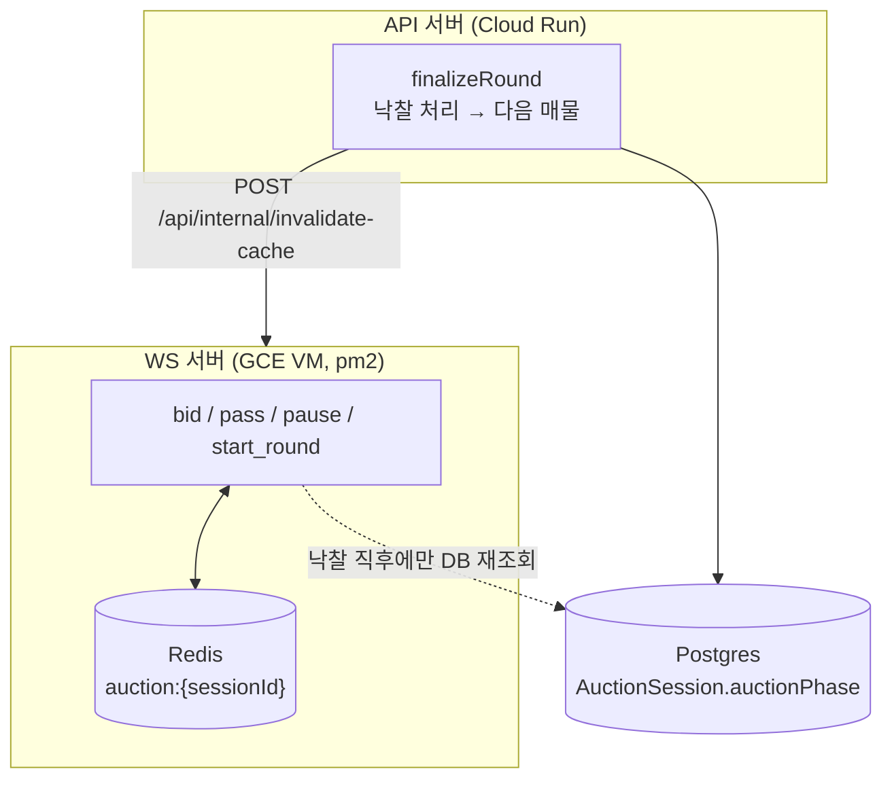

내전 팀을 짤 때 쓰는 실시간 경매(드래프트) 기능은 이 서비스에서 가장 손이 많이 간 실시간 로직이다. 이번 편은 "왜 경매를 다시 시작할 수 없다"는 버그가 반복해서 나던 이유와, 그걸 잡아가는 과정을 기록한다.

## 구조 — 왜 서버가 두 대인가

경매의 진행 상태(`auctionPhase`: `IDLE`/`WAITING`/`BIDDING`/`PAUSED`/`COMPLETE`)는 두 개의 완전히 분리된 프로세스가 나눠서 쓴다.

- **API 서버** (`packages/api`, Cloud Run) — 라운드 낙찰 처리, 다음 매물로 넘어가는 등 **정합성이 중요한 전환**을 담당
- **WS 서버** (`server-ws.ts`, 별도 GCE VM, pm2 `auction-ws`) — 입찰, 포기, 일시정지/재개, 라운드 시작 등 **지연시간이 중요한 전환**을 담당



둘 다 같은 `auctionPhase` 값을 쓰지만 저장소가 다르다 — API는 Postgres를 직접 쓰고, WS 서버는 속도를 위해 Redis에 세션 전체를 JSON 스냅샷으로 캐싱해서 쓴다. 이 둘을 맞추기 위해 API가 라운드를 끝낼 때마다 WS 서버에 내부 API(`/api/internal/invalidate-cache`)로 "캐시 지워"라고 알려주는 구조다.

<br/>

## 문제 — "경매를 다시 시작할 수 없어요"

라운드가 낙찰된 뒤 다음 라운드를 시작하려고 하면, 가끔 "현재 상태(BIDDING)에서는 시작 불가"라는 에러가 영구적으로 뜨는 버그가 있었다. 복구 방법은 `undo_last`(직전 처리 취소)로 한 번 되돌리는 것뿐이었다.

원인은 캐시 재기록 방식에 있었다. 당시 WS 서버의 "포기(pass)" 핸들러는 이런 식으로 동작했다.

```ts
// 문제가 있던 방식
const session = await getSessionFromRedis(sessionId);   // 전체 스냅샷을 읽고
const passed = JSON.parse(session.passedTeams || "[]");
passed.push(myTeam.id);
const updated = { ...session, passedTeams: JSON.stringify(passed) };
await redis.set(sessionKey(sessionId), JSON.stringify(updated), "EX", 1800);  // 전체를 다시 쓴다
```

"읽어서 한 필드만 고치고 전체를 다시 쓰는" 이 패턴이 다음 타이밍과 겹치면 사고가 난다.

1. 유저가 포기(pass)를 누르는 순간, 그 요청이 Redis에서 세션 스냅샷을 읽는다. 이 시점 `auctionPhase`는 아직 `BIDDING`이다.
2. 거의 동시에 API 서버가 낙찰 처리(`finalizeRound`)를 끝내고, Postgres의 `auctionPhase`를 `WAITING`으로 바꾼 뒤, WS 서버에 "캐시 지워"라고 요청해 Redis 키가 삭제된다.
3. 그런데 1번에서 읽어뒀던 pass 요청이 뒤늦게 "전체 스냅샷 다시 쓰기"를 실행한다 — 방금 삭제된 키를, **낙찰 이전의 낡은 `auctionPhase: BIDDING` 값 그대로** 되살려버린다.

이후로는 Postgres엔 이미 `WAITING`으로 정확히 기록돼 있는데, Redis만 영원히 `BIDDING`으로 남는다. 그리고 라운드 시작(`start_round`) 핸들러는 당시 캐시만 믿고 검사하고 있었기 때문에, 진짜 상태와 무관하게 계속 거부당했다.

<br/>

## 수정 1 — 일단 증상부터: `start_round`는 DB를 믿게 하기

가장 먼저 한 수정은 `start_round`가 캐시 대신 Postgres를 권위 있는 소스로 삼아 재검증하도록 바꾸는 것이었다.

```diff
 socket.on("start_round", async ({ sessionId }) => {
-    const session = await getSessionFromRedis(sessionId);
+    // phase 전환(WAITING→BIDDING)은 API의 finalizeRound(낙찰 후 DB를 WAITING으로 set)와 공동 소유다.
+    // finalize 직후 stale Redis가 BIDDING으로 남으면(pass 핸들러의 비원자적 재기록이 invalidate된
+    // 캐시를 옛 BIDDING으로 되살릴 때) 캐시만 믿으면 시작이 영구히 막힌다.
+    // → 캐시 대신 DB 권위 상태를 강제 재로드(+캐시 갱신)하여 검증한다. start는 매물당 1회뿐이라 비용 무시 가능.
+    const session = await loadSessionToRedis(sessionId);
     if (!session) return socket.emit("error", { message: "세션을 찾을 수 없습니다" });
     if (session.auctionPhase !== "WAITING") {
       return socket.emit("error", { message: `현재 상태(${session.auctionPhase})에서는 시작 불가` });
     }
```

`getSessionFromRedis`(캐시 우선, 없으면 DB 조회)를 `loadSessionToRedis`(무조건 Postgres를 다시 읽고 캐시도 덮어씀)로 바꾼 게 전부다. 라운드 시작은 매물 하나당 딱 한 번만 일어나는 액션이라, 여기서만 DB를 강제로 다시 읽어도 비용 부담이 없다는 게 이 수정을 밀어붙일 수 있었던 이유다. 입찰(bid)이나 일시정지(pause)처럼 훨씬 자주 일어나는 액션까지 전부 DB로 검증했다면 그건 Redis를 캐시로 쓰는 의미 자체가 없어졌을 것이다.

<br/>

## 수정 2 — 9분 뒤, 근본 원인 치료: "포기"를 원자적으로

증상은 고쳤지만, 캐시가 죽은 키를 되살리는 근본 원인(전체 스냅샷 읽고-고치고-다시 쓰기)은 그대로였다. 같은 날 바로 이어서 고쳤다. 포기 핸들러를 Redis Lua 스크립트로 바꿔서, "포기한 팀 목록"이라는 필드 하나만 원자적으로 패치하도록 만들었다.

```lua
-- PASS_SCRIPT
local session = redis.call("GET", KEYS[1])
if not session then return nil end            -- 키가 없다(=이미 종료/전환됨) → 되살리지 않고 끝
local data = cjson.decode(session)
if data.auctionPhase ~= "BIDDING" then
  return cjson.encode({stale=true})            -- BIDDING이 아니면 포기 자체가 무의미 → 미반영
end
local passed = {}
if data.passedTeams and data.passedTeams ~= "" then
  passed = cjson.decode(data.passedTeams)
end
for _, id in ipairs(passed) do
  if id == teamId then return cjson.encode({ok=true, already=true}) end
end
table.insert(passed, teamId)
data.passedTeams = cjson.encode(passed)
redis.call("SET", KEYS[1], cjson.encode(data), "EX", 1800)
return cjson.encode({ok=true, passedTeams=data.passedTeams})
```

이 스크립트가 지키는 두 가지 규칙이 핵심이다.

- **키가 이미 없으면(=삭제됐으면) 아무것도 하지 않는다.** 예전 방식처럼 "읽었던 값을 나중에 다시 쓰는" 일이 없으니, 삭제된 키를 되살릴 방법 자체가 없어진다.
- **`auctionPhase`가 `BIDDING`이 아니면 반영하지 않는다.** 전체 스냅샷이 아니라 `passedTeams` 필드 하나만 고치기 때문에, 동시에 들어온 입찰(`highBid`)을 덮어쓰는 lost-update도 함께 막힌다.

입찰(bid) 처리는 이미 같은 방식(Lua 스크립트로 원자적 패치)으로 짜여 있었는데, 포기(pass)만 예전 방식 그대로 남아있던 게 이번 버그의 실제 원인이었던 셈이다.

<br/>

## 감시자는 따로 있다 — watchdog은 판단하지 않는다

한 가지 더: 클라이언트 타이머가 멈추는 경우(백그라운드 탭 등)를 대비해 WS 서버가 5초마다 Redis를 스스로 폴링해서, 타임아웃을 넘긴 `BIDDING` 라운드가 있으면 `round_finalized` 이벤트를 쏘는 watchdog이 있다. 그런데 이 watchdog은 **직접 라운드를 끝내지 않는다.** 실제 종료(낙찰/유찰 처리 후 다음 매물로 전환)는 여전히 클라이언트의 `GET /live-bid` 폴링 경로에 있는, `updateMany({ where: { auctionPhase: "BIDDING" } })` 같은 claim-guard(먼저 BIDDING을 선점한 요청만 통과)를 통해서만 일어난다.

즉 watchdog은 "이거 끝났을 것 같은데?"라고 알려주기만 하고, 진짜 판단과 실행은 항상 하나의 원자적 경로로만 몰아둔 것이다. 감시자와 실행자를 분리해두면, watchdog이 오작동하거나 중복으로 쏘더라도 조기 종료나 중복 종료가 구조적으로 불가능해진다.

<br/>

## 정리 — 배운 것

1. **"읽고 - 고치고 - 전체를 다시 쓰는" 패턴은 캐시 삭제와 반드시 경합한다.** 다른 프로세스가 그 사이에 캐시를 지워도, 뒤늦게 도착한 쓰기가 죽은 키를 예전 값 그대로 되살려버린다. 필드 하나를 고칠 땐 필드 하나만 원자적으로 건드려야 한다.
2. **증상 수정과 원인 수정은 분리해도 되지만, 반드시 둘 다 해야 한다.** `start_round`를 DB 권위로 바꾼 것만으로도 유저는 더 이상 막히지 않았겠지만, 근본 원인(pass의 비원자적 쓰기)을 그대로 뒀다면 다른 필드에서 같은 증상이 또 나왔을 것이다.
3. **여러 프로세스가 상태를 나눠 가질 땐, 전환마다 "누가 진짜인지"를 다르게 정할 수 있다.** 이 서비스에서는 입찰·일시정지처럼 빈번한 전환은 Redis(캐시)를 믿고, 라운드 시작처럼 드물고 되돌리기 힘든 전환만 Postgres(DB)를 강제로 재확인하게 했다. 모든 걸 DB로 검증하면 캐시를 쓰는 의미가 없고, 모든 걸 캐시로만 검증하면 이번 버그처럼 stale 상태에 영원히 갇힌다.
4. **감시(watchdog)와 실행(claim-guard)을 분리하면 감시자의 실수가 치명적이지 않다.** watchdog은 "끝난 것 같다"는 신호만 보내고, 실제 상태 전환은 항상 하나의 원자적 경로에서만 일어나게 하면 중복 실행을 걱정할 필요가 없다.
