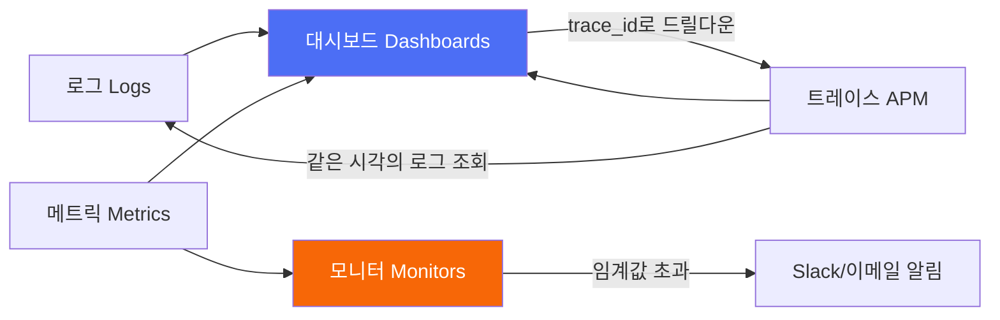
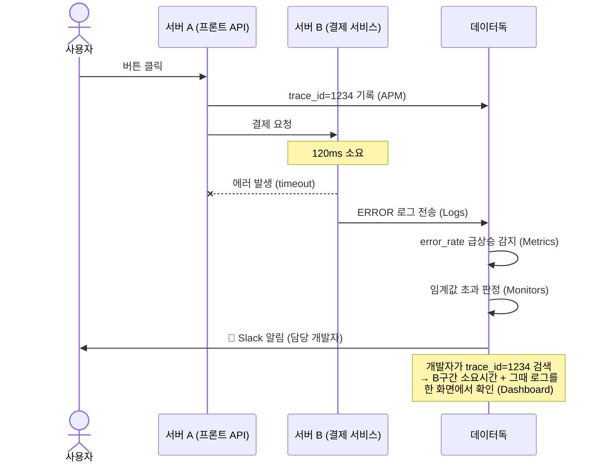

옵저버빌리티(observability) 플랫폼인 데이터독을 공부하면서 정리한 내용이다. 데이터독 자체를 처음부터 다뤄본 적이 없어서, 이번 편은 5대 핵심 개념(로그/메트릭/트레이스/모니터/대시보드)이 각각 뭘 하는지, 왜 필요한지부터 짚는다. ([공식문서](https://docs.datadoghq.com/) 대조 완료)

## TL;DR

- 데이터독은 로그·메트릭·트레이스 3가지 신호를 한 곳에 모아 trace_id 하나로 원인까지 추적하게 해주는 도구다.
- 5대 핵심 개념: **로그**(일지), **메트릭**(숫자 그래프), **트레이스/APM**(여정 지도), **모니터**(감시자), **대시보드**(상황판).
- 서버가 몇 대 안 될 땐 SSH로 로그 뒤지면 됐지만, 서비스가 커지고 마이크로서비스로 쪼개지면 "흩어진 정보를 손으로 짜맞추는" 문제가 생긴다.
- 핵심은 이 흩어진 신호를 trace_id 하나로 연결해서 "로그 따로, 숫자 따로, 추적 따로" 찾아 헤매지 않게 하는 것.

 

## 1. 왜 필요한가

서버 한두 대짜리 서비스는 문제가 생기면 그냥 서버에 들어가서 로그 파일을 열어보면 됐다. 그런데 서버가 수십~수백 대로 늘고 마이크로서비스로 쪼개지면 얘기가 달라진다.

- "어디서 에러가 났지?" → 로그가 서버마다 흩어져 있어서 일일이 들어가서 찾아야 함
- "왜 갑자기 느려졌지?" → CPU/메모리 수치를 서버별로 따로따로 봐야 함
- "이 요청이 어느 서비스에서 막혔지?" → A서비스→B서비스→C서비스를 거치는 동안 어디서 지연됐는지 추적 불가능

## 2. 5대 핵심 개념

데이터독 공식 문서는 이걸 "5대 개념"이 아니라 **[3 Pillars of Observability](https://docs.datadoghq.com/)**(로그·메트릭·트레이스)로 프레이밍하고, 모니터·대시보드는 이 3개 축을 소비하는 기능으로 둔다. 개념 자체는 아래 5개로 정리하는 게 이해하긴 편해서 그대로 간다.

1. **로그(Logs)** — 시스템이 남기는 일지. "몇 시 몇 분에 에러 발생, 메시지는 이러함" 같은 텍스트 기록 ([Log Management](https://docs.datadoghq.com/logs/))
2. **메트릭(Metrics)** — 시간에 따라 변하는 숫자. CPU 사용률, 응답 시간, 초당 요청 수 같은 수치가 그래프로 쌓임
3. **APM/트레이스(Traces)** — 요청 하나가 여러 서비스를 거치는 여정 지도. A→B→C 서비스를 거칠 때 각 구간에서 얼마나 걸렸는지 추적 ([APM](https://docs.datadoghq.com/tracing/))
4. **모니터(Monitors)** — 3 pillar를 "이상하면 알려줘"로 소비하는 기능. 특정 조건(예: 에러율 5% 초과)이 되면 자동으로 알림(Slack, 이메일 등) 발송
5. **대시보드(Dashboards)** — 3 pillar를 모아 보는 상황판. 지표들을 원하는 대로 배치해서 한눈에 보는 화면 ([Dashboards](https://docs.datadoghq.com/dashboards/))

## 3. 실제 흐름 예시

## 4. 정리

- 원인 추적 시간 단축: "느려졌다"는 증상만 보고도 어느 서비스, 어느 구간이 병목인지 클릭 몇 번으로 확인 가능
- 선제 대응: 문제가 사용자한테 크게 번지기 전에 모니터 알림으로 먼저 인지
- 팀 공용 언어: 같은 대시보드를 보고 대화하니까 혼선이 줄어듦
- 여러 옵저버빌리티 도구(로그 전용, 메트릭 전용, 트레이싱 전용 SaaS)를 따로따로 조합해서 쓰는 팀이라면, 데이터독은 이 역할들을 하나의 플랫폼으로 묶어 제공하는 선택지라고 보면 된다.

---

다음 편은 LLM 서비스에 특화된 AI Observability(AI Obs) 개념을 다룬다.
