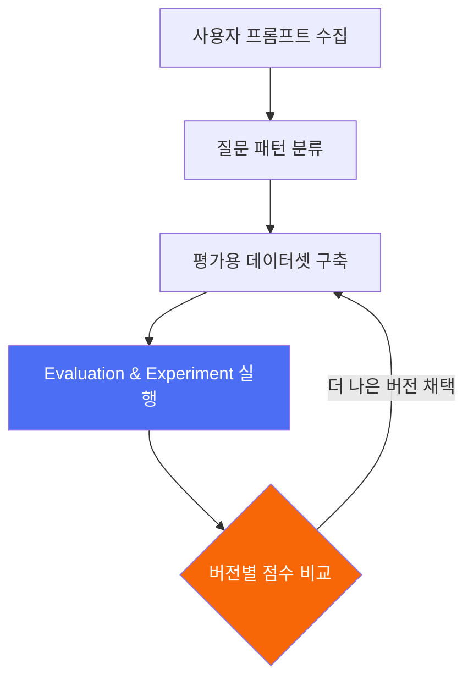
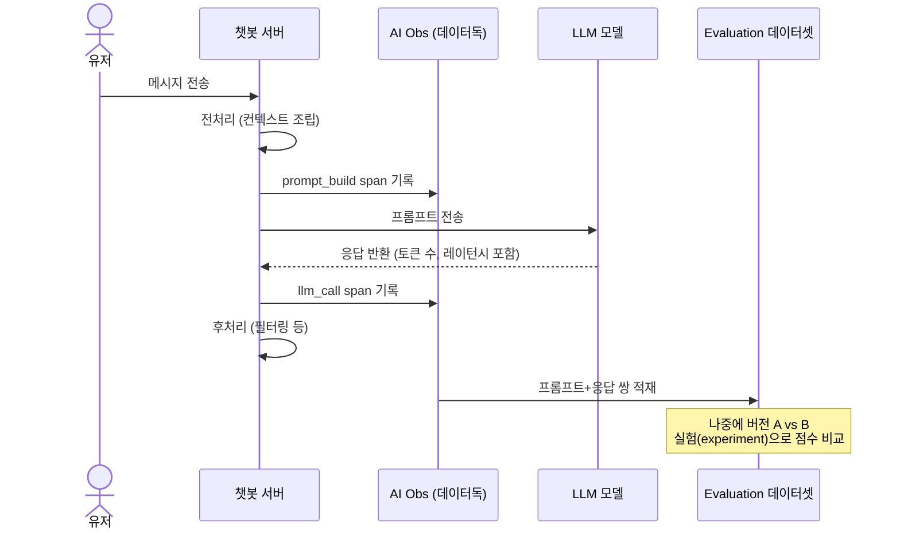

지난 편에서 로그·메트릭·트레이스·모니터·대시보드라는 데이터독의 기본 5대 개념을 봤다. 이번 편은 LLM(챗봇 등)을 쓰는 서비스에 특화된 **AI Obs(AI Observability)** 개념을 정리한다.

## TL;DR

- AI Obs는 LLM 호출을 일반 API 호출과 다르게 취급해서, "이 프롬프트가 이 답변을 만들었고 품질은 이랬다"까지 추적·평가하는 관측 계층이다.
- 일반 APM은 "요청이 몇 ms 걸렸다"만 보여주는데, LLM 서비스는 그것만으론 부족하다 — 에러가 아니라 "품질 저하"가 문제인 경우가 많고, 프롬프트를 바꿨을 때 "정말 좋아졌는지"를 감으로 판단하게 된다.
- 핵심 요소: LLM 호출을 하나의 span으로 기록 → 에러 시 코드 라인까지 연결 → 프롬프트 최적화 워크플로우(수집→패턴화→데이터셋→평가→비교) → Watchdog(이상탐지).

 

## 1. 왜 일반 APM만으로는 부족한가

- 응답이 느려도 "서버가 느린 건지, LLM API 자체가 느린 건지" 구분이 안 됨
- 500 에러는 안 났는데 답변 품질이 이상해지는 건 일반 모니터링으로 못 잡음
- 프롬프트를 바꿨을 때 "정말 좋아졌는지"를 감으로 판단하게 됨 — A/B 비교, 버전별 채점 인프라가 따로 필요
- 채팅 한 턴 안에 여러 단계(전처리, 프롬프트 조립, LLM 호출, 후처리)가 얽히면 "이 턴에서 뭐가 어떤 순서로 일어났는지" 한눈에 안 보임

## 2. 핵심 아이디어

**한 줄 요약:** LLM 호출을 일반 API 호출과 다르게 취급해서, 프롬프트·응답·품질 점수까지 추적·평가·비교하는 관측 계층.

1. **LLM 호출을 하나의 span으로 기록** — 프롬프트 입력, 모델 응답, 토큰 수, 레이턴시가 하나의 구간으로 남음
2. **세션 리플레이 → 트레이스 연결** — 유저가 실제로 뭘 봤는지와 그 뒤 서버에서 무슨 일이 일어났는지를 이어붙임
3. **에러 발생 시 코드 연동** — 트레이스에서 에러가 잡히면 원인이 된 코드 위치까지 바로 연결
4. **프롬프트 최적화 워크플로우** — 사용자 프롬프트 수집 → 질문 패턴 분류 → 평가용 데이터셋 구축 → evaluation & experiment → 프롬프트/모델 버전별 점수 비교
5. **Watchdog(이상탐지)** — 과거 데이터와 비교해서 "지금 이 패턴이 평소랑 다르다"를 자동으로 감지

## 3. 실제 흐름 예시 (일반화된 챗봇 시나리오)

LLM 챗봇 서비스에서 유저 메시지 한 번이 처리되는 과정을 span으로 쪼개면 이렇게 된다.

이렇게 하나의 trace_id 아래 모든 span이 묶이면, "이번 턴 전체 소요시간 중 LLM 호출이 몇 %를 차지했는지"를 한 화면에서 분해해서 볼 수 있다.

## 4. 랭퓨즈(Langfuse) 같은 LLM 전용 툴과의 관계

LLM 서비스를 운영하다 보면 보통 인프라 관측(APM/로그)과 LLM 전용 관측(프롬프트 트레이싱, 평가, 데이터셋)을 서로 다른 툴로 나눠 쓰게 되는 경우가 많다. 랭퓨즈 같은 툴은 프롬프트 트레이싱과 evaluation에 특화되어 있는데, 데이터독의 AI Obs는 이 LLM 관측 기능을 인프라 APM과 하나의 플랫폼으로 합치는 걸 지향한다. 어느 쪽이 실제로 더 나은가는 "LLM 답변 품질 실험을 얼마나 정교하게 하고 싶은가"와 "인프라까지 포함한 엔드투엔드 가시성이 얼마나 중요한가"의 트레이드오프 문제다 — 다음 편에서 더 자세히 비교해본다.

## 5. 정리

- 툴 파편화 해소: 인프라 문제와 프롬프트 품질 문제를 trace_id 하나로 연결
- 원인 분석 자동화: 에러 원인이 된 코드 위치까지 자동으로 짚어줘서 디버깅 시간이 줄어듦
- 프롬프트 개선의 근거화: 감이 아니라 evaluation 점수로 버전을 비교하고 채택할 수 있음

---

다음 편은 랭퓨즈와 데이터독 AI Obs를 실제로 비교했을 때 뭐가 다른지 정리한다.
