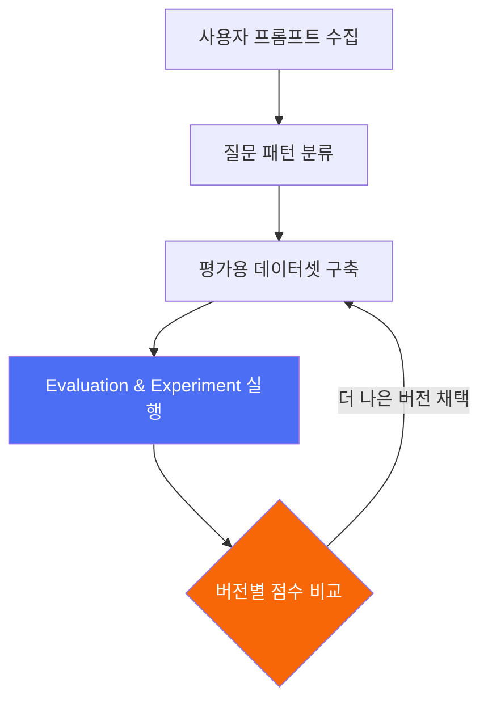
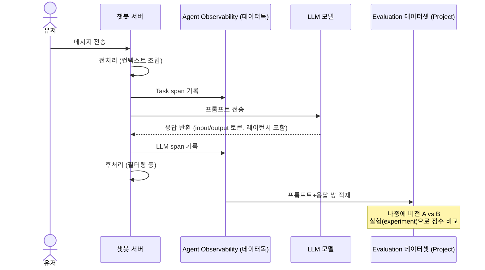

지난 편에서 로그·메트릭·트레이스·모니터·대시보드라는 데이터독의 기본 5대 개념을 봤다. 이번 편은 LLM(챗봇 등)을 쓰는 서비스에 특화된 **[Agent Observability](https://docs.datadoghq.com/llm_observability/)**(공식 명칭. URL은 여전히 `/llm_observability/` 하위 — 예전 명칭이 LLM Observability였던 흔적) 개념을 정리한다. 처음엔 "AI Obs"라고 대충 알고 있었는데, 공식 문서를 대조하면서 여러 개념을 잘못 뭉쳐서 이해하고 있었다는 걸 알게 됐다.

## TL;DR

- Agent Observability는 LLM 호출을 일반 API 호출과 다르게 취급해서, "이 프롬프트가 이 답변을 만들었고 품질은 이랬다"까지 추적·평가하는 관측 계층이다.
- 일반 APM은 "요청이 몇 ms 걸렸다"만 보여주는데, LLM 서비스는 그것만으론 부족하다 — 에러가 아니라 "품질 저하"가 문제인 경우가 많고, 프롬프트를 바꿨을 때 "정말 좋아졌는지"를 감으로 판단하게 된다.
- span은 LLM / Workflow / Agent / Tool / Task / Embedding / Retrieval 7가지 종류로 세분화된다.
- ⚠️ "세션 리플레이 → 트레이스 → MCP" 흐름은 내가 잘못 이해하고 있던 부분이다 — 세션 리플레이는 RUM 소속 기능이고, Agent Observability의 MCP 연동은 자체 trace 데이터를 쓴다.
- Watchdog(이상탐지)와 GitHub 코드 연동은 Agent Observability 전용 기능이 아니라 데이터독 플랫폼 공통 기능이 여기에도 적용된 것이다.

 

## 1. 왜 일반 APM만으로는 부족한가

- 응답이 느려도 "서버가 느린 건지, LLM API 자체가 느린 건지" 구분이 안 됨
- 500 에러는 안 났는데 답변 품질이 이상해지는 건 일반 모니터링으로 못 잡음
- 프롬프트를 바꿨을 때 "정말 좋아졌는지"를 감으로 판단하게 됨 — A/B 비교, 버전별 채점 인프라가 따로 필요
- 채팅 한 턴 안에 여러 단계(전처리, 프롬프트 조립, LLM 호출, 후처리)가 얽히면 "이 턴에서 뭐가 어떤 순서로 일어났는지" 한눈에 안 보임

## 2. 핵심 아이디어 (공식문서로 재검증)

**한 줄 요약:** LLM 호출을 일반 API 호출과 다르게 취급해서, 프롬프트·응답·품질 점수까지 추적·평가·비교하는 관측 계층.

1. **[Span Kind 7종](https://docs.datadoghq.com/llm_observability/terms/)으로 세분화된 트레이스 기록** — LLM 호출 하나를 뭉뚱그리지 않고 **LLM / Workflow / Agent / Tool / Task / Embedding / Retrieval** 7가지 종류로 구분해서 기록한다. 각 span은 입출력(프롬프트/응답), `input_tokens`/`output_tokens`, 시작시각+소요시간, 에러 정보를 담는다
2. **[MCP Server](https://docs.datadoghq.com/llm_observability/mcp_server/)를 통한 AI 코딩 도구 연동** — 데이터독 MCP Server가 Claude Code·Cursor 같은 AI 코딩 도구에 trace 데이터를 직접 노출한다. `/agent-observability-trace-rca` 스킬이 "왜 이 LLM 응답이 나빴는지"를 진단하고 코드베이스를 검색해서 구체적인 코드 diff까지 제안한다 — 세션 리플레이가 아니라 Agent Observability 자체 trace가 이 진단의 입력이다
3. **에러 발생 시 소스코드 연동** — 이건 Agent Observability 전용이 아니라 데이터독의 범용 **[Source Code Integration](https://docs.datadoghq.com/source_code/) / Error Tracking** 기능(GitHub 연동, Suspect Commits)이 여기도 적용된 것
4. **[프롬프트 최적화 워크플로우](https://docs.datadoghq.com/llm_observability/experiments/setup/) (Experiments)** — Projects가 데이터셋+실험을 담는 조직 단위. 프로덕션 trace에서 실패 패턴 발견 → 그 패턴을 겨냥한 evaluator 자동 생성 → 실험 실행 → 결과 분석해서 개선 권고까지 이어지는 루프
5. **이상탐지는 Watchdog(범용)** — "지금 이 패턴이 평소랑 다르다"를 잡아내는 Watchdog은 Agent Observability 전용이 아니라 데이터독 메트릭 전반에 쓰이는 범용 이상탐지 엔진이다

## 3. 실제 흐름 예시 (일반화된 챗봇 시나리오)

LLM 챗봇 서비스에서 유저 메시지 한 번이 처리되는 과정을 span으로 쪼개면 이렇게 된다.

이렇게 하나의 trace_id 아래 모든 span이 묶이면, "이번 턴 전체 소요시간 중 LLM 호출이 몇 %를 차지했는지"를 한 화면에서 분해해서 볼 수 있다.

## 4. Bits AI 생태계 — 서로 다른 기능을 구분하기

POC 자료를 읽을 때 "Bits AI", "MCP", "GitHub 연동", "세션 리플레이"를 하나의 흐름으로 뭉쳐서 이해했었는데, 실제로는 별개 기능이었다.

- **[Bits AI](https://docs.datadoghq.com/bits_ai/)**: 개발/보안/운영 워크플로우를 자동화하는 "에이전트 팀원" 포지셔닝의 상위 브랜드
- **[Datadog MCP Server](https://docs.datadoghq.com/bits_ai/mcp_server/)**: Bits AI 생태계의 일부로, 옵저버빌리티 데이터를 MCP 프로토콜로 외부 AI 도구에 노출하는 다리 역할
- **[Bits Investigation](https://docs.datadoghq.com/bits_ai/bits_ai_sre/)**: 프로덕션 이슈를 자율적으로 조사하는 에이전트 — 가설 수립→텔레메트리 조회→검증→재조사의 루프를 스스로 돌며 근본원인에 수렴
- **[AI-Enhanced SAST](https://docs.datadoghq.com/security/code_security/static_analysis/ai_enhanced_sast/)**: LLM으로 코드의 데이터 흐름을 추론해서 보안 취약점을 찾는 정적분석 — "코드 리뷰"라기보다 보안 취약점 탐지에 특화
- **RUM (Real User Monitoring)**: 1편에 이어 4편에서 다룰 별개 제품. Agent Observability와는 트레이스만 연결 가능하고, 세션 리플레이 자체가 LLM 트레이스와 직결되는 건 아니다

## 5. 랭퓨즈(Langfuse) 같은 LLM 전용 툴과의 관계

LLM 서비스를 운영하다 보면 보통 인프라 관측(APM/로그)과 LLM 전용 관측(프롬프트 트레이싱, 평가, 데이터셋)을 서로 다른 툴로 나눠 쓰게 되는 경우가 많다. 랭퓨즈 같은 툴은 프롬프트 트레이싱과 evaluation에 특화되어 있는데, 데이터독의 Agent Observability는 이 LLM 관측 기능을 인프라 APM과 하나의 플랫폼으로 합치는 걸 지향한다. 어느 쪽이 실제로 더 나은가는 "LLM 답변 품질 실험을 얼마나 정교하게 하고 싶은가"와 "인프라까지 포함한 엔드투엔드 가시성이 얼마나 중요한가"의 트레이드오프 문제다 — 다음 편에서 더 자세히 비교해본다.

## 6. 정리

- 툴 파편화 해소: 인프라 문제와 프롬프트 품질 문제를 trace_id 하나로 연결
- 원인 분석 자동화: (a) Error Tracking의 GitHub 연동으로 코드 라인까지, (b) Bits Investigation이 자율적으로 가설-검증 루프를 돌며 근본원인에 수렴 — 이 둘은 별개 기능
- 프롬프트 개선의 근거화: 감이 아니라 evaluation 점수로 버전을 비교하고 채택할 수 있음

### 참고 (공식문서)

- [Agent Observability](https://docs.datadoghq.com/llm_observability/)
- [Agent Observability Terms and Concepts](https://docs.datadoghq.com/llm_observability/terms/)
- [Agent Observability MCP and Skills](https://docs.datadoghq.com/llm_observability/mcp_server/)
- [Evaluations](https://docs.datadoghq.com/llm_observability/evaluations/)
- [Setup and Usage (Experiments)](https://docs.datadoghq.com/llm_observability/experiments/setup/)
- [Bits AI](https://docs.datadoghq.com/bits_ai/)
- [Datadog MCP Server](https://docs.datadoghq.com/bits_ai/mcp_server/)
- [Bits Investigation](https://docs.datadoghq.com/bits_ai/bits_ai_sre/)
- [Source Code Integration](https://docs.datadoghq.com/source_code/)
- [AI-Enhanced Static Code Analysis](https://docs.datadoghq.com/security/code_security/static_analysis/ai_enhanced_sast/)

---

다음 편은 랭퓨즈와 데이터독 Agent Observability를 실제로 비교했을 때 뭐가 다른지 정리한다.
