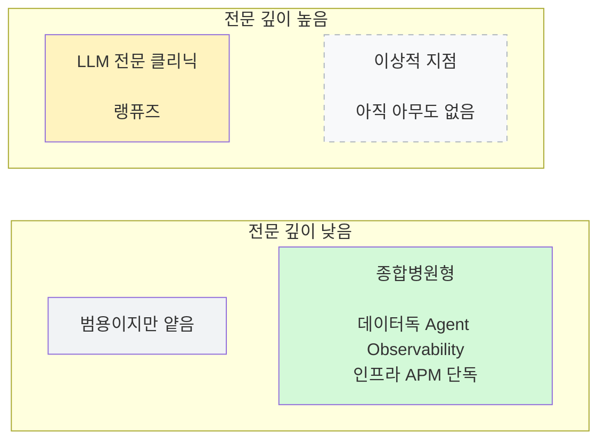
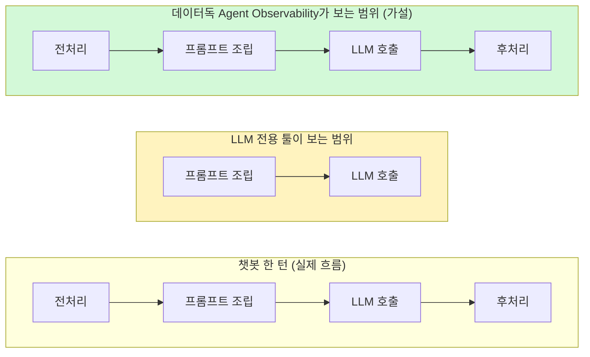

지난 편에서 데이터독의 Agent Observability가 LLM 호출을 관측·평가하는 기능이라는 걸 봤다. 이번 편은 LLM 전용 관측 툴인 랭퓨즈(Langfuse)와 비교했을 때 어떤 차이가 있는지 정리한다.

## TL;DR

- 랭퓨즈는 "LLM 전용 선수", 데이터독은 "회사 전체를 보는 종합병원"에 가깝다.
- 인프라 관측과 LLM 관측을 서로 다른 툴로 나눠 쓰면, "이 요청이 왜 느렸나"를 알아내려고 두 대시보드를 오가며 시간대를 손으로 맞춰봐야 하는 문제가 생긴다.
- 5가지 축(범위/트레이스 연결/원인 분석 자동화/성숙도/비용 구조)으로 비교해봤다.
- 완전 대체가 가능한지는 실제로 두 툴을 나란히 써보기 전까지는 가설 단계다.

 

## 1. 문제 상황: 툴이 나뉘어 있을 때

인프라는 A 툴(예: 시그노즈 같은 오픈소스 APM), LLM 이벤트는 B 툴(예: 랭퓨즈)로 나눠서 쓰는 구성을 가정해보자. 이 둘을 같이 봐야 진짜 원인을 찾을 수 있는 경우가 많다.

예를 들어 "이 채팅 턴이 느렸다"의 원인이 ① LLM 응답 자체가 느렸는지 ② DB 조회가 느렸는지 ③ 커넥션 풀이 부족했는지는 LLM 전용 툴 화면만 봐서는 못 잡는다. 지금은 두 대시보드를 오가며 손으로 시간대를 맞춰봐야 하는 게 문제다.

## 2. 5축 비교

1. **범위** — LLM 전용 툴은 LLM 호출만 촘촘히 본다. 데이터독은 인프라(APM)+LLM(Agent Observability)+프론트(RUM)+로그까지 한 플랫폼에서 다룬다.
2. **트레이스 연결** — LLM 전용 툴은 LLM 호출 앞뒤(DB 조회, 커넥션 풀 등)를 모른다. 데이터독은 trace_id 하나로 "DB 조회→전처리→프롬프트조립→LLM호출→후처리" 전체를 한 화면에 이어붙인다.
3. **원인 분석 자동화** — LLM 전용 툴은 평가 결과를 사람이 해석해야 한다. 데이터독은 범용 이상탐지(Watchdog)와 Error Tracking의 GitHub 연동을 LLM 트레이스에도 그대로 붙일 수 있어서(2편 참고, Agent Observability 전용 기능은 아니고 플랫폼 공통 기능), 인프라 쪽 자동화 도구를 LLM 관측에도 재사용할 수 있다.
4. **성숙도/전문성** — LLM 전용 툴은 프롬프트 평가·데이터셋 관리에 오래 특화된 만큼 그 부분은 더 세밀할 가능성이 크다(실측 전 가설). 데이터독 Agent Observability는 종합 플랫폼의 신설 기능에 가까워서 그 깊이는 검증이 더 필요하다.
5. **비용 구조** — LLM 전용 툴은 LLM 이벤트 단위 과금인 경우가 많고, 데이터독은 호스트/서비스 단위 과금이 섞인다.

가로축은 좁은 범위(LLM만) → 넓은 범위(인프라+LLM+프론트), 세로축은 낮은 LLM 전문 깊이 → 높은 LLM 전문 깊이다. 아래는 가설적인 포지셔닝이며 실측 결과는 아니다.

왼쪽 열은 좁은 범위(LLM만), 오른쪽 열은 넓은 범위(인프라+LLM+프론트)다.

## 3. 트레이스 커버리지 차이

챗봇 한 턴의 흐름을 두 도구로 각각 봤을 때, "어디까지 보이는가"의 경계가 달라진다.

LLM 전용 툴은 프롬프트 조립~LLM 호출 구간만 정밀하게 보고, 그 앞뒤는 화면에 안 잡힌다. "왜 느렸나"를 물으면 LLM 구간 답만 준다. 데이터독 Agent Observability는 가설상 전체 턴을 하나의 trace로 묶어서 "이번 턴 전체 800ms 중 LLM이 600ms, DB조회가 150ms" 식으로 분해할 수 있다 — 단, 이 분해 정밀도가 실제로 LLM 전용 툴만큼 나올지는 검증이 필요하다.

## 4. 정리

- **판단 기준**: LLM 답변 품질을 정교하게 실험·버저닝하는 게 목적이면 LLM 전용 툴이 더 깊을 가능성이 크다. "이 턴이 왜 느렸나/왜 에러났나"를 인프라까지 포함해서 추적하려면 통합 플랫폼 쪽이 유리하다.
- **완전 대체 여부는 실측 필요**: 결국 두 툴을 나란히 놓고 실제 프롬프트 evaluation 깊이를 비교해봐야 결론이 난다.
- **정확한 프레이밍**: "통합 플랫폼이 LLM 전용 툴을 완전히 대체한다"가 아니라 "인프라 관측을 통합하면서 LLM 가시성까지 얹을 수 있는가"로 좁혀서 보는 게 정확하다.

---

다음 편은 프론트엔드 전용 관측 기능인 RUM(Real User Monitoring)을 다룬다.
