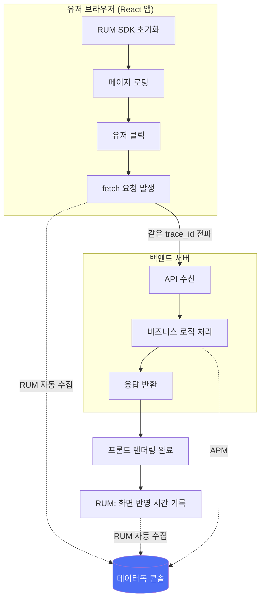
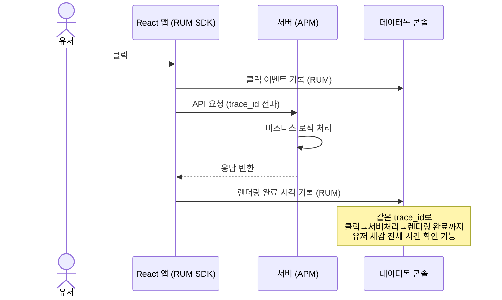

지금까지는 서버 쪽 관측(로그/메트릭/APM, AI Obs)을 봤는데, 이번 편은 **유저 브라우저 안**에서 벌어지는 일을 보는 RUM(Real User Monitoring)을 정리한다. 공식 문서([docs.datadoghq.com](https://docs.datadoghq.com/real_user_monitoring/))를 대조해서 정확한 파라미터명까지 확인했다.

## TL;DR

- RUM은 React 등 프론트엔드 앱에 SDK를 심어서, 유저의 클릭·페이지 로딩·에러·성능을 서버 트레이스와 같은 trace_id로 이어붙이는 기능이다.
- 서버 로그가 완벽해도 못 보는 게 있다 — 프론트 렌더링이 깨지거나, 유저 체감 속도와 서버 응답시간이 다르거나, 특정 브라우저에서만 나는 버그.
- `applicationId`/`clientToken`/`site`로 초기화하고, `sessionSampleRate`/`sessionReplaySampleRate`로 샘플링을 조절하고, `allowedTracingUrls`로 백엔드 트레이스와 연결한다.
- ⚠️ RUM-Trace 연결(`allowedTracingUrls`)을 켜면 APM 유료 데이터를 RUM에서 끌어쓰는 것이라 APM 청구액에 영향을 준다 (공식 문서에 명시됨).

<br/>

## 1. 왜 필요한가

- 서버는 정상 응답(200)을 보냈는데, 프론트에서 렌더링이 깨지거나 JS 에러로 화면이 멈추는 경우 — 서버 로그엔 안 잡힘
- "이 페이지가 느리다"는 유저 체감과 서버 응답시간이 다를 수 있음 — 이미지 로딩, 폰트 깜빡임, 번들 사이즈 때문에 체감 속도가 늦어질 수 있음
- 특정 브라우저/기기에서만 나는 버그 — 서버는 "그 사람 화면에서 뭐가 보였는지"는 모름

## 2. 설치 절차 (공식 문서 기준)

1. **SDK 설치** — `npm install --save @datadog/browser-rum` (React 앱은 이 방식이 권장. CDN 비동기 스크립트 방식도 있음)
2. **`datadogRum.init()`으로 초기화** — 필수 파라미터는 `applicationId`, `clientToken`, `site`(조직의 데이터독 리전). `service`, `env`, `version`은 선택
3. **자동 수집 시작** — 페이지 로딩 성능, 유저 클릭/인터랙션, 네트워크 요청, 애플리케이션 에러가 자동으로 수집됨
4. **샘플링 레이트 조절** — `sessionSampleRate`(세션 자체를 몇 %나 수집할지)와 `sessionReplaySampleRate`(그중 세션 리플레이는 몇 %나 녹화할지)를 따로 지정
5. **서버 트레이스와 연결** — `allowedTracingUrls`에 "이 도메인으로 나가는 요청은 서버 트레이스랑 이어달라"고 화이트리스트를 등록. `propagatorTypes: ["tracecontext"]`를 지정하면 W3C 표준 `traceparent` 헤더로 trace_id가 전파됨

```javascript
import { datadogRum } from '@datadog/browser-rum';

datadogRum.init({
  applicationId: '<APP_ID>',
  clientToken: '<CLIENT_TOKEN>',
  site: 'datadoghq.com',
  service: 'my-web-app',
  env: 'production',

  sessionSampleRate: 100,
  sessionReplaySampleRate: 20,

  allowedTracingUrls: [
    { match: 'https://api.example.com', propagatorTypes: ['tracecontext'] },
  ],
});
```

## 3. 실제 동작 과정





## 4. 비용 관련 주의사항 (공식 문서 확인)

`allowedTracingUrls`로 RUM-Trace 연결을 켜면 **APM 유료 데이터를 RUM에서 끌어쓰는 것**이라 APM 청구액에 영향을 준다고 공식 문서에 명시되어 있다. 도입을 검토할 때 이 연결 기능을 켤지 여부도 비용 계산에 넣어야 한다.

## 5. 정리

- 유저 체감 성능 파악: 서버 응답은 빨랐는데 실제 화면 반영이 늦었다면, 그 차이를 정확히 짚어낼 수 있음
- 프론트 전용 버그 포착: 서버 로그엔 안 남는 JS 에러, 특정 브라우저 크래시를 자동 수집
- 엔드투엔드 가시성: APM+AI Obs+RUM을 합치면 "유저 클릭부터 답변이 화면에 뜨기까지" 전 구간이 하나의 trace로 이어짐

### 참고 (공식문서)

- [RUM & Session Replay 개요](https://docs.datadoghq.com/real_user_monitoring/)
- [Browser Monitoring Client-Side Setup](https://docs.datadoghq.com/real_user_monitoring/application_monitoring/browser/setup/client/)
- [Connect RUM and Traces](https://docs.datadoghq.com/tracing/other_telemetry/rum/)

---

다음 편은 여러 언어로 나뉜 서비스 사이에서 트레이스가 실제로 어떻게 이어지는지, APM 계측(instrumentation) 원리를 다룬다.
