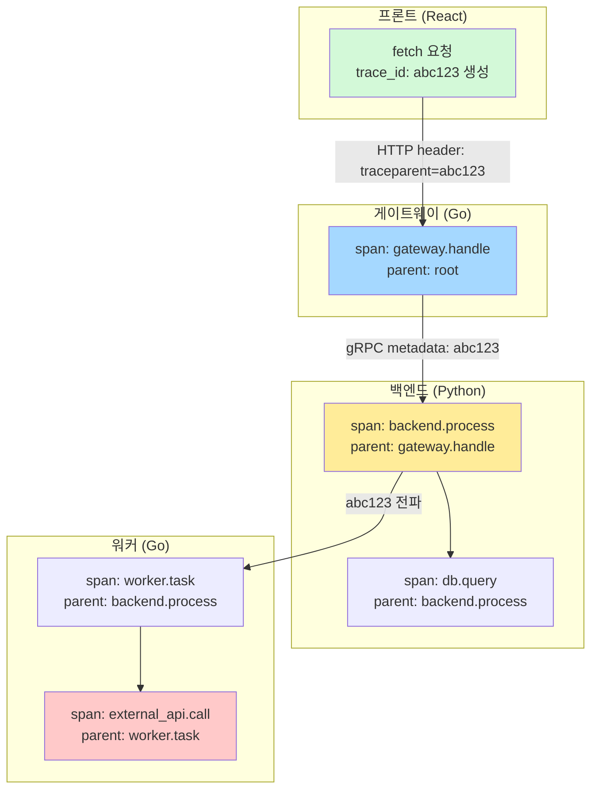

1편에서 "trace_id 하나로 여러 서비스를 이어붙인다"고 정리했는데, 이번 편은 그게 실제로 **어떻게** 이어지는지 — 계측(instrumentation)의 원리를 다룬다.

## TL;DR

- 계측은 코드 곳곳에 미리 심어둔 "꼬리표 부착기"다 — 각 서비스 코드 안에 "지금 여기서 무슨 함수가 시작됐고 끝났는지"를 자동으로 기록하는 장치.
- trace_id를 서비스 경계를 넘어 전파(Context Propagation)하고, 각 서비스 안에서 "이 구간(span)이 언제 시작해서 끝났는지"를 기록하면 하나의 트레이스가 완성된다.
- Auto Instrumentation(공통 라이브러리는 자동)과 Manual Instrumentation(비즈니스 로직은 수동)을 조합해서 쓴다.
- OpenTelemetry(OTel) 같은 표준 프로토콜을 쓰면 언어가 섞인 폴리글랏 아키텍처에서도 trace가 끊기지 않는다.

 

## 1. 문제 상황

trace_id로 여러 서비스를 잇는다는 아이디어 자체는 쉬운데, 실제로 구현하려면 만만치 않은 문제가 있다.

- 서비스 A가 서비스 B를 호출할 때, **같은 trace_id**를 B에게 어떻게 전달할까? (HTTP 헤더? gRPC 메타데이터?)
- 함수 하나하나마다 "시작 시각, 끝 시각 기록해줘"를 개발자가 매번 손으로 써야 한다면 코드가 로깅 코드로 도배됨
- 언어가 섞인 스택(예: 프론트는 React, 게이트웨이는 Go, 백엔드는 Python)에서 언어마다 계측 방식이 다르면 trace가 중간에 끊김
- 계측을 다 심어도 "이 함수가 정확히 어디 소속(span)인지" 계층 구조를 안 잡으면 트레이스가 평평한 로그 더미가 됨

## 2. 핵심 아이디어

**한 줄 요약:** trace_id를 요청과 함께 서비스 경계를 넘어 전파시키고, 각 서비스 안에서 span을 자동/수동으로 기록하는 것.

1. **Trace 시작** — 맨 처음 요청이 들어온 지점(진입점 API)에서 고유한 trace_id를 생성
2. **Span 생성** — 실행되는 각 함수/구간마다 span이라는 작은 기록 단위를 만듦. span은 이름, 시작~끝 시각, 부모 span ID를 가짐 (부모-자식 구조로 계층이 생김)
3. **Context Propagation(컨텍스트 전파)** — 서비스 A가 서비스 B를 호출할 때, trace_id와 현재 span ID를 HTTP 헤더(`traceparent` 등)나 gRPC 메타데이터에 실어서 같이 보냄
4. **자동 계측 vs 수동 계측** — 웹 프레임워크·DB 드라이버·HTTP 클라이언트 같은 공통 라이브러리는 에이전트가 자동으로 span을 만들어줌(Auto Instrumentation). "이 부분은 꼭 보고 싶다" 하는 비즈니스 로직은 개발자가 코드에 한 줄 추가해서 수동으로 span을 만듦(Manual Instrumentation)
5. **수집 & 조립** — 각 서비스에서 만들어진 span들이 에이전트를 거쳐 중앙 서버로 모이고, 같은 trace_id끼리 부모-자식 관계로 재조립되어 하나의 트리 구조 트레이스가 완성됨

## 3. 폴리글랏 아키텍처 예시

프론트(React), 게이트웨이(Go), 백엔드(Python), 워커(Go)처럼 언어가 섞인 구성을 가정해보자.

```mermaid
gantt
    title trace_id=abc123 — 재조립된 span 트리 (타임라인 뷰)
    dateFormat X
    axisFormat %Lms
    section 프론트
    fetch 요청                :f1, 0, 5
    section 게이트웨이
    gateway.handle             :g1, 5, 20
    section 백엔드
    backend.process            :b1, 25, 300
    db.query                   :b2, 30, 40
    section 워커
    worker.task                :e1, 330, 3
    external_api.call          :active, e2, 333, 600
```

이렇게 각기 다른 언어로 짜인 서비스가 **같은 trace_id를 계속 넘겨주기만 하면**, 콘솔에서 하나의 폭포수(waterfall) 그래프로 재조립돼서 보인다.

## 4. 정리

- 어디서 시간이 새는지 정확히 특정: "전체 968ms 중 external_api.call이 600ms"처럼 병목 구간을 span 단위로 바로 짚음
- 언어가 달라도 끊기지 않음: OpenTelemetry 같은 표준 프로토콜을 쓰면 React/Go/Python이 섞여도 trace가 하나로 이어짐
- 자동+수동 계측의 균형: 프레임워크 레벨은 자동으로 다 잡히고, 비즈니스적으로 중요한 구간만 수동으로 span을 추가하면 됨
- 오픈소스 APM에서 SaaS형 APM으로 전환을 검토할 때, 기존 계측이 OpenTelemetry 표준을 따르고 있다면 벤더 교체가 상대적으로 수월하다 — 표준 프로토콜을 쓰는 게 장기적으로 벤더 락인을 줄이는 선택인 셈이다.

---

다음 편은 모니터 알림 조건을 어떻게 설계하는지 다룬다.
