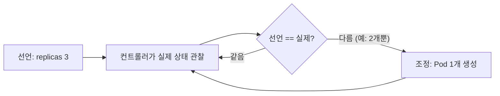

컨테이너/Docker는 그럭저럭 다뤄봤지만 Kubernetes는 제대로 공부해본 적이 없어서, 개념부터 순서대로 정리해보기로 했다. 첫 편은 가장 기본적인 질문부터 — Docker만으로는 왜 부족하고, K8s가 정확히 어떤 문제를 풀어주는가.

## TL;DR

- Docker는 "컨테이너 하나를 어떻게 실행할지"는 잘 풀었지만, "여러 개를 여러 서버에 걸쳐 장애 나면 알아서 복구되게 운영하는 것"(오케스트레이션)은 안 풀어준다
- K8s의 핵심은 명령형이 아니라 **선언형** — "3개 띄워"가 아니라 "3개 있어야 한다"만 선언
- 컨트롤러가 관찰(Watch) → 조정(Reconcile) 루프를 끊임없이 돌면서 선언된 상태와 실제 상태를 맞춘다
- 이 루프 덕분에 컨테이너가 죽어도 자동 복구되고, 스케일링도 숫자 하나만 바꾸면 된다

<br/>

## 1. Docker만 쓰던 시절의 문제

Docker로 컨테이너 하나씩 띄우는 건 할 줄 아는데, 그게 수십~수백 개가 되고 서버도 여러 대가 되면 상황이 달라진다.

- 서버 1대에 컨테이너를 몇 개 띄웠는데 트래픽이 늘어서 서버를 3대로 늘려야 한다 → 어느 서버에 어떤 컨테이너를 배치할지 사람이 직접 정해야 함
- 컨테이너 하나가 죽었다 → `docker restart`를 누군가 수동으로 눌러야 알아챔 (또는 눈치도 못 챔)
- 새 버전을 배포해야 한다 → 컨테이너를 하나씩 내리고 새로 띄우는 동안 서비스가 잠깐 끊김
- 트래픽이 늘어서 컨테이너를 2개에서 5개로 늘려야 한다 → 수동으로 `docker run`을 3번 더 실행하고, 로드밸런서 설정도 손으로 고쳐야 함

즉, "몇 개를, 여러 서버에, 장애 나면 알아서 복구되게" 운영하는 문제(오케스트레이션)를 자동화해줄 뭔가가 필요했다.

## 2. 핵심 아이디어 — 선언하면 알아서 맞춰준다

**핵심 한 줄 요약:** "지금 이 상태여야 한다"고 선언만 하면, K8s가 실제 상태를 그 선언대로 계속 맞춰준다.

1. **선언(Desired State):** "이 컨테이너를 3개 띄워줘"라고 YAML로 선언만 함 (어느 서버에 띄울지는 안 정함)
2. **관찰(Watch):** K8s 컨트롤러가 실제 상태를 계속 지켜봄 ("지금 2개만 떠있네")
3. **조정(Reconcile):** 선언과 실제 상태가 다르면 자동으로 맞춤 ("1개 더 띄워야겠다")
4. **반복:** 이 관찰-조정 루프가 끊임없이 돌면서, 컨테이너가 죽으면 즉시 다시 띄우고, 서버가 다운되면 다른 서버로 옮김

이 "선언하면 알아서 유지해준다"는 방식을 **선언적(declarative)** 방식이라 부르고, K8s의 핵심 철학이다.



이 루프는 멈추지 않고 계속 돈다 — 그래서 Pod가 죽는 순간 바로 다음 관찰 사이클에서 감지되고 복구된다.

## 3. 비유 — 레스토랑 매니저

| 상황 | 비유 |
|---|---|
| Docker 단독 운영 | 사장이 직접 홀에 서서, 손님이 늘면 직접 테이블 세팅하고 부족하면 직접 뛰어다님 |
| K8s | "홀에 웨이터가 항상 3명 있어야 해"라고 매니저에게 선언만 해두면, 웨이터 한 명이 아프면 매니저가 알아서 다른 사람 투입 |
| 컨테이너가 죽음 | 웨이터가 갑자기 퇴근함 → 매니저(K8s)가 즉시 눈치채고 대체 인력 투입 |
| 서버 여러 대 | 매장이 여러 지점으로 늘어남 → 어느 지점에 몇 명 배치할지도 매니저가 자동으로 판단 |

사장이 매번 "지금 몇 명 있지? 부족하네, 한 명 더 불러야지"를 직접 계산 안 해도 되는 게 핵심이다.

## 4. 실제로 이렇게 쓴다

```bash
# --- Docker 단독 (명령형: 매번 사람이 지시) ---
docker run -d --name web1 nginx   # 컨테이너 1개 실행
docker run -d --name web2 nginx   # 늘리려면 또 실행
# web1이 죽으면? → 아무도 안 알려줌, 사람이 직접 docker ps로 확인 후 재실행해야 함
```

```yaml
# --- K8s (선언형: "이 상태여야 한다"만 적음) ---
apiVersion: apps/v1
kind: Deployment
metadata:
  name: web
spec:
  replicas: 3          # "항상 3개 떠있어야 한다"고 선언
  selector:
    matchLabels:
      app: web
  template:
    spec:
      containers:
      - name: nginx
        image: nginx    # 어떤 컨테이너 이미지를 쓸지
```

```bash
kubectl apply -f web-deployment.yaml
# K8s가 이 선언을 받아서:
#   - 지금 0개 떠있음 → 3개 만들어야겠다 → 3개 생성
#   - 나중에 1개가 죽으면 → 2개뿐이네 → 자동으로 1개 재생성 (사람 개입 없음)
```

## 지금 상태 / 다음에 할 일

1강은 여기까지. 자가 치유(Self-healing), 손쉬운 스케일링, 무중단 배포가 전부 이 "선언 + reconcile 루프" 위에서 돌아간다는 걸 알았으니, 다음 편은 K8s가 실제로 다루는 가장 작은 단위인 **Pod** — "컨테이너 = Pod"가 아니라는 흔한 오해부터 풀어본다.
