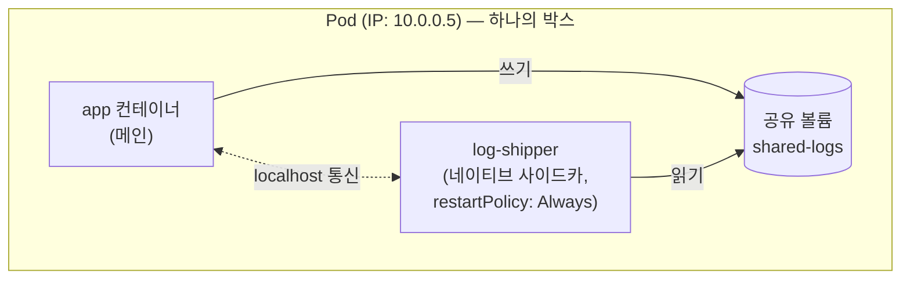

[지난 편]()에서 K8s가 "선언 + reconcile 루프"로 상태를 유지한다는 걸 봤다. 그런데 그 루프가 실제로 관리하는 최소 단위가 뭔지 짚고 넘어가야 한다 — 놀랍게도 컨테이너가 아니라 **Pod**다.

## TL;DR

- Pod는 "컨테이너 1개"가 아니라 "컨테이너 1개 이상을 담는 포장 박스"다
- 같은 Pod 안 컨테이너들은 같은 IP를 쓰고 `localhost`로 통신하며, 볼륨도 공유한다
- Pod가 죽으면 안의 컨테이너 전부가 같이 죽고, 재활용이 아니라 완전히 새로 교체된다
- K8s 1.29부터는 사이드카 컨테이너를 `initContainers` + `restartPolicy: Always`로 명시적으로 선언하는 네이티브 방식이 생겼고, 1.33에서 stable GA 됐다

<br/>

## 1. 컨테이너를 K8s가 하나씩 직접 다룬다면

- 메인 앱 컨테이너 + 로그를 수집해서 전송하는 컨테이너가 항상 같이 떠있어야 하는데, 컨테이너 단위로만 관리하면 "이 둘은 세트"라는 걸 표현할 방법이 없다
- 이 두 컨테이너가 서로 통신하려면 매번 네트워크 주소를 찾고 연결해야 한다 — 같은 서버에 떠있어도 남남처럼 다뤄짐
- 둘 중 하나가 다른 서버로 옮겨지고 하나는 그대로 있으면 → 세트로 동작해야 하는 애들이 흩어진다
- 파일을 공유해야 하는 경우(메인 앱이 로그 파일 쓰고, 사이드카가 그 파일 읽어서 전송) → 컨테이너 간 공유 저장공간을 매번 따로 설정해야 한다

"항상 붙어 다니고, 서로 쉽게 통신하고, 같이 뜨고 같이 죽어야 하는 컨테이너 묶음"을 표현할 최소 단위가 필요했고, 그게 Pod다.

## 2. 핵심 아이디어

**핵심 한 줄 요약:** Pod는 "같은 네트워크·저장공간을 공유하며 항상 함께 배포되는 컨테이너 묶음"이다.

1. **그룹화:** Pod 하나에 컨테이너 1개 이상을 넣을 수 있음 (대부분은 1개, 필요할 때만 사이드카 추가)
2. **네트워크 공유:** 같은 Pod 안 컨테이너들은 같은 IP 주소를 쓰고, `localhost`로 서로 바로 통신 가능
3. **저장공간 공유:** Pod에 볼륨을 붙이면, 그 안의 모든 컨테이너가 같은 파일을 읽고 쓸 수 있음
4. **생명주기 공유:** Pod 안 컨테이너들은 항상 같이 스케줄링되고, Pod가 죽으면 안의 컨테이너도 전부 같이 죽음
5. **일회성:** Pod는 죽으면 (재활용이 아니라) 완전히 새로 교체됨 — 그래서 Pod를 직접 관리하지 않고 Deployment가 대신 관리해준다 (다음 편)



박스(Pod) 밖에서 보면 IP 하나로만 보이고, 그 안에 컨테이너 2개가 네트워크와 볼륨을 공유하며 함께 산다.

## 3. 비유 — 택배 박스

| 상황 | 비유 |
|---|---|
| 컨테이너 여러 개 | 물건 여러 개 (메인 앱, 로그 수집기) |
| Pod | 그 물건들을 담는 하나의 택배 박스 |
| 같은 Pod = 같은 IP | 박스 안 물건들은 같은 송장 주소를 공유 |
| 볼륨 공유 | 박스 안에 다 같이 쓰는 메모지 한 장을 넣어둠 |
| Pod가 죽으면 전부 같이 죽음 | 박스가 파손되면 안의 물건도 전부 폐기 (개별 물건만 못 빼냄) |

## 4. 실제로 이렇게 쓴다

```yaml
# 가장 흔한 형태 — 컨테이너 1개짜리 Pod
apiVersion: v1
kind: Pod
metadata:
  name: my-app
spec:
  containers:
  - name: app
    image: my-app:1.0
    ports:
    - containerPort: 8080
```

```yaml
# 사이드카 패턴 — K8s 1.29+ 네이티브 사이드카 방식 (1.33에서 stable GA)
# initContainers에 restartPolicy: Always를 주면 "사이드카"로 인식됨
apiVersion: v1
kind: Pod
metadata:
  name: my-app-with-sidecar
spec:
  containers:
  - name: app                      # 메인 컨테이너
    image: my-app:1.0
    volumeMounts:
    - name: shared-logs
      mountPath: /var/log/app      # 여기에 로그를 씀

  initContainers:
  - name: log-shipper               # 사이드카 — initContainers 자리에 선언
    image: log-shipper:1.0
    restartPolicy: Always           # 이 필드가 있어야 "사이드카"로 취급됨
                                     # (app보다 먼저 뜨고, app이 끝나야 같이 종료됨 — 순서 보장)
    volumeMounts:
    - name: shared-logs
      mountPath: /var/log/app      # 같은 파일을 읽어서 외부로 전송

  volumes:
  - name: shared-logs
    emptyDir: {}                    # 두 컨테이너가 공유하는 임시 저장공간
```

> 예전에는(1.29 이전) 사이드카도 그냥 `containers` 배열에 나란히 넣었다. 지금도 동작은 하지만, `initContainers` + `restartPolicy: Always` 방식이 "이건 사이드카다"를 K8s에 명시적으로 알려줘서 시작/종료 순서까지 보장해준다. 공식 문서: [Sidecar Containers](https://kubernetes.io/docs/concepts/workloads/pods/sidecar-containers/)

```bash
kubectl get pods
# NAME                     READY   STATUS    RESTARTS   AGE
# my-app-with-sidecar      2/2     Running   0          5m
#                          ^-- 컨테이너 2개(app + 사이드카)가 한 Pod 안에서 함께 Running
```

## 지금 상태 / 다음에 할 일

Pod가 "컨테이너 묶음 + 공유 네트워크/스토리지"라는 걸 정리했다. 근데 Pod는 죽으면 완전히 새로 교체되는 일회성 자원이라고 했는데, 그럼 "항상 3개 떠있어야 한다"는 건 누가 지켜주는 걸까 — 다음 편은 **Deployment & ReplicaSet**.
