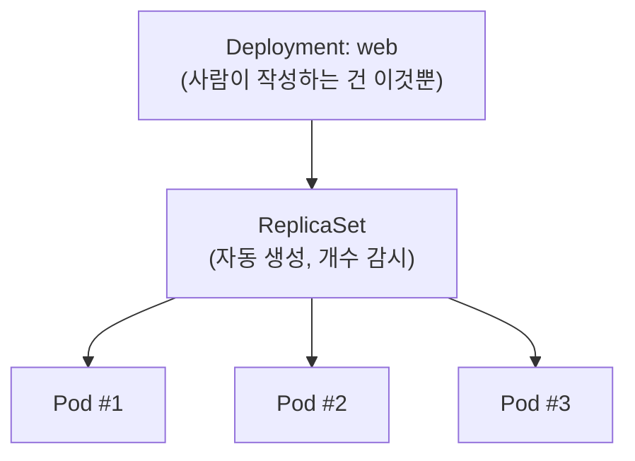
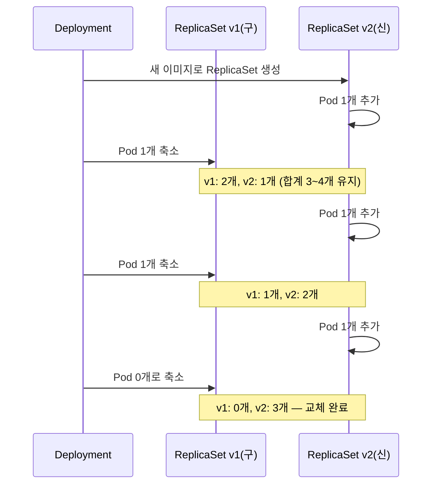

[지난 편]()에서 Pod는 죽으면 재활용이 아니라 완전히 새로 교체되는 일회성 자원이라고 정리했다. 그럼 "항상 3개 떠있어야 한다"는 걸 누가 지켜주고, 새 버전 배포는 어떻게 무중단으로 되는 걸까 — 이번 편은 Deployment와 ReplicaSet.

## TL;DR

- ReplicaSet은 "Pod가 항상 정해진 개수만큼 떠있게 지키는 감시자"
- Deployment는 그 위에서 "무중단으로 버전을 교체하는 절차"까지 관리하는 상위 개념
- 실제로 배포 시엔 기존 ReplicaSet의 Pod를 하나씩 줄이고 새 ReplicaSet의 Pod를 하나씩 늘리는 롤링 업데이트가 일어남
- 그래서 실무에서는 Pod도 ReplicaSet도 직접 안 만들고 거의 항상 Deployment만 작성한다

<br/>

## 1. Pod를 사람이 직접 만들면 생기는 문제

- Pod 하나를 직접 만들었는데 죽었다 → 아무도 다시 안 만들어줌. 사람이 알아채고 다시 apply 해야 함
- "항상 3개 떠있어야 한다" → Pod 3개를 각각 이름 다르게 만들고, 하나 죽으면 몇 개 남았는지 사람이 세어야 함
- 새 버전을 배포해야 한다 → 기존 Pod 3개를 다 지우고 새 Pod 3개를 만들면, 그 사이에 서비스가 완전히 끊김
- 배포했는데 새 버전에 버그가 있다 → 예전 버전으로 되돌리려면 예전 설정을 어디서 다시 찾아와야 함

## 2. 핵심 아이디어

**핵심 한 줄 요약:** ReplicaSet은 "Pod 개수 유지"만 담당하고, Deployment는 그 위에서 "무중단으로 버전을 교체하는 절차"까지 관리한다.

1. **ReplicaSet (개수 담당):** "이 Pod 스펙으로 3개가 항상 떠있어야 한다"만 지킴 — 지난 편의 관찰-조정 루프가 여기서 실제로 돎
2. **Deployment (버전 관리 담당):** ReplicaSet을 직접 만드는 대신, Deployment가 ReplicaSet을 만들고 감독함
3. **롤링 업데이트:** 새 버전 배포 시, 기존 ReplicaSet(v1)의 Pod를 하나씩 줄이면서 새 ReplicaSet(v2)의 Pod를 하나씩 늘림 → 항상 최소 개수는 떠있어서 무중단
4. **리비전 기록:** Deployment는 과거 ReplicaSet들을 기록으로 남겨둠 → 문제 생기면 `kubectl rollout undo`로 즉시 되돌릴 수 있음
5. **실무 규칙:** 그래서 실제로는 Pod도, ReplicaSet도 사람이 직접 안 만들고 거의 항상 Deployment만 작성함





## 3. 비유 — 공장 생산 라인 교대

| 상황 | 비유 |
|---|---|
| ReplicaSet | "이 라인엔 항상 인원 3명이 있어야 한다"를 지키는 현장 반장 |
| Pod가 죽음(직원 결근) | 반장이 즉시 눈치채고 대체 인력 투입 |
| Deployment | 반장에게 "구버전 매뉴얼로 일하던 사람을 신버전 매뉴얼로 한 명씩 순서대로 교체해"라고 지시하는 공장장 |
| 롤링 업데이트 | 3명 전원을 한꺼번에 신버전 교육 보내지 않고, 1명씩 교체 투입 → 라인이 절대 멈추지 않음 |
| 롤백 | 신버전 매뉴얼에 문제 있으면 "다시 구버전 매뉴얼로 되돌려"라고 공장장이 즉시 지시 |

## 4. 실제로 이렇게 쓴다

```yaml
# 사람이 실제로 작성하는 건 Deployment 하나뿐
apiVersion: apps/v1
kind: Deployment
metadata:
  name: web
spec:
  replicas: 3
  strategy:
    type: RollingUpdate
    rollingUpdate:
      maxUnavailable: 1   # 한 번에 최대 1개까지만 내림 (명시적 지정값 — 기본값은 25%)
      maxSurge: 1         # 한 번에 최대 1개까지만 추가로 띄움 (명시적 지정값 — 기본값은 25%)
  selector:
    matchLabels:
      app: web
  template:
    metadata:
      labels:
        app: web
    spec:
      containers:
      - name: nginx
        image: nginx:1.25   # 여기 버전을 바꾸면 롤링 업데이트 트리거
```

```bash
# 이미지 버전만 바꿔서 재적용 → 새 ReplicaSet 자동 생성
kubectl set image deployment/web nginx=nginx:1.26

# 진행 상황 확인 — 하나씩 교체되는 게 보임
kubectl rollout status deployment/web

# 문제 생기면 즉시 되돌리기
kubectl rollout undo deployment/web
```

## 지금 상태 / 다음에 할 일

Deployment가 ReplicaSet을 감독하고, ReplicaSet이 Pod 개수를 지킨다는 계층 구조를 정리했다. 근데 Pod는 죽으면 IP가 바뀌는데, 다른 서비스가 이 Pod를 어떻게 계속 찾아가는지가 남았다 — 다음 편은 **Service**.
