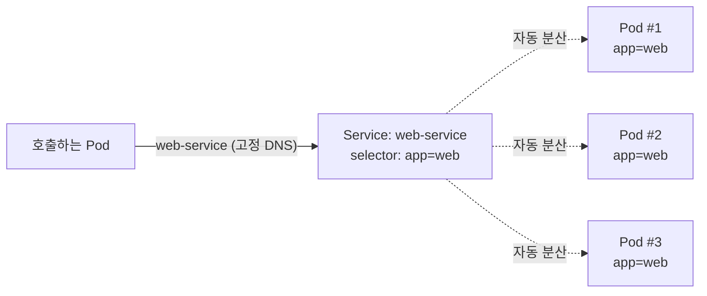

[지난 편]()에서 롤링 업데이트 중에 Pod가 계속 죽고 새로 생긴다는 걸 봤다. 근데 Pod가 재생성될 때마다 IP가 바뀌는데, 그럼 다른 Pod가 얘를 어떻게 계속 찾아가는 걸까 — 이번 편은 [Service](https://kubernetes.io/docs/concepts/services-networking/service/).

## TL;DR

- Service는 "Pod들 앞에 붙는 변하지 않는 대표 주소"
- IP가 아니라 라벨(Label)로 대상 Pod를 지정해서, Pod가 몇 개든 IP가 뭐든 자동으로 대상에 포함시킴
- Service가 생성되면 절대 안 바뀌는 가상 IP와 DNS 이름이 부여되고, 살아있는 Pod들에게 요청을 자동 분산함
- Pod가 죽고 새로 생겨도 Service는 라벨만 보고 대상 목록을 실시간 갱신 — 호출하는 쪽은 아무것도 몰라도 됨

<br/>

## 1. Pod의 IP를 직접 쓴다면

- Pod A가 Pod B(IP: 10.0.0.5)를 직접 호출하도록 하드코딩 → B가 재배포되면서 IP가 10.0.0.9로 바뀜 → A는 계속 옛날 IP로 요청을 보내다 실패함
- B가 3개 복제되어 떠있음(지난 편의 ReplicaSet) → A는 3개 중 어떤 IP로 보내야 할지, 그중 하나가 죽으면 어떻게 알고 다른 걸로 바꿔야 할지 스스로 처리해야 함
- 롤링 업데이트 중 → 옛 버전 Pod들이 사라지고 새 버전 Pod들이 생기는 그 순간, IP 목록이 계속 바뀜 → 호출하는 쪽이 그 변화를 실시간으로 추적해야 함

## 2. 핵심 아이디어

**핵심 한 줄 요약:** Service는 라벨로 Pod 그룹을 지정해두고, 그 그룹 안에서 살아있는 Pod에게 요청을 자동으로 분산시켜주는 고정 주소다.

1. **[라벨 셀렉터](https://kubernetes.io/docs/concepts/overview/working-with-objects/labels/):** Service는 IP가 아니라 `app: web` 같은 라벨로 대상 Pod를 지정함 — Pod가 몇 개든, IP가 뭐든 라벨만 맞으면 자동으로 대상에 포함
2. **고정 주소 발급:** Service가 생성되면 절대 안 바뀌는 가상 IP(ClusterIP)와 [DNS 이름](https://kubernetes.io/docs/concepts/services-networking/dns-pod-service/)이 부여됨
3. **자동 로드밸런싱:** 요청이 오면 현재 라벨이 일치하는 Pod들 중 정상 동작 중인 것에게 랜덤/순환 방식으로 분산
4. **자동 갱신:** Pod가 죽고 새로 생겨도 Service는 라벨만 보고 대상 목록을 실시간으로 갱신
5. **노출 범위 선택:** 클러스터 내부용(ClusterIP), 노드 포트로 외부 접근(NodePort), 클라우드 로드밸런서 연결(LoadBalancer) 등 용도별로 타입 선택



Pod #2가 죽고 새 IP로 재생성돼도, 호출하는 쪽이 보는 건 여전히 `web-service` 하나뿐이다.

## 3. 비유 — 대표 전화번호(콜센터)

| 상황 | 비유 |
|---|---|
| Pod의 개별 IP | 상담원 개개인의 직통 번호 (계속 바뀜 — 퇴사/입사) |
| Service | "1588-XXXX" 같은 대표 전화번호 (절대 안 바뀜) |
| 라벨 셀렉터 | "상담팀 소속"이라는 조건 — 그 조건에 맞는 사람이면 누구든 응대 대상 |
| 로드밸런싱 | 전화하면 지금 비어있는 상담원에게 자동 연결 |
| Pod 재배포(직원 교체) | 상담원이 바뀌어도 대표번호는 그대로라 발신자는 전혀 신경 안 씀 |

## 4. 실제로 이렇게 쓴다

```yaml
# 지난 편 Deployment로 Pod 3개가 떠있다고 가정 — 라벨: app=web
apiVersion: apps/v1
kind: Deployment
metadata:
  name: web
spec:
  replicas: 3
  selector:
    matchLabels:
      app: web
  template:
    metadata:
      labels:
        app: web        # <- 이 라벨이 핵심
    spec:
      containers:
      - name: nginx
        image: nginx:1.25
        ports:
        - containerPort: 80
```

```yaml
# Service가 같은 라벨(app: web)을 가진 Pod들을 자동으로 대상에 포함
apiVersion: v1
kind: Service
metadata:
  name: web-service
spec:
  selector:
    app: web             # 이 라벨과 일치하는 Pod만 찾아서 연결
  ports:
  - port: 80
    targetPort: 80
  type: ClusterIP          # 클러스터 내부에서만 접근 가능한 고정 IP
```

```bash
# 다른 Pod에서는 IP 대신 이 이름으로 호출
curl http://web-service        # DNS 이름 하나로 끝 — IP 몰라도 됨

kubectl get endpoints web-service
# NAME           ENDPOINTS
# web-service    10.0.0.5:80,10.0.0.9:80,10.0.0.12:80
#                ^-- 지금 살아있는 Pod IP 3개가 자동으로 연결됨 (Pod 바뀌면 이 목록도 자동 갱신)

# 참고: Endpoints는 공식 문서상 EndpointSlice로 대체되는 추세.
# 최신 클러스터에서는 아래 명령이 실무 표준:
# kubectl get endpointslices -l kubernetes.io/service-name=web-service
```

> 공식 문서: [EndpointSlice](https://kubernetes.io/docs/concepts/services-networking/endpoint-slices/)

## 지금 상태 / 다음에 할 일

Service가 라벨 기반으로 Pod의 생명주기와 호출자를 분리해준다는 걸 정리했다. 다음 편은 **ConfigMap & Secret** — 설정값이나 비밀번호를 컨테이너 이미지 안에 박아넣지 않고 어떻게 외부에서 주입하는지.
