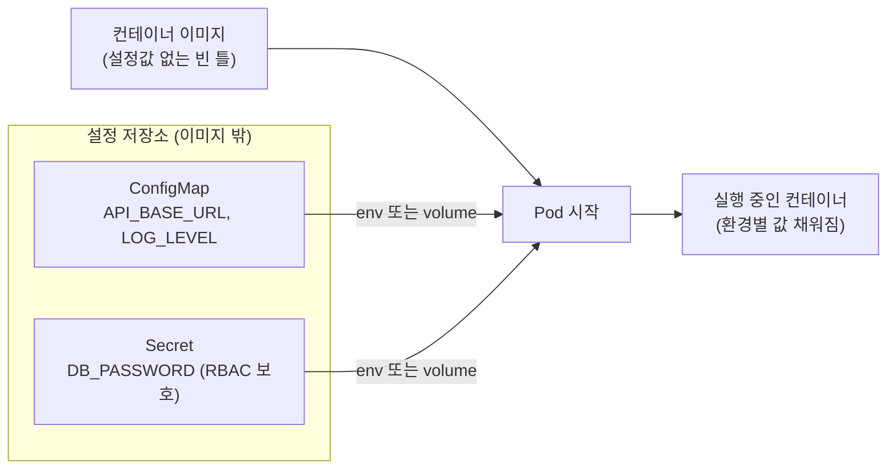

[지난 편]()까지 Pod/Deployment/Service를 정리했다. 이번 편은 조금 다른 결 — 설정값과 비밀번호를 컨테이너 이미지 안에 박아넣지 않고 어떻게 외부에서 주입하는지, ConfigMap과 Secret.

## TL;DR

- ConfigMap은 이미지 밖에 따로 보관하는 설정값 보관함, Secret은 그중 민감한 값을 다루는 금고
- 컨테이너가 시작될 때 K8s가 환경변수나 파일로 값을 주입해준다 — 이미지 자체는 값이 없는 "빈 틀"
- 같은 이미지를 dev/staging/prod에 그대로 배포하고, 환경별로 ConfigMap/Secret만 다르게 연결
- Secret은 base64 인코딩일 뿐 암호화가 아니다 — RBAC와 별도의 저장소 암호화 설정이 필요

<br/>

## 1. 설정값을 이미지 안에 박아두면

- 환경별(dev/staging/prod)로 DB 주소가 다름 → 환경마다 설정값이 다르게 박힌 이미지를 각각 따로 빌드해야 함 → "같은 이미지를 모든 환경에 배포한다"는 원칙이 깨짐
- 설정값 하나만 바꾸고 싶어도 → 이미지를 통째로 다시 빌드하고 재배포해야 함
- 비밀번호나 API 키를 이미지 안에 넣음 → 이미지 레이어에 그대로 남아서 `docker history`로 뽑아낼 수 있음. Dockerfile을 Git에 올리면 커밋 히스토리에 영원히 남음
- 비밀번호를 코드 안에 상수로 박아넣음 → 코드 리뷰어, 레포 접근 권한 있는 모두가 비밀번호를 봄 — 접근 제어 불가능

## 2. 핵심 아이디어

**핵심 한 줄 요약:** 설정값을 K8s 오브젝트로 따로 정의해두고, Pod가 뜰 때 환경변수나 파일로 주입받는다 — 민감한 값은 Secret이라는 별도 오브젝트로 다뤄 접근을 더 엄격히 통제한다.

1. **분리 정의:** 설정값(ConfigMap)이나 민감값(Secret)을 이미지와 별개로 K8s에 등록해둠
2. **참조 방식 선택:** Pod 스펙에서 환경변수로 주입하거나, 파일처럼 볼륨으로 마운트
3. **런타임 주입:** 컨테이너가 시작되는 시점에 K8s가 값을 채워 넣음 — 이미지 자체는 값이 없는 "빈 틀"
4. **환경별 재사용:** 같은 이미지를 dev/staging/prod에 그대로 배포하고, 각 환경에 맞는 ConfigMap/Secret만 다르게 연결
5. **Secret의 추가 보호:** base64로 인코딩되어 저장되고(암호화 아님), RBAC로 "누가 이 Secret을 읽을 수 있는지"를 별도로 제한 가능



같은 이미지가 dev에서는 dev용 ConfigMap/Secret을, prod에서는 prod용을 연결받아 서로 다른 설정으로 동작한다.

## 3. 비유 — 레시피 카드 vs 금고 열쇠

| 상황 | 비유 |
|---|---|
| 컨테이너 이미지 | 요리사(변하지 않는 실력과 도구) |
| ConfigMap | 냉장고에 붙여둔 레시피 카드 (환경별로 다른 카드를 붙이면 같은 요리사가 다른 요리를 함) |
| Secret | 금고 안에 있는 특급 소스 레시피 (아무나 못 보고, 허가된 사람만 열람) |
| 이미지에 설정 하드코딩 | 요리사 몸에 레시피를 문신으로 새김 — 바꾸려면 요리사를 통째로 교체해야 함 |

## 4. 실제로 이렇게 쓴다

```yaml
# ConfigMap — 민감하지 않은 설정값
apiVersion: v1
kind: ConfigMap
metadata:
  name: app-config
data:
  API_BASE_URL: "https://api.staging.example.com"
  LOG_LEVEL: "debug"
```

```yaml
# Secret — 민감한 값 (base64 인코딩해서 저장)
apiVersion: v1
kind: Secret
metadata:
  name: app-secret
type: Opaque
data:
  DB_PASSWORD: cGFzc3dvcmQxMjM=   # echo -n 'password123' | base64
```

```yaml
# Pod에서 둘 다 환경변수로 주입받아 사용
apiVersion: v1
kind: Pod
metadata:
  name: my-app
spec:
  containers:
  - name: app
    image: my-app:1.0            # 이미지 자체엔 설정값이 없음 (재사용 가능한 "빈 틀")
    envFrom:
    - configMapRef:
        name: app-config          # ConfigMap 통째로 환경변수화
    env:
    - name: DB_PASSWORD
      valueFrom:
        secretKeyRef:
          name: app-secret        # Secret은 명시적으로 하나씩 지정 (실수로 전체 노출 방지)
          key: DB_PASSWORD
```

```bash
# 설정값만 바꿀 땐 이미지 재빌드 없이 ConfigMap만 수정 후 재적용
kubectl edit configmap app-config
kubectl rollout restart deployment/my-app   # Pod가 새 값으로 재시작
```

> **실무 팁 (immutable):** 값이 자주 안 바뀌는 ConfigMap/Secret에는 `immutable: true`를 추가할 수 있다(v1.21부터 GA). K8s가 "이 값은 안 바뀐다"고 믿고 watch를 줄여서 API 서버 부하를 낮춘다 — 값을 바꾸려면 새 이름으로 새로 만들고 Pod가 그 새 이름을 참조하도록 갱신해야 함. 공식 문서: [Immutable Secrets and ConfigMaps](https://kubernetes.io/docs/concepts/configuration/secret/#secret-immutable)

## 지금 상태 / 다음에 할 일

Pod → Deployment/ReplicaSet → Service → ConfigMap/Secret까지 K8s의 기본 오브젝트들을 순서대로 정리했다. 다음 편은 **Ingress** — 지금까지는 클러스터 내부(Service)까지만 다뤘는데, 외부 사용자의 요청이 실제로 어떻게 클러스터 안까지 들어오는지.
