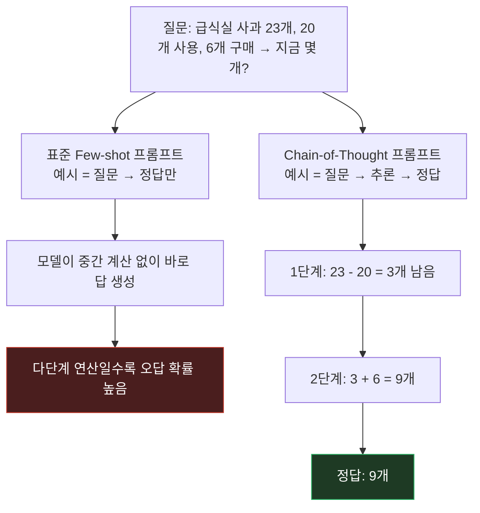

LLM/프롬프팅 관련 논문을 한 편씩 깊게 읽어보는 시리즈를 시작한다. 첫 편은 프롬프트 엔지니어링에서 가장 자주 언급되는 개념인 [**Chain-of-Thought(CoT) Prompting**](https://arxiv.org/abs/2201.11903) — Wei et al., 2022, NeurIPS — 이다.

## 1. 기본적인 이해부터

쉽게 말하면, CoT(Chain-of-Thought) 프롬프팅은 **모델에게 "정답만 말고 풀이 과정도 보여줘"라고 예시로 가르치는 방법**이다. Few-shot 프롬프트에 넣는 예시(exemplar)를 `질문 → 정답` 쌍이 아니라 `질문 → 중간 추론 단계들 → 정답` 형태로 바꾸는 게 전부다. 이 단순한 변화가 대형 모델의 다단계 추론 성능을 크게 끌어올린다.

## 2. 문제점/배경

2022년 당시 GPT-3류 모델은 few-shot 프롬프팅(예시 몇 개 보여주고 패턴 따라하게 하기)으로 번역·분류 같은 태스크는 잘 풀었지만, **산수 문제·상식 추론·기호 조작처럼 여러 단계를 거쳐야 하는 문제**에서는 모델 크기를 키워도 성능이 잘 안 늘었다. 예시를 `Q: 로저는 테니스공 5개가 있다... A: 11`처럼 답만 보여주면, 모델도 중간 계산 없이 바로 답을 뱉으려다 틀리는 패턴이 반복됐다.

## 3. 해결책의 핵심 아이디어

**핵심 한 줄 요약:** 정답 이전에 사람이 문제를 풀 때 쓰는 것 같은 자연어 추론 과정을 예시에 넣어주면, 모델이 추론에 이어 답을 생성하면서 다단계 문제를 스스로 분해해 푼다.

**단계별 설명:**
1. Few-shot 예시를 `Q → A`가 아니라 `Q → (추론 문장들) → A` 형태로 구성
2. 모델이 새 문제를 받으면 이 패턴을 따라 **중간 추론을 먼저 생성**한 뒤 답을 냄
3. 각 추론 스텝이 이전 스텝의 결과를 이어받는 식으로 문제가 작은 조각으로 분해됨
4. 계산량(토큰 단위 "생각할 시간")이 늘어나는 효과가 생겨 복잡한 문제에서 정확도가 오름
5. **모델 스케일이 일정 수준(대략 100B 파라미터 안팎, 논문에서는 PaLM 540B·GPT-3 175B급) 이상일 때만 이 효과가 뚜렷하게 나타남** — 작은 모델에서는 CoT를 넣어도 이득이 거의 없거나 오히려 앞뒤 안 맞는 추론을 생성해 손해를 봄. 저자들은 이를 **emergent ability**라고 부름

## 4. 비유/예시

**신입 개발자에게 코드 리뷰를 부탁하는 상황에 비유하면:**

| CoT 없음 (표준 few-shot) | CoT 있음 |
|---|---|
| "이 PR 승인해도 돼?" → "네" | "이 PR 승인해도 돼?" → "1. 이 함수가 null을 리턴할 수 있는지 봤고 2. 호출부에서 가드하고 있는지 확인했고 3. 테스트가 그 케이스를 커버하네요 → 네, 승인해도 됩니다" |
| 답은 빠르지만 근거가 없어서 틀려도 왜 틀렸는지 모름 | 중간 판단 과정이 드러나서 어디서 틀렸는지 추적 가능, 그리고 과정을 밟다 보니 애초에 덜 틀림 |

CoT는 모델에게 "결론만 말고 근거를 단계별로 대라"고 시키는 것과 같고, 그 근거를 만드는 과정 자체가 정답률을 올린다.

## 5. 실제 동작 과정

```text
[표준 Few-shot 프롬프트]
Q: 로저는 테니스공 5개를 갖고 있다. 캔 2개를 더 샀고, 캔마다 공이 3개씩 들어있다.
   로저는 지금 테니스공을 몇 개 갖고 있나?
A: 11

Q: 급식실에 사과가 23개 있었다. 20개를 요리에 쓰고 6개를 더 샀다.
   지금 사과는 몇 개인가?
A: [모델이 바로 답을 생성 → 다단계 연산에서 오답 확률 높음]


[Chain-of-Thought 프롬프트]
Q: 로저는 테니스공 5개를 갖고 있다. 캔 2개를 더 샀고, 캔마다 공이 3개씩 들어있다.
   로저는 지금 테니스공을 몇 개 갖고 있나?
A: 로저는 처음에 공 5개가 있었다. 캔 2개 × 공 3개 = 6개를 더 샀다.
   5 + 6 = 11. 답은 11개다.

Q: 급식실에 사과가 23개 있었다. 20개를 요리에 쓰고 6개를 더 샀다.
   지금 사과는 몇 개인가?
A: [모델이 "23개에서 20개를 써서 3개가 남았다. 6개를 더 사서 3+6=9개다"
   같은 중간 단계를 먼저 생성한 뒤 답에 도달 → 정답률 대폭 상승]
```

논문은 이 효과를 GSM8K(초등 수준 서술형 산수), SVAMP·ASDiv·AQuA(산수), CommonsenseQA·StrategyQA(상식), last-letter-concatenation·coin-flip(기호 조작) 등 여러 벤치마크에서 확인했고, PaLM 540B + CoT가 당시 fine-tuned 모델의 기존 SOTA를 뛰어넘는 결과를 GSM8K에서 보였다.

> 위 구체 수치는 이 글에서 의도적으로 뭉뚱그렸다 — 정확한 인용이 필요하면 원문 표와 대조할 것.

흥미로운 ablation도 있었는데, "추론 없이 수식만 보여주기"나 "정답 뒤에 추론 넣기" 같은 변형은 CoT만큼 효과가 없었다. 즉 이득은 단순히 "관련 텍스트가 더 있어서"가 아니라 **정답 전에 순차적으로 계산이 일어나는 구조** 자체에서 나온다는 뜻이다.

## 그림으로 보기



왼쪽 가지(표준 프롬프트)는 계산을 한 번에 건너뛰고, 오른쪽 가지(CoT)는 중간 단계를 거쳐서 답에 도달한다 — 이 "거쳐가는 단계"가 정확도를 올리는 핵심.

## 6. 결과/장점

- **파인튜닝 없이 성능 향상**: 모델 가중치를 하나도 안 건드리고 프롬프트만 바꿔서 다단계 추론 정확도를 크게 올림 — 이게 이 논문이 임팩트가 컸던 이유
- **해석 가능성**: 모델이 왜 그 답을 냈는지 추론 과정이 텍스트로 남아서, 어디서 틀렸는지 사후 분석이 쉬워짐
- **후속 연구의 출발점**: 다음 편에서 다룰 Self-Consistency(같은 질문에 CoT를 여러 번 샘플링해서 다수결로 답 결정)와 Tree of Thoughts(추론을 트리로 확장해 백트래킹·탐색까지 허용)가 전부 이 논문의 "추론 경로를 명시적으로 생성한다"는 아이디어 위에 세워짐

## 실무 적용 아이디어

캐릭터 기반 대화형 서비스라면, 답변을 생성하기 전에 "상황 판단 → 톤 결정" 같은 내부 추론 단계를 프롬프트에 넣어두고 사용자에게는 최종 답변만 노출하는 구조(hidden scratchpad)에 CoT를 응용해볼 수 있다. 다만 이 논문의 결론(효과가 모델 스케일에 크게 의존한다)을 감안하면, 작은/저가 모델에 무리하게 CoT를 걸면 오히려 장황하고 부정확한 응답이 나올 수 있어 실측이 필요하다.

---

다음 편은 CoT의 "한 번 풀이"를 "여러 번 풀고 다수결"로 바꾸는 **Self-Consistency (Wang et al., 2022)**.
