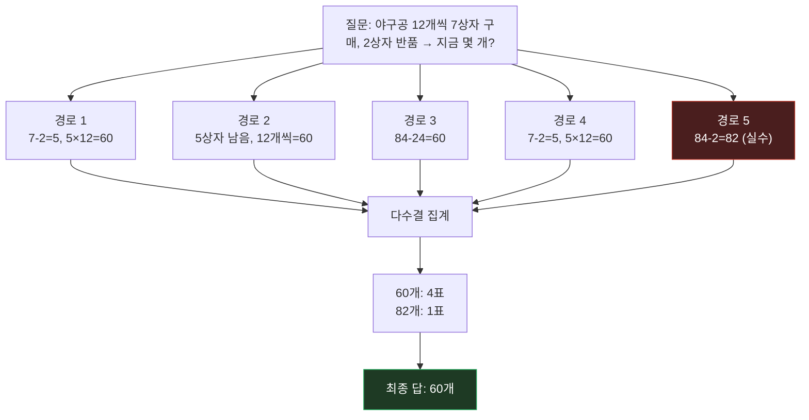

시리즈 두 번째 편. 지난 편에서 다룬 [Chain-of-Thought Prompting]()이 만든 "하나의 추론 경로"를 여러 개로 늘리고 다수결을 취하는 논문, **Self-Consistency Improves Chain of Thought Reasoning** (Wang et al., 2022)이다.

## 1. 기본적인 이해부터

쉽게 말하면, Self-Consistency는 **"같은 문제를 여러 번 다르게 풀어보고 가장 많이 나온 답을 채택하는" 방법**이다. CoT로 추론 경로 하나를 생성하는 대신, 같은 프롬프트에서 추론 경로를 여러 개 샘플링한 뒤 최종 답들을 모아 **다수결 투표**로 정답을 정한다.

## 2. 문제점/배경

CoT는 모델이 추론 과정을 생성하게 만들어서 정확도를 올렸지만, 어디까지나 **한 번의 시도**였다. LLM은 같은 질문에 온도(temperature)를 조금만 줘도 매번 다른 추론 경로를 생성할 수 있는데, 그중에는 중간에 계산 실수를 하거나 엉뚱한 방향으로 새는 경로도 섞여 있다. CoT 단독으로는 "이번에 생성한 그 경로가 하필 실수한 경로"였을 때 그냥 틀린 답을 그대로 받아들이는 수밖에 없었다. 사람도 어려운 문제를 한 번의 풀이로 끝내기보다 다른 방식으로 다시 풀어서 답이 같은지 검산하는데, 그 검산 과정이 빠져 있었던 것.

## 3. 해결책의 핵심 아이디어

**핵심 한 줄 요약:** 하나의 정답에 이르는 길은 여러 개 있을 수 있으니, 다양한 추론 경로를 여러 번 샘플링해서 가장 많이 도달한 답을 고르면 개별 경로의 실수가 상쇄된다.

**단계별 설명:**
1. 같은 CoT 프롬프트를 모델에 넣되, greedy decoding(항상 제일 그럴듯한 다음 토큰만 고르는 방식) 대신 **temperature/top-k 샘플링**으로 여러 번(논문에서는 보통 수십 개) 추론 경로를 생성
2. 각 경로는 서로 다른 방식으로 문제에 접근하거나, 같은 접근이어도 중간 표현이 조금씩 다름
3. 각 경로 끝에서 나온 **최종 답만 추출**해서 모으고, 추론 과정 자체는 버림
4. 모인 답들 중 **가장 많이 나온 답(다수결)**을 최종 답으로 채택
5. 정답으로 가는 경로는 여러 갈래가 있어도 대개 같은 답에 수렴하는 반면, 오답 경로는 실수 지점이 제각각이라 답이 흩어지는 경향이 있어서 다수결이 잘 먹힘

## 4. 비유/예시

**같은 목적지를 두고 여러 사람에게 길을 물어보는 상황에 비유하면:**

| CoT만 사용 | Self-Consistency |
|---|---|
| 지나가는 사람 1명에게 길을 묻고 그대로 감 | 지나가는 사람 10명에게 각자 길을 묻고, 그 중 가장 많이 알려준 방향으로 감 |
| 그 사람이 잘못 알고 있으면 그대로 헤맴 | 몇 명이 헷갈려도 다수가 맞는 방향을 알고 있으면 정답 방향으로 수렴 |
| 빠르지만 리스크가 그 한 사람에게 전부 걸림 | 물어보는 데 시간(=계산 비용)이 더 들지만 훨씬 안정적 |

CoT가 "한 번 제대로 생각해보기"라면, Self-Consistency는 "여러 번 생각해보고 다수결로 검산하기"다.

## 5. 실제 동작 과정

```text
[프롬프트는 CoT와 동일 — few-shot 예시 + 새 질문]
Q: 한 상자에 야구공이 12개씩 들어있다. 상자 7개를 샀는데
   그 중 2상자는 반품했다. 지금 야구공은 몇 개인가?

[Temperature 샘플링으로 5개의 추론 경로 생성]
경로 1: "상자 7개 - 반품 2개 = 5상자. 5 × 12 = 60개" → 답: 60
경로 2: "7상자 중 2상자 반품이니 5상자 남음. 12개씩이니 60개" → 답: 60
경로 3: "12개씩 7상자 = 84개. 반품 2상자 = 24개.
         84 - 24 = 60개" → 답: 60
경로 4: "7 - 2 = 5, 5 × 12 = 60개" → 답: 60
경로 5: "12 × 7 = 84개에서 2개를 뺀다" (반품 단위 착각) → 답: 82

[최종 답 집계]
60개: 4표, 82개: 1표
→ 다수결로 "60개"를 최종 답으로 채택 (경로 5의 실수가 걸러짐)
```

논문은 이 방식으로 GSM8K, SVAMP 같은 산수 벤치마크와 CommonsenseQA, StrategyQA 같은 상식 벤치마크에서 CoT 단독 대비 추가적인 정확도 향상을 보였고, greedy decoding 하나만 쓰는 CoT보다 일관되게 나은 결과를 냈다. 다만 대가도 있는데, **경로를 N개 샘플링하면 추론 비용도 N배** 들어서 지연시간·비용이 그만큼 늘어난다.

> 정확한 정확도 수치·샘플 개수(N) 기본값은 이 글에서 뭉뚱그렸다 — 원문 표 대조가 필요하면 논문을 직접 참고할 것.

## 그림으로 보기



5개 경로 중 4개가 서로 다른 계산 방식으로도 같은 답(60)에 수렴하고, 실수한 경로 5(82) 하나는 다수결에서 자연스럽게 걸러진다.

## 6. 결과/장점

- **정확도 향상**: 단일 CoT 경로의 우연한 실수를 다수결로 상쇄해 여러 추론 벤치마크에서 추가 성능 개선
- **모델 재학습 불필요**: CoT와 마찬가지로 파인튜닝 없이 디코딩 방식(샘플링 + 집계)만 바꿔서 얻는 이득
- **추론 비용 트레이드오프**: 정확도를 돈(계산량)으로 사는 구조라, 지연시간에 민감한 서비스에서는 N을 얼마나 둘지 조율이 필요

## 실무 적용 아이디어

여러 응답 후보를 동시에 생성해 두고, 특정 기준(예: 원치 않는 언어/문자가 섞였는지, 서비스 정책을 위반하는 형식인지)으로 후보를 걸러낸 뒤 남은 것 중 채택하는 방식은, 순차적으로 한 번씩만 재시도하는 구조보다 "모든 시도가 동시에 실패"할 확률을 낮출 수 있다. 다만 후보 수만큼 비용이 늘어나는 트레이드오프가 있어서, 실시간 응답보다는 지연에 조금 관대한 백그라운드 판정 작업에 먼저 적용해볼 만하다.

---

다음 편은 "여러 경로 다수결"을 "탐색 가능한 트리"로 확장한 **Tree of Thoughts (Yao et al., 2023)**.
