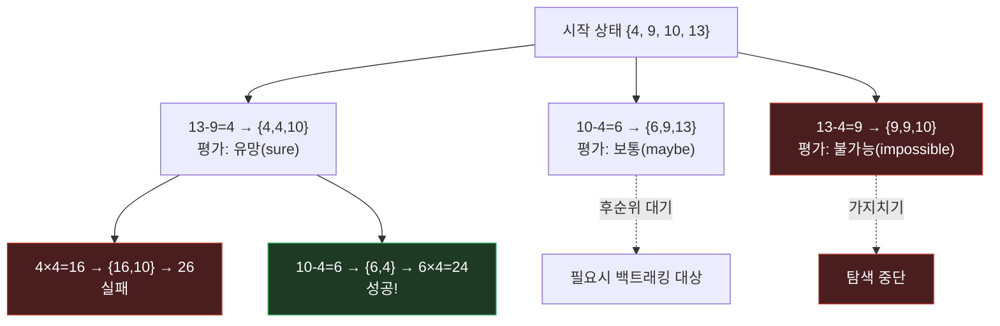

시리즈 세 번째 편이자 "프롬프팅 기법" 트랙의 마지막 편. [Self-Consistency]()의 "여러 경로 다수결"을 "탐색+백트래킹이 가능한 트리"로 확장한 **Tree of Thoughts: Deliberate Problem Solving with Large Language Models** (Yao et al., 2023, NeurIPS)이다.

## 1. 기본적인 이해부터

쉽게 말하면, Tree of Thoughts(ToT)는 **"생각을 한 줄로 쭉 이어가지 않고, 여러 갈래로 뻗어보면서 막히면 되돌아가는" 방법**이다. CoT가 하나의 선형 추론을, Self-Consistency가 여러 개의 독립적인 선형 추론을 다수결로 묶었다면, ToT는 추론 중간에 **"여기서 갈림길이다, 어느 쪽이 더 유망한지 스스로 평가하고, 아니다 싶으면 이전 지점으로 되돌아가서 다른 길을 시도"**하게 만든다.

## 2. 문제점/배경

CoT와 Self-Consistency는 둘 다 **한 번 내뱉은 추론을 끝까지 밀어붙이는** 구조였다. 사람이 문제를 풀 때는 중간에 "어, 이 방향 아닌 것 같은데" 싶으면 앞으로 돌아가서 다른 선택지를 시도하는데, Self-Consistency는 이미 끝까지 다 뱉어진 완성된 경로들끼리만 비교하지, **중간에 이 경로가 잘못됐다고 판단해서 조기에 포기하고 다른 쪽으로 갈아타는 건** 못했다. 특히 24게임(숫자 4개로 24 만들기), 창작 글쓰기, 미니 크로스워드처럼 **여러 단계를 조합해야 하고 중간에 막다른 길에 부딪히기 쉬운 문제**에서는 앞선 두 방법으로도 한계가 뚜렷했다.

## 3. 해결책의 핵심 아이디어

**핵심 한 줄 요약:** 추론을 트리 구조로 취급해서, 각 중간 단계(노드)를 모델 스스로 평가하고 유망한 가지만 넓이/깊이 우선 탐색으로 확장하며, 막힌 가지는 백트래킹으로 포기한다.

**단계별 설명:**
1. **분해(decomposition)**: 문제를 여러 개의 중간 "생각 단계(thought)"로 쪼갤 수 있게 정의 (예: 24게임이면 각 단계가 두 숫자를 골라 연산 하나를 적용하는 것)
2. **생성(generation)**: 현재 상태에서 다음으로 가능한 여러 생각 후보를 모델이 생성 (한 노드에서 여러 자식 노드로 분기)
3. **평가(evaluation)**: 각 후보 생각이 "이 방향이 최종 답에 도달할 가능성이 있는지"를 모델 스스로 채점(예: "확실히 가능/아마 가능/불가능" 같은 자기평가) 하거나 여러 후보를 서로 비교
4. **탐색(search)**: BFS(넓이 우선) 또는 DFS(깊이 우선) 알고리즘으로 유망한 노드를 우선 확장, 가망 없는 노드는 그 자리에서 가지치기(pruning)
5. **백트래킹**: 확장하다 막다른 길에 부딪히면 이전 분기점으로 돌아가 다른 후보를 시도 — 이 부분이 CoT/Self-Consistency에는 없던 핵심 차이

## 4. 비유/예시

**미로찾기 vs 체스 두는 방식에 비유하면:**

| 방법 | 비유 |
|---|---|
| CoT | 미로에서 한 방향으로 계속 걸어가기 — 막히면 그냥 거기서 끝 |
| Self-Consistency | 미로를 10명이 각자 한 번씩 처음부터 걸어보고, 가장 많이 도착한 출구로 결론 |
| Tree of Thoughts | 미로 갈림길마다 "이 길이 출구로 이어질 것 같은가"를 판단하면서 걷고, 막히면 **직전 갈림길로 돌아가** 다른 길을 시도 (체스 기사가 몇 수 앞을 내다보고 안 좋은 수는 무르는 것과 비슷) |

ToT는 "한 번에 끝까지" 대신 "탐색하면서 스스로 심사하고, 아니면 물러서기"를 프롬프트만으로 흉내 낸다.

## 5. 실제 동작 과정

```text
[예시: 24게임 — 숫자 4, 9, 10, 13으로 24 만들기]

Step 1 (생성): 현재 상태 {4, 9, 10, 13}에서 가능한 다음 연산 여러 개 생성
  - 13 - 9 = 4  → 남은 숫자 {4, 4, 10}
  - 10 - 4 = 6  → 남은 숫자 {6, 9, 13}
  - 13 - 4 = 9  → 남은 숫자 {9, 9, 10}
  - ... (여러 후보)

Step 2 (평가): 각 후보 상태에 대해 모델이 자체 평가
  - {4, 4, 10}: "4×4+10=26, 4+4+10=18... 24 만들 수 있어 보임 → 유망(sure)"
  - {6, 9, 13}: "6+9+13=28, 조합이 애매함 → 가능성 낮음(maybe)"
  - {9, 9, 10}: "9+9+10=28, 뺄셈 조합도 안 나옴 → 불가능(impossible)"

Step 3 (탐색): 평가 점수가 높은 {4, 4, 10} 가지를 우선 확장
  - 4 × 4 = 16 → {16, 10} → 16 + 10 = 26 (실패)
  - 10 - 4 = 6 → {6, 4} → 6 × 4 = 24 ✓ 성공!

Step 4 (백트래킹, 만약 실패했다면):
  {4, 4, 10} 가지가 전부 막다른 길이었다면 Step 1로 돌아가
  다음으로 유망했던 {6, 9, 13} 가지를 시도
```

논문은 이 구조로 24게임에서 CoT(단일 경로) 대비 성공률을 큰 폭으로 끌어올렸고, 창작 글쓰기·미니 크로스워드 같은 태스크에서도 CoT/Self-Consistency 대비 우위를 보였다. 다만 각 노드마다 "생성 + 평가"를 반복하므로 **API 호출 횟수와 비용이 CoT나 Self-Consistency보다 훨씬 많이 든다** — 탐색 트리가 커질수록 기하급수적으로 늘어날 수 있다.

> 성공률 수치는 이 글에서 정확한 인용 없이 요약했다 — 정확한 숫자가 필요하면 원문을 대조할 것.

## 그림으로 보기



`{9,9,10}` 가지는 평가 단계에서 "불가능"으로 판정돼 더 확장하지 않고 가지치기된다. `{4,4,10}` 가지에서도 첫 시도(16+10=26)는 실패하지만, 같은 가지 안에서 다른 조합(10-4=6, 6×4=24)으로 성공에 도달한다 — 이게 CoT/Self-Consistency에는 없던 "가지 안에서의 재시도 + 가지 간 가지치기".

## 6. 결과/장점

- **국소 최적점 탈출**: CoT/Self-Consistency가 못 하던 "중간에 잘못 든 길에서 되돌아가기"가 가능해져 탐색이 필요한 조합 문제에서 강함
- **자기평가 활용**: 모델이 자신의 중간 산출물을 스스로 채점하게 만들어 "생성"과 "심사"를 분리 — 이후 에이전트 설계(자체 평가 루프)에도 영향을 준 아이디어
- **비용 트레이드오프**: 트리 탐색이라 API 호출이 많아짐 — CoT 1회, Self-Consistency N회, ToT는 트리 크기에 비례해 훨씬 더 많은 호출이 필요

## 실무 적용 아이디어

같은 입력에 대해 여러 번 다른 응답(리롤)을 생성해야 하는 대화형 서비스라면, 후보들을 처음부터 서로 다른 방향으로 명시적으로 분기시키고 스스로 "이전 후보와 얼마나 겹치는지" 평가해 가장 차별화된 후보를 고르는 방식을 응용해볼 수 있다. 리롤 결과끼리 너무 비슷해서 사용자가 "반복됐다"고 느끼는 문제를 생성 단계에서부터 완화하는 접근이 될 수 있는데, 다만 비용이 크게 늘어나므로 실시간 채팅보다는 오프라인 큐레이션에 먼저 적용해보는 게 현실적이다.

---

이걸로 "프롬프팅 기법" 트랙을 마무리한다. 다음은 In-Context Learning의 뿌리인 **GPT-3 (Brown et al., 2020)** — 지금까지 본 CoT/Self-Consistency/ToT가 전부 이 논문의 전제 위에서 작동한다.
