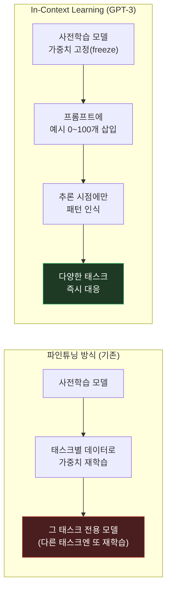

시리즈 네 번째 편. [프롬프팅 기법 트랙]()에서 다룬 CoT/Self-Consistency/ToT가 전부 전제로 깔고 가는 개념, In-Context Learning(ICL)의 뿌리인 **Language Models are Few-Shot Learners** (Brown et al., 2020, NeurIPS) — 흔히 "GPT-3 논문"이라 불리는 그 논문이다.

## 1. 기본적인 이해부터

쉽게 말하면, 이 논문은 **"모델을 다시 학습시키지 않고, 프롬프트 안에 예시 몇 개만 보여줘도 새 작업을 해낸다"**는 걸 처음으로 대규모로 증명한 논문이다. 175B 파라미터짜리 GPT-3라는 모델을 만들고, 그 모델에 가중치 업데이트(파인튜닝) 없이 **프롬프트에 예시를 몇 개 넣는 것만으로** 번역, 질의응답, 산수, 글쓰기 등 온갖 작업을 시켰더니 꽤 잘 해냈다는 걸 보여줬다. 지금 당연하게 쓰는 "프롬프트에 예시 넣기"라는 개념 자체가 이 논문에서 체계적으로 정의되고 검증된 것.

## 2. 문제점/배경

이 논문 이전(2018~2020년대 초)에는 언어모델을 새로운 태스크에 적용하는 표준 방법이 **파인튜닝**이었다. BERT나 GPT-2 같은 사전학습 모델을 가져다가, 원하는 태스크(감정분석이면 감정분석용 데이터셋)로 **가중치를 다시 학습**시켜야 했다. 이러려면:
- 태스크별로 라벨링된 학습 데이터셋이 따로 필요
- 태스크가 바뀔 때마다 다시 파인튜닝(재학습) 필요 — GPU 시간과 엔지니어링 리소스 소모
- 파인튜닝 데이터 분포에 모델이 과적합돼서, 실제 배포 환경의 다양한 입력에는 오히려 약해지는 경우도 있음

즉 "이 모델로 새 작업을 시키고 싶다"는 요청이 들어올 때마다 **재훈련 파이프라인을 새로 돌려야** 했다. 마치 직원 한 명한테 새 업무를 맡길 때마다 처음부터 다시 채용·교육하는 것과 비슷한 비효율이었다.

## 3. 해결책의 핵심 아이디어

**핵심 한 줄 요약:** 모델을 충분히 크게 키우고 충분히 많은 텍스트로 학습시키면, 가중치를 전혀 바꾸지 않고도 프롬프트 안의 예시 몇 개만으로 새 태스크를 "그 자리에서" 배우는 능력(In-Context Learning)이 나타난다.

**단계별 설명:**
1. GPT-2와 동일한 트랜스포머 디코더 구조를 그대로 두되, 파라미터 수를 175B까지 스케일업 (당시 기준 압도적으로 큰 규모)
2. 이 모델을 파인튜닝 없이, 세 가지 조건으로 평가: **zero-shot**(예시 없이 지시문만), **one-shot**(예시 1개), **few-shot**(예시 10~100개 정도를 프롬프트에 나열)
3. 프롬프트 안에 넣은 예시들은 경사하강법으로 학습되는 게 아니라, **모델이 추론(inference)하는 그 순간에만 참고하는 문맥**으로 작동 — 이게 바로 "In-Context Learning"
4. 번역, TriviaQA/자연어 질의응답, Winograd 스타일 대명사 추론, 상식 추론(PIQA), SuperGLUE, 간단한 산수, 신조어 활용 등 폭넓은 태스크에서 few-shot 조건의 GPT-3가 zero-shot이나 더 작은 모델보다 뚜렷이 나은 성능을 보임
5. 핵심 관찰: **모델이 클수록 few-shot 학습 능력 자체가 커짐** — 작은 모델은 예시를 더 줘도 성능이 잘 안 느는 반면, 큰 모델은 예시 개수가 늘수록 성능이 가파르게 오름 (이게 CoT 논문의 "emergent ability" 개념으로 이어짐)

## 4. 비유/예시

**신입 직원 vs 경력직 컨설턴트에 비유하면:**

| 파인튜닝 방식 | In-Context Learning (GPT-3) |
|---|---|
| 새 업무를 맡기려면 몇 주간 교육·연수 프로그램을 다시 돌려야 함 | 경력 많은 컨설턴트에게 "이런 식으로 3개 사례를 봐주세요" 하고 예시 몇 개 보여주면 바로 그 패턴대로 다음 일을 처리 |
| 교육이 끝나면 그 사람은 그 업무만 잘함(다른 업무는 또 재교육) | 같은 사람이 예시만 바꿔주면 번역도, 요약도, 산수도 그 자리에서 대응 |
| "다시 가르치는 비용"이 매번 발생 | "예시를 보여주는 비용"만 발생 — 훨씬 가볍고 빠름 |

GPT-3는 "이미 세상 많은 걸 읽어서 배운 사람"에게 매번 재교육 대신 몇 가지 예시만 보여줘도 새 일을 시킬 수 있다는 걸 증명한 셈이다.

## 5. 실제 동작 과정

```text
[Zero-shot — 예시 없이 지시만]
지시: 다음 문장을 영어에서 프랑스어로 번역하시오.
입력: "cheese"
출력: ?  (모델이 지시문만 보고 바로 시도)


[One-shot — 예시 1개]
지시: 다음 문장을 영어에서 프랑스어로 번역하시오.
예시: sea otter → loutre de mer
입력: "cheese"
출력: fromage


[Few-shot — 예시 여러 개]
지시: 다음 문장을 영어에서 프랑스어로 번역하시오.
예시 1: sea otter → loutre de mer
예시 2: peppermint → menthe poivrée
예시 3: plush girafe → girafe peluche
입력: "cheese"
출력: fromage

→ 예시가 늘어날수록 모델이 "이 태스크가 정확히 어떤 패턴인가"를
   더 명확히 파악해서 정확도가 올라감. 이 모든 과정에서
   모델 가중치는 단 한 번도 업데이트되지 않음 — 프롬프트만 다름.
```

논문은 이 방식으로 GPT-3(175B)가 다수의 벤치마크에서 fine-tuned 모델들과 경쟁할 만한 성능을 보였고, 특히 뉴스 기사 생성 실험에서는 사람 평가자가 GPT-3가 쓴 기사와 실제 인간 기자가 쓴 기사를 구분하기 어려워했다는 결과도 보고했다. 다만 한계도 명확히 밝혔는데, 문장 중간을 채우는 bidirectional 태스크나 일부 복잡한 추론에서는 약점을 보였고, 편향·악용 가능성 같은 사회적 영향도 논문에서 따로 다뤘다.

> 구체적 벤치마크 수치와 아키텍처 세부값(레이어 수 등)은 이 글에서 뭉뚱그렸다 — 정확한 인용이 필요하면 원문을 대조할 것.

## 그림으로 보기




위쪽 그림: 파인튜닝은 가중치를 바꾸고, ICL은 가중치를 고정한 채 프롬프트만 바꾼다. 아래쪽 그림: 예시 개수가 늘수록(zero→few-shot) 정확도가 오르고, 이 상승 폭 자체가 모델이 클수록 커진다(작은 모델은 예시를 더 줘도 격차가 잘 안 벌어짐).

## 6. 결과/장점

- **재학습 없는 태스크 적응**: 새 작업마다 파인튜닝 파이프라인을 새로 돌릴 필요 없이 프롬프트 설계만으로 대응 가능 — 이게 지금 "프롬프트 엔지니어링"이라는 직군/스킬이 존재하는 이유의 뿌리
- **패러다임 전환**: "모델에 지식을 넣는 방법"이 파인튜닝(가중치 수정) 중심에서 프롬프팅(문맥 설계) 중심으로 옮겨가는 계기
- **스케일의 힘 실증**: 모델 크기가 커질수록 새로운 능력(few-shot 학습)이 나타난다는 걸 보여줘서, 이후 "scaling law" 연구와 CoT의 emergent ability 논의로 이어짐

## 실무 적용 아이디어

캐릭터 기반 채팅 서비스의 캐릭터 정의(페르소나) + 대화 예시는 사실상 이 논문의 few-shot In-Context Learning 그대로다. 캐릭터별로 모델을 따로 파인튜닝하는 게 아니라, 프롬프트 안에 페르소나 설정과 대화 예시만 넣어서 그 자리에서 그 캐릭터처럼 행동하게 만드는 구조이기 때문이다. 다음 편에서 다룰 논문이 "이 예시들이 정말 무엇을 가르치는가"를 파고드는데, 캐릭터 프롬프트를 설계할 때도 같은 질문이 따라온다.

---

다음 편은 **"Rethinking the Role of Demonstrations" (Min et al., 2022)** — few-shot 예시가 정말 무엇을 가르치는지 실험으로 해부한 논문.
