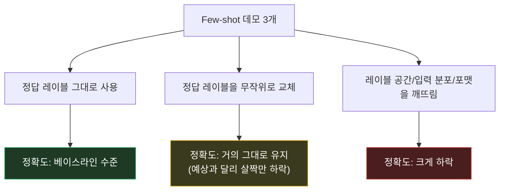
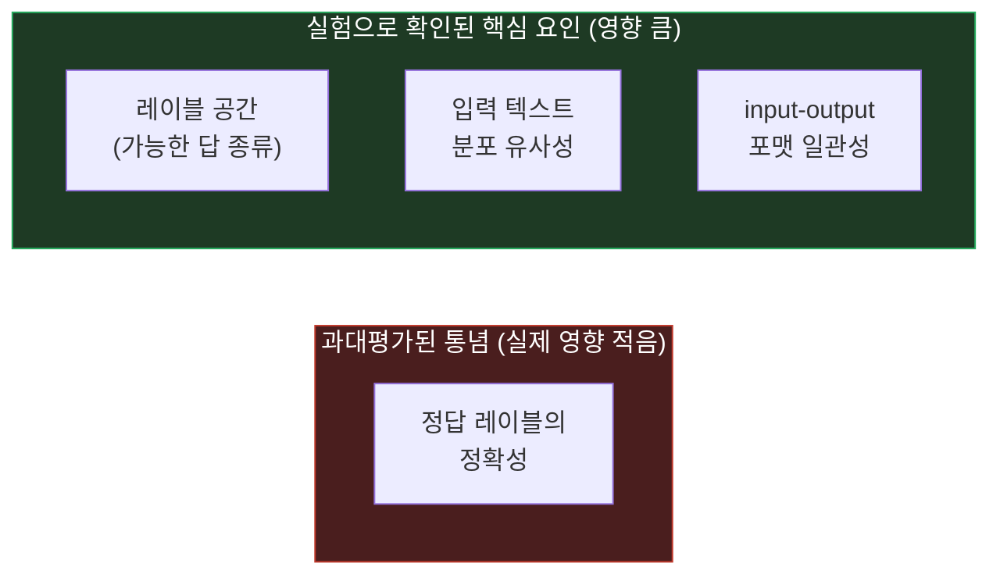

시리즈 다섯 번째 편이자 "In-Context Learning 원리" 트랙의 마지막 편. [GPT-3 논문]()이 보여준 In-Context Learning이 정말 "예시에서 배우는" 건지 파고든 [**Rethinking the Role of Demonstrations: What Makes In-Context Learning Work?**](https://arxiv.org/abs/2202.12837) (Min et al., 2022, EMNLP)이다.

## 1. 기본적인 이해부터

쉽게 말하면, 이 논문은 **"Few-shot 예시에서 모델이 정확히 뭘 배우는지"를 실험으로 해부한 논문**이다. 놀랍게도 예시의 **정답 레이블을 일부러 틀리게(무작위로) 바꿔도** 모델 성능이 거의 안 떨어진다는 걸 발견했다. 즉 GPT-3가 예시를 보고 "입력→정답"이라는 논리적 매핑을 진짜로 학습하는 게 아니라, 다른 것들을 참고한다는 뜻이었다.

## 2. 문제점/배경

GPT-3 논문은 "프롬프트에 예시 몇 개 넣으면 모델이 그 태스크를 배운다"는 걸 보여줬지만, **왜/어떻게** 그게 가능한지는 명확히 설명하지 않았다. 당연히 다들 "모델이 각 예시의 입력-정답 쌍을 보고, 그 관계(매핑 규칙)를 학습한다"고 가정했다. 지도학습(supervised learning)의 직관을 그대로 가져온 것 — 라벨이 맞아야 학습이 되고, 라벨이 틀리면 학습을 망친다는 상식. 이 가정이 맞다면 프롬프트 엔지니어링에서 "예시의 정답이 정확한가"가 가장 중요한 변수여야 하는데, 아무도 이걸 직접 검증하지 않았다.

## 3. 해결책의 핵심 아이디어

**핵심 한 줄 요약:** ICL은 예시에서 입력→정답의 논리적 매핑을 배우는 게 아니라, 그 태스크의 "형식·레이블 종류·입력 분포"를 파악하는 데 예시를 활용한다.

**단계별 설명:**
1. 12개 모델(GPT-2, GPT-3, MetaICL 등), 26개 분류/객관식 태스크로 다양한 ablation(구성요소 하나씩 바꿔보기) 실험 설계
2. **정답 레이블을 무작위로 뒤섞은 데모**로 few-shot을 시켜봄 — 예: "이 리뷰는 긍정" 예시의 정답을 일부러 "부정"으로 바꿔치기
3. 예상과 달리 **정확도가 거의 안 떨어짐** (정상 라벨 대비 미미한 하락) → 모델이 "입력↔정답 매핑"을 실제로 학습하는 게 아니라는 강력한 신호
4. 대신 성능에 진짜 영향을 주는 요소를 분리해서 확인: **① 레이블 공간(label space)** — 이 태스크에서 나올 수 있는 답의 종류(긍정/부정처럼), **② 입력 분포** — 데모의 입력 텍스트가 실제 테스트 입력과 비슷한 성격인지, **③ 포맷** — input/output이 어떤 형태(구두점, 구분자 등)로 짝지어지는지
5. 이 세 가지를 예시에서 제거하면(예: 아예 다른 도메인 텍스트를 쓰거나 포맷을 망가뜨리면) 그제서야 성능이 크게 떨어짐 — 즉 **"정답이 맞다"보다 "이 태스크가 어떤 모양인지 보여주는 것"이 훨씬 중요**

## 4. 비유/예시

**신입 통역사에게 용어집을 주는 상황에 비유하면:**

| 예상했던 그림 | 실제로 밝혀진 그림 |
|---|---|
| "이 단어는 이렇게 번역하세요"라는 정답 쌍을 하나하나 외워서 그대로 적용 | 정답 쌍이 몇 개 틀려 있어도 "아, 이런 형식의 문서를, 이런 톤으로, 이 정도 답 종류(공식/비공식) 중에서 고르면 되는구나"를 파악하고 그 감각으로 번역 |
| 정답이 틀리면 통역사가 그 오답을 그대로 따라함 | 통역사는 이미 통역할 줄 알아서, 예시는 "이 상황에서 어떤 형식·톤·선택지가 기대되는지"를 알려주는 참고자료로만 씀 |

즉 데모는 "정답을 가르치는 선생님"이라기보다 "이 자리에서 뭘 어떻게 해야 하는지 보여주는 견본"에 가까웠다는 것.

## 5. 실제 동작 과정

```text
[실험 A: 정상 데모]
리뷰: "배송이 빨라서 좋았어요" → 감정: 긍정
리뷰: "제품이 파손되어 왔어요" → 감정: 부정
리뷰: "생각보다 별로였어요" → 감정: 부정

새 입력: "다시 살 만큼 만족스러웠어요" → 감정: ?
결과: 긍정 (정확)


[실험 B: 정답 레이블을 무작위로 뒤섞은 데모]
리뷰: "배송이 빨라서 좋았어요" → 감정: 부정   (틀린 라벨!)
리뷰: "제품이 파손되어 왔어요" → 감정: 긍정   (틀린 라벨!)
리뷰: "생각보다 별로였어요" → 감정: 긍정      (틀린 라벨!)

새 입력: "다시 살 만큼 만족스러웠어요" → 감정: ?
결과: 긍정 (여전히 정확! — 정답 매핑은 다 틀렸는데도 성능 거의 안 떨어짐)

[실험 C: 레이블 공간/포맷 자체를 깨뜨린 데모]
전혀 다른 도메인 텍스트나 "긍정/부정"이 아닌 임의 기호를 라벨로 사용
→ 이때는 성능이 크게 하락 (진짜로 중요한 건 이쪽)
```

논문은 이 패턴을 분류·객관식 태스크 전반에서 재현했고, 모델·태스크에 따라 정도 차이는 있었지만 "정답 레이블의 정확성"보다 "레이블 공간/입력 분포/포맷"이 일관되게 더 중요한 변수로 나타났다.

> 정확한 하락폭 수치는 이 글에서 뭉뚱그렸다 — 태스크별 세부 수치가 필요하면 원문 표를 대조할 것.

## 그림으로 보기





위쪽 flowchart는 세 가지 ablation 실험 결과를, 아래쪽 flowchart는 통념(레이블 정확성이 제일 중요할 것)과 실제 실험 결과(레이블 공간·입력 분포·포맷이 더 중요)가 정반대라는 걸 한눈에 보여준다.

## 6. 결과/장점

- **ICL 메커니즘에 대한 재정의**: "모델이 예시로부터 태스크 로직을 학습한다"가 아니라 "모델이 이미 가진 능력을 예시가 형식·범위 지정으로 끌어낸다(prime)"는 쪽으로 이해를 수정
- **프롬프트 설계 우선순위 재조정**: 예시의 정답이 100% 정확한지보다, 레이블 종류를 빠짐없이 보여주는지·입력 텍스트가 실제 상황과 비슷한 결인지·포맷이 일관적인지가 더 중요하다는 실무 지침
- **CoT와의 긴장 관계**: 이 논문의 결론(예시는 로직이 아니라 형식을 가르친다)을 CoT에 그대로 적용하면 살짝 불편한 질문이 생김 — CoT의 추론 예시도 "진짜 추론 로직"을 가르치는지, 아니면 "추론하는 것처럼 보이는 포맷"만 프라이밍하는 건지는 이 논문만으로는 결론이 안 남 (후속 연구 영역)

## 실무 적용 아이디어

이 논문의 발견(모델은 예시의 "입력 분포"를 따라간다)은, 캐릭터 기반 채팅 서비스의 캐릭터 설정 텍스트 자체가 일종의 데모 역할을 한다는 뜻이기도 하다. 캐릭터 설정에 의도치 않은 언어·문체 예시가 섞여 있으면, 모델이 정답 여부와 무관하게 그 분포를 따라갈 수 있다는 시사점이다. 그렇다면 사후에 출력을 필터링하는 것보다, 애초에 설정(입력) 자체를 정제하는 편이 더 근본적인 대응일 수 있다.

이걸로 "In-Context Learning 원리" 트랙까지 두 트랙을 마무리한다. 다음은 에이전트/툴 사용 트랙(ReAct, Toolformer)과 정렬/안전성 트랙(InstructGPT, Constitutional AI)으로 이어갈 예정.
