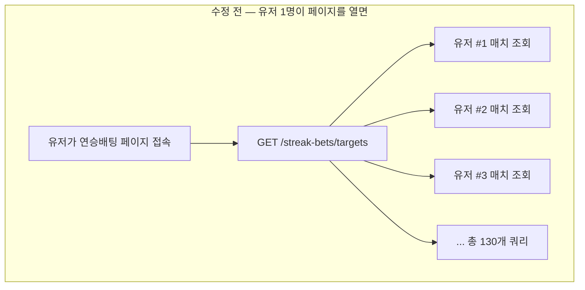
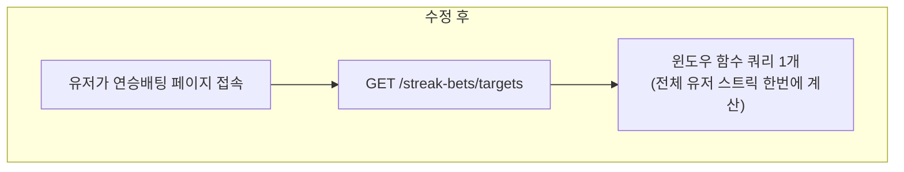
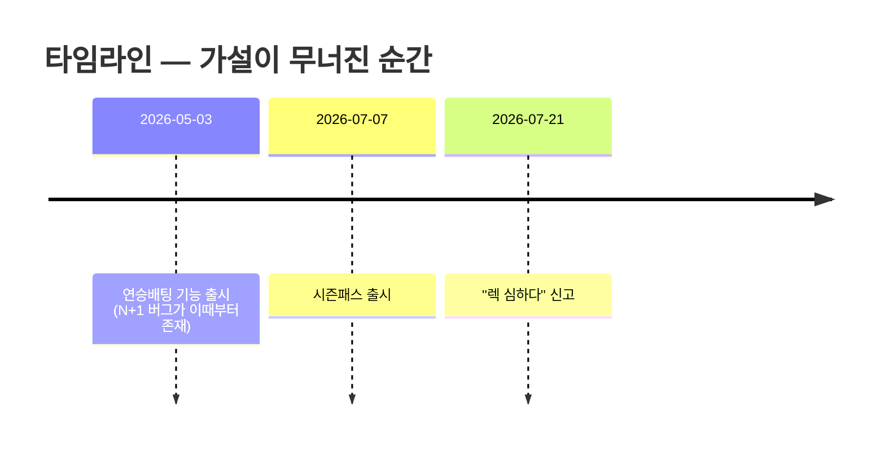
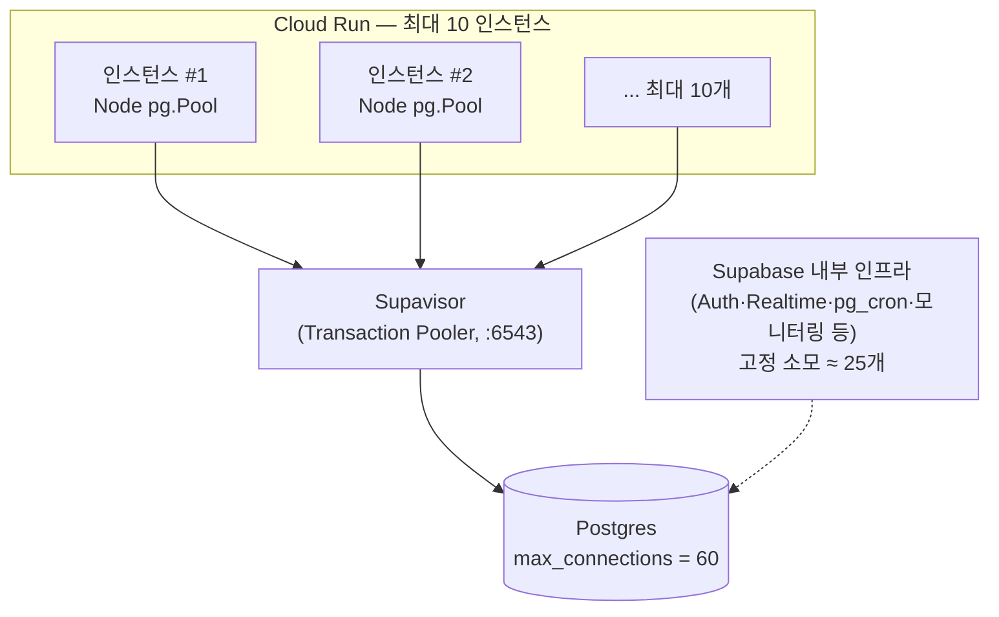
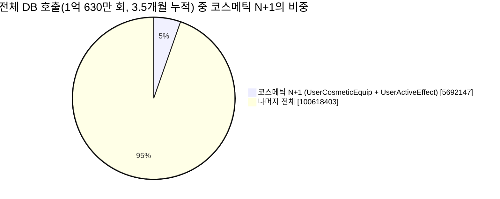

이번 편은 배포 사고나 아키텍처 이야기가 아니라 성능 조사 이야기다. "시즌패스 출시 이후로 서버가 느려졌다"는 유저 신고 하나로 시작해서, 전혀 예상치 못한 곳에서 진짜 원인을 찾은 과정을 기록해둔다.

## TL;DR

- "시즌패스 출시 이후로 서버가 느려졌다"는 유저 신고로 조사를 시작했다.
- 실측(`pg_stat_statements`) 결과, 시즌패스 자체의 DB 부하는 무시할 수준이었다 — 처음 세운 가설은 **틀렸다**.
- 대신 완전히 무관한 곳에서 진짜 문제 두 개를 찾았다: 한 페이지가 유저 수만큼 쿼리를 쏘는 **N+1 버그** 두 건.
- 핵심 교훈: 이 규모(DAU 50~70명) 서비스에서 "렉"의 원인은 거의 항상 **트래픽 총량이 아니라, 요청 하나가 몇 개의 쿼리로 터지느냐**다.

<br/>

## 1. 시작 — "시즌패스 이후로 렉이 심해졌어요"

새 시즌패스 기능("함께하는 여름방학")을 출시한 뒤, 유저들 사이에서 "요즘 서버가 렉 걸린다"는 말이 돌기 시작했다. 타이밍이 시즌패스 출시와 겹친다는 게 유일한 단서였다.

가장 먼저 의심한 건 당연히 시즌패스 자체였다. 미션 진행도 계산 로직(`countMissionSignal`)이 미션 조회마다 여러 테이블을 실시간으로 카운트하는 구조라, 이게 무겁지 않을까 생각했다.

```ts
// packages/api/src/lib/season-pass.ts
export async function countMissionSignal(userId, signal, cadence, periodKey) {
  switch (signal) {
    case "BET_STORE_BUY": {
      const [purchases, megaphones, bubbleSkins, customizations] = await Promise.all([
        prisma.betStorePurchase.count({ where: { groupId, userId, createdAt: { gte, lt } } }),
        prisma.megaphone.count({ ... }),
        prisma.bubbleSkinPurchase.count({ ... }),
        prisma.customizationPurchase.count({ ... }),
      ]);
      return purchases + megaphones + bubbleSkins + customizations;
    }
    // ...
  }
}
```

<br/>

## 2. 첫 번째 반증 — 감이 아니라 실측으로 확인하기

Supabase Postgres에는 `pg_stat_statements` 확장이 이미 켜져 있었다. 실제 쿼리 비용을 직접 뜯어봤다.

```sql
SELECT round(total_exec_time::numeric,1) AS total_ms, calls, round(mean_exec_time::numeric,2) AS mean_ms, left(query, 140)
FROM pg_stat_statements
ORDER BY total_exec_time DESC LIMIT 25;
```

결과: 시즌패스 관련 쿼리(`PassMissionSlot`, `BetStorePurchase`, `StreakBet`, `ScrimBet`, `Megaphone` 등)는 상위 25개 안에 단 하나도 없었다. 개별 쿼리 비용도 1~10ms 수준으로 가벼웠다.

DAU도 확인했다 — 시즌패스 출시(7/7) 전후로 특별한 변화가 없었다.

| 날짜 | DAU |
| --- | --- |
| 06/22 | 48 |
| 06/29 | 64 |
| **07/03** | 75 |
| **07/07 (시즌패스 출시)** | 59 |
| 07/13 | 55 |
| 07/17 | 54 |
| 07/20 | 69 |

**결론: 시즌패스의 DB 부하는 죄가 없었다.** 트래픽도 안 늘었다. 첫 가설은 폐기.

그래도 소득은 있었다 — 조사 중에 시즌패스와 함께 배포된 전역 배경 컴포넌트(`SeasonAtmosphereBackground`/`SeasonAtmosphereBanner`)가 페이지마다 같은 API를 **2번씩 중복 호출**하는 race condition을 발견해 고쳤다. 사소했지만 진짜 버그였다.

<br/>

## 3. 진짜 원인을 찾아서 — 연승배팅 페이지의 N+1

"진짜 무거운 쿼리가 뭔지 보자"며 `pg_stat_statements` 상위 목록을 다시 훑다가, `RiotMatchParticipant` 조회가 압도적으로 많다는 걸 발견했다. 추적해보니 `GET /streak-bets/targets`(연승배팅 페이지)가 범인이었다.

```ts
// 수정 전 — packages/api/src/routes/streak-bets.ts
const users = await prisma.user.findMany({
  where: { isGuest: false, deletedAt: null, puuid: { not: "" } },
});
const enriched = await Promise.all(
  users.map(async (u) => ({
    ...u,
    streak: (await getCurrentStreak(u.id)).streak,   // 유저 1명당 쿼리 1개
  })),
);
```

`getCurrentStreak()`는 유저 한 명의 최근 30경기를 조회해서 연승/연패를 계산하는 함수다. 문제는 이걸 **전체 유저(130명)에 대해 각각** 호출하고 있었다는 것 — 페이지 한 번 열 때마다 DB 쿼리 130개가 동시에 나갔다.





수정: window function으로 130개 쿼리를 1개로 합쳤다.

```ts
// 수정 후 — packages/api/src/lib/streak-bets.ts
export async function getCurrentStreaksBatch(userIds: number[]) {
  const rows = await prisma.$queryRaw`
    SELECT rmp."userId", rmp.win, rmp."gameEndAt" FROM (
      SELECT rmp."userId", rmp.win, rmp."gameEndAt",
        ROW_NUMBER() OVER (PARTITION BY rmp."userId" ORDER BY rmp."gameEndAt" DESC) AS rn
      FROM "RiotMatchParticipant" rmp
      JOIN "RiotMatch" rm ON rm.id = rmp."matchId"
      WHERE rmp."userId" = ANY(${userIds}) AND rm."queueId" = ${SOLO_QUEUE}
    ) rmp
    WHERE rn <= ${STREAK_LOOKBACK}
    ORDER BY rmp."userId", rmp."gameEndAt" DESC
  `;
  // ... JS에서 유저별로 그룹핑 후 연승/연패 계산
}
```

<br/>

## 4. 정직한 반전 — "근데 이게 진짜 원인이 맞아?"

수정하고 나서 뿌듯해하고 있었는데, 확인 질문 하나가 들어왔다. **"그거 진짜 근본 원인이 맞아?"**

다시 검증했다. 타임라인을 대조해보니:



**연승배팅 N+1 버그는 시즌패스보다 2개월 이상 먼저 존재했다.** "시즌패스 이후로 렉이 심해졌다"는 관찰과 시점이 안 맞았다. "시즌패스가 연승배팅 미션을 만들어서 이 페이지 방문이 늘었을 것"이라는 간접 연결고리도 확인해봤지만, 실제 배팅 건수는 시즌패스 출시 이후 **오히려 줄어 있었다**.

| 주 | StreakBet 건수 |
| --- | --- |
| 05/11 | 229 |
| 05/25 | 220 |
| 06/29 | 58 |
| **07/06 (시즌패스 출시)** | 46 |
| 07/13 | 81 |
| 07/20 | 8 (진행중) |

솔직하게 인정했다: N+1은 실제 버그고 고친 건 낭비가 아니지만, **"시즌패스 이후 렉 심해짐"이라는 신고의 근본 원인이라고 확신할 근거는 없었다.**

<br/>

## 5. "동시접속 100도 안 되는데 왜 렉이 걸려?"

여기서 나온 질문이 이 조사 전체를 관통하는 진짜 인사이트를 끌어냈다.

> "끽해봤자 동시 접속이 100 정도도 안 될 만한 이런 서비스에 왜 렉이 걸린다는 건지 이해할 수 없어."

이 질문에 대한 답이 바로 3번에서 고친 버그의 진짜 의미였다. **"동시 접속자 수"가 문제가 아니라, "요청 1개가 몇 개의 DB 쿼리로 터지느냐"가 문제다.**

커넥션 구조를 직접 확인했다.



```sql
SHOW max_connections;              -- 60
SELECT count(*) FROM pg_stat_activity;  -- 36 (그중 ~25는 Supabase 내부 인프라)
```

Postgres 서버 전체의 **하드 리밋이 60개**였고, 그중 약 25개는 Supabase 자체 인프라(Auth, Realtime, pg_cron, 모니터링)가 고정으로 물고 있었다. 우리 앱(Node `pg.Pool`)은 기본값 10개짜리 풀을 쓰고 있었는데 — 여기서 3번의 버그가 왜 위험한지 명확해진다:

**유저 1명이 연승배팅 페이지를 여는 순간, 그 요청 하나가 10개짜리 풀을 통째로 점유해버린다.** 그 순간 같은 Cloud Run 인스턴스에서 처리되던 다른 유저의 요청은 전부 커넥션이 빌 때까지 대기열에 걸린다. **동시접속자가 100명이든 5명이든 상관없다 — 트래픽이 적을수록 오히려 한 사람의 실수가 풀 전체를 독점하기 쉽다.**

조치: 풀 크기를 10 → 30으로 올렸다. Supavisor(트랜잭션 풀러)가 중간에서 초과분을 큐잉/멀티플렉싱해주기 때문에 Postgres의 하드 리밋(60)을 직접 위협하지 않으면서 여유를 확보할 수 있었다.

```ts
// packages/api/src/lib/prisma.ts
const adapter = new PrismaPg({ connectionString: process.env.DATABASE_URL!, max: 30 });
```

<br/>

## 6. 진짜 큰 놈 — 코스메틱 N+1 (전체 DB 호출의 5.4%)

"DB를 과호출하는 API가 더 있는지 확인해봐"라는 요청에 배포 직후 실시간 로그를 보다가 이상한 패턴을 발견했다.

```
GET /api/season-pass/cosmetics/user/273
GET /api/season-pass/cosmetics/user/214
GET /api/season-pass/cosmetics/user/146
GET /api/season-pass/cosmetics/user/161
GET /api/season-pass/cosmetics/user/204
...
```

유저 ID별로 같은 엔드포인트가 연달아 호출되고 있었다. 범인은 `Nickname` 컴포넌트 — **22개 페이지**(대부분 유저 목록을 `.map()`으로 그리는 랭킹·멤버 목록·채팅·배팅 내역)에서 재사용되는 공용 컴포넌트인데, 각 인스턴스가 자기 유저의 시즌 코스메틱을 **개별적으로** fetch하고 있었다.

이미 배치 엔드포인트(`/cosmetics/users?ids=...`)가 존재했고, 코드 주석에도 "N+1 방지"라고 명시돼 있었다. 그런데 정작 가장 많이 쓰이는 컴포넌트가 그 배치 엔드포인트를 안 쓰고 있었던 것.

`pg_stat_statements`로 실제 규모를 확인했다:



| 쿼리 | 호출 횟수 | 비중 |
| --- | ---: | ---: |
| `UserCosmeticEquip` findMany | 2,846,330회 | — |
| `UserActiveEffect` findMany | 2,845,817회 | — |
| **합계** | **5,692,147회** | **전체의 5.4%** |

개별 쿼리는 0.01~0.015ms로 극히 가벼워서 눈에 안 띄었지만, **호출 횟수 자체가 이번 조사 전체에서 발견한 어떤 문제보다 컸다** — 알림 폴링의 5배 이상.

**수정 방식**: 22개 호출부를 다 고치는 대신, 재사용되는 훅(`useSeasonCosmetic`) 내부에서 같은 렌더 tick에 요청된 userId들을 모아 microtask 경계에서 배치 요청 1번으로 합치도록 바꿨다. DataLoader 패턴과 동일한 아이디어다.

```ts
// packages/frontend/src/hooks/useSeasonCosmetics.ts
const cosmeticsCache = new Map<number, SeasonCosmeticState>();
let cosmeticsPendingIds: number[] = [];
let cosmeticsFlushScheduled = false;

function scheduleCosmeticsFlush() {
  if (cosmeticsFlushScheduled) return;
  cosmeticsFlushScheduled = true;
  queueMicrotask(() => {
    cosmeticsFlushScheduled = false;
    const ids = cosmeticsPendingIds;
    cosmeticsPendingIds = [];
    if (ids.length === 0) return;
    // 배치 엔드포인트 1번 호출 → 캐시에 저장 → 대기 중인 모든 컴포넌트에 알림
    apiFetch(`/api/season-pass/cosmetics/users?ids=${ids.join(",")}`)
      .then((r) => r.json())
      .then((d) => { for (const id of ids) cosmeticsCache.set(id, d[id] ?? EMPTY_STATE); });
  });
}

export function useSeasonCosmetic(userId?: number) {
  useEffect(() => {
    if (!cosmeticsCache.has(userId)) {
      cosmeticsPendingIds.push(userId);
      scheduleCosmeticsFlush();   // 여러 컴포넌트가 동시에 호출해도 microtask당 1번만 flush
    }
    // ... 구독 등록
  }, [userId]);
  return cosmeticsCache.get(userId) ?? EMPTY_STATE;
}
```

호출부 코드(22곳)는 단 한 줄도 바꾸지 않았다. 유저 50명짜리 목록 페이지가 이제 요청 1번으로 끝난다.

<br/>

## 7. 전수조사 — "진짜 없는지 한 번 더"

마지막으로 정말 더 없는지 `pg_stat_statements` 호출 횟수 상위 40개를 전부 훑으며 하나씩 판정했다. **의심 → 기각의 과정 자체가 이 조사에서 가장 중요한 부분이었다.**

| 의심 대상 | 실제 판정 | 근거 |
| --- | --- | --- |
| `RiotMatchParticipant` 나머지 무거운 쿼리들 | 정상 | Riot 동기화 cron(전체 유저 순회는 원래 배치 작업) + 단일 유저 "전적 새로고침" 액션. N+1 아님 |
| `ChampionPool WHERE userId IN (...)` | 정상 | Prisma가 `include: { championPool: true }` 관계 로드 시 **자동으로** 만들어주는 배치 쿼리. Prisma 자체의 N+1 방지 메커니즘 |
| `Evaluation DISTINCT ON` | 정상 | SQL 자체가 이미 `targetId = ANY($1)`로 배치 처리 중 |
| `useCosmeticSkinById` (칭호테두리 등) | 정상 | 해당 테이블(`RadarSkin`/`TitleFrameSkin`/`NameEffectSkin`) 쿼리가 실측상 **0건** — 대부분 레거시 기본 스킨이라 fetch 자체가 거의 안 일어남 |
| WS 서버(`server-ws.ts`) watchdog | 정상 | 5초마다 돌지만 Postgres가 아니라 **Redis만** 조회 |
| `Membership`/`AccountPermission`/`Ban` 등 | 정상 | 호출 수는 수천만 건으로 제일 많지만 건당 0.02ms — 매 요청 공통 권한 체크 비용, 최적화 대상 아님 |

<br/>

## 8. 정리 — 배운 것

1. **"타이밍이 겹친다"는 상관관계일 뿐 인과관계가 아니다.** 처음 세운 가설(시즌패스가 원인)은 실측으로 반증됐다. 감이 아니라 `pg_stat_statements` 같은 실측 도구로 확인해야 한다.
2. **작은 서비스일수록 "트래픽 양"보다 "요청 1개의 쿼리 팬아웃"이 문제다.** 동시접속 100명이 아니라, 유저 1명이 잘못 만들어진 페이지 하나를 여는 것만으로 커넥션 풀 전체를 잠깐 독점할 수 있다.
3. **"이게 진짜 원인 맞아?"라는 검증 질문이 결정적이었다.** 첫 수정(연승배팅 N+1)은 실제 버그였지만 타임라인상 신고의 근본 원인은 아니었을 가능성이 크다 — 정직하게 인정하고 계속 파야 진짜 원인(코스메틱 N+1, 전체 DB 호출의 5.4%)을 찾을 수 있었다.
4. **이미 만들어둔 배치 엔드포인트도 실제로 쓰이는지 확인해야 한다.** "N+1 방지"라는 주석과 배치 API가 이미 있었는데도, 가장 많이 쓰이는 컴포넌트가 그걸 안 쓰고 있었다.
5. **N+1을 고칠 때 호출부를 다 바꿀 필요는 없다.** 공용 훅/함수 내부에 배칭 레이어를 한 겹 넣으면 22곳을 건드리지 않고도 문제를 해결할 수 있다.

<br/>

*이 글은 실제 프로덕션 서비스(리그 오브 레전드 사설 내전 커뮤니티, DAU 50~70명)에서 진행된 조사를 정리한 것입니다. 모든 수치는 `pg_stat_statements`(Postgres 확장, 2026-04-12부터 누적)를 통해 직접 측정했습니다.*
