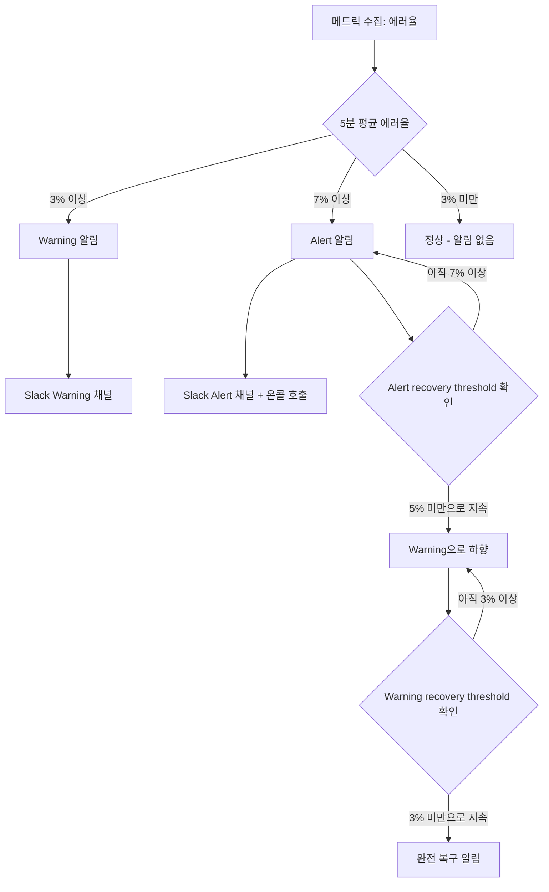
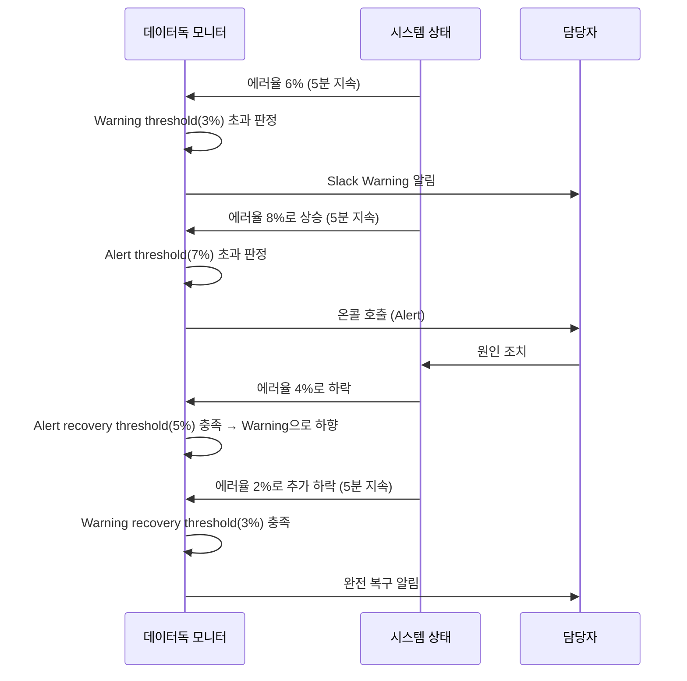

1편에서 "모니터는 임계값 초과 시 알림을 보내는 감시자"라고만 짚었는데, 실제로 쓸모 있는 알림을 만들려면 그보다 훨씬 세밀한 설계가 필요하다. 공식 문서([docs.datadoghq.com/monitors](https://docs.datadoghq.com/monitors/))를 대조해서 정확한 용어까지 정리했다.

## TL;DR

- 모니터는 "무엇을 볼지" + "어떤 기준으로 이상을 판단할지"(모니터 타입) + "얼마나 지속돼야 진짜로 볼지"(평가 윈도우) + "누구한테 어떻게 알릴지"(알림 라우팅) 4가지를 조합해서 설계한다.
- 임계값을 너무 빡빡하게 잡으면 알림 피로(alert fatigue)로 진짜 문제도 무시하게 되고, 너무 느슨하면 장애를 놓친다.
- 데이터독의 공식 용어는 "Critical"이 아니라 **"Alert threshold"**(필수)와 **"Warning threshold"**(선택)다.
- 복구 임계값도 Alert/Warning 각각 별도 필드로 존재해서, 트리거보다 낮게 잡으면 반복 알림(flapping)을 막을 수 있다.

 

## 1. 왜 대충 설정하면 역효과가 나는가

- 임계값을 너무 빡빡하게 잡으면 사소한 변동에도 알림이 쏟아져서, 진짜 문제가 터졌을 때 담당자가 "또 오탐이겠지" 하고 무시하게 됨(알림 피로)
- 반대로 너무 느슨하면 실제 장애가 나도 알림이 안 와서 유저 신고로 먼저 알게 됨
- 고정 임계값은 트래픽이 적은 새벽엔 별 의미 없는 숫자일 수도 있고, 트래픽이 폭증하는 이벤트 기간엔 너무 늦게 잡는 기준일 수도 있음
- 알림이 와도 "이게 얼마나 심각한지, 누가 봐야 하는지"가 불명확하면 대응이 늦어짐

## 2. 모니터 타입 4가지 (공식문서 검증)

1. **Threshold(임계값)**: "에러율이 5%를 넘으면" 같은 고정 기준. 가장 단순하고 이해하기 쉬움
2. **Anomaly(이상탐지)**: 과거 패턴과 비교해서 "지금 이 수치가 평소와 다르다"를 자동 판단. 내부적으로 3가지 알고리즘이 있다 — **Basic**(계절성 없는 지표, 롤링 분위수 기반, 변화에 빠르게 적응), **Agile**(계절성 있고 변동도 예상되는 지표, SARIMA 기반, 최근 데이터에 민감), **Robust**(계절성이 안정적인 지표, 시계열 분해 기반, 장기 이상치에 흔들리지 않음). 최소한 선택한 계절성 주기의 3배 이상 과거 데이터가 있어야 정확도가 나온다(주간 계절성이면 최소 3주치)
3. **Outlier(이상치)**: 같은 그룹(예: 여러 서버 인스턴스) 중에서 유독 한 대만 다르게 행동할 때 잡음. 알고리즘은 **DBSCAN**(기본값, 밀도 기반 클러스터링 — 그룹 간 동기화 패턴이 중요할 때)과 **MAD**(중앙절대편차 — 동기화 편차가 정상적인 경우)
4. **Forecast(예측)**: 현재 추세대로면 앞으로 임계값을 넘을 것 같다고 미리 경고, 매 평가마다 예상값+편차범위(bounds)를 같이 계산

## 3. Warning/Alert 2단계 + 복구 임계값

데이터독 UI 상 정확한 명칭은 **"Alert threshold"**(필수)와 **"Warning threshold"**(선택) 2가지다. "Critical"이라는 용어는 쓰지 않는다.

복구 임계값도 **"Alert recovery threshold"**와 **"Warning recovery threshold"**가 각각 별도 필드로 존재한다. 트리거보다 낮은 값으로 복구 기준을 잡으면(예: 5% 넘으면 트리거, 3% 밑으로 내려가야 복구) 값이 임계값 근처에서 왔다갔다할 때 알림이 반복적으로 열렸다 닫혔다 하는 걸 막을 수 있다(hysteresis). Anomaly 모니터는 조금 다르게, `trigger_window`(트리거 판단용 시간범위)와 `recovery_window`(복구 판단용 시간범위)를 별도 파라미터로 지정한다.

## 4. No Data 처리 — 놓치기 쉬운 설정

메트릭 자체가 안 들어올 때 어떻게 할지도 별도 설정이다: "0으로 간주", "마지막 상태 유지", "NO DATA로 표시", **"NO DATA 표시하며 알림 발송"**, "정상(OK)으로 간주" 중 선택할 수 있다. 데이터 파이프라인이 죽어서 메트릭이 아예 안 들어오는 상황(조용한 침묵 실패)을 놓치지 않으려면 이 설정이 은근히 중요하다.

## 5. 실제 흐름 예시

## 6. 정리

- 알림 피로 방지: 평가 윈도우 + Warning/Alert 2단계 임계값으로 사소한 변동은 걸러내고, 진짜 심각한 것만 사람을 깨움
- 대응 속도와 정확도의 균형: 지표 성격(계절성 유무, 안정성)에 맞는 알고리즘(Basic/Agile/Robust)을 고르는 게 핵심
- 반복 알림(flapping) 방지: Alert/Warning 복구 임계값을 트리거 기준보다 낮게 각각 잡아서 해결
- 침묵 실패 방지: No Data 처리 옵션을 "NO DATA 표시하며 알림 발송"으로 잡아두면 메트릭 파이프라인 자체가 죽는 상황까지 잡아낼 수 있음

### 참고 (공식문서)

- [Anomaly Monitor](https://docs.datadoghq.com/monitors/types/anomaly/)
- [Outlier Monitor](https://docs.datadoghq.com/monitors/monitor_types/outlier/)
- [Forecasts Monitor](https://docs.datadoghq.com/monitors/types/forecasts/)
- [Recovery thresholds](https://docs.datadoghq.com/monitors/guide/recovery-thresholds/)
- [Configure Monitors](https://docs.datadoghq.com/monitors/configuration/)

---

데이터독 학습 시리즈는 여기까지. 로그/메트릭/APM(1편) → AI Obs(2편) → LLM 전용 툴과의 비교(3편) → RUM(4편) → 계측 원리(5편) → 모니터 알림 설계(6편)까지 정리했다.
