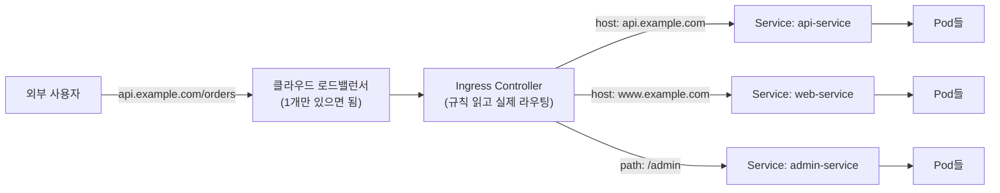

[지난 편]()까지는 클러스터 내부(Service)까지만 다뤘다. 이번 편은 반대 방향 — 외부 사용자의 요청이 실제로 클러스터 안까지 어떻게 들어오는지, [Ingress](https://kubernetes.io/docs/concepts/services-networking/ingress/).

## TL;DR

- Ingress는 "도메인/경로 기준으로 트래픽을 여러 Service로 나눠주는 규칙 명세서"
- Ingress 오브젝트 자체엔 실제 프록시 로직이 없다 — 별도로 설치하는 **Ingress Controller**가 진짜 일을 한다
- 덕분에 클라우드 로드밸런서를 서비스마다 하나씩 만들 필요 없이, 하나로 여러 서비스를 노출할 수 있다
- TLS 인증서도 Ingress 레벨에서 한 번만 설정하면 그 아래 모든 서비스에 적용된다

<br/>

## 1. Service만으로 외부 노출하면 생기는 문제

- Service를 외부에 노출하는 타입은 `LoadBalancer`인데, **Service 하나당 클라우드 로드밸런서가 하나씩** 발급된다 → 서비스가 10개면 로드밸런서 10개, 비용도 10배
- `api.example.com`은 API 서버로, `www.example.com`은 웹 서버로 보내고 싶다 → Service 자체엔 도메인 이름으로 분기하는 기능이 없음
- `/api`는 백엔드로, `/admin`은 관리자 페이지로 보내고 싶다 → Service는 포트 기준으로만 라우팅하지, 경로 기준 분기는 못함
- HTTPS 인증서를 적용하고 싶다 → Service마다 각각 설정을 반복해야 함

## 2. 핵심 아이디어

**핵심 한 줄 요약:** Ingress는 라우팅 규칙만 선언하는 명세서이고, 실제로 트래픽을 받아 분기하는 건 별도로 설치하는 Ingress Controller(진짜 프록시/로드밸런서)가 한다.

1. **Ingress 오브젝트:** "이 도메인/경로로 오면 이 Service로 보내라"는 규칙만 YAML로 선언
2. **[Ingress Controller](https://kubernetes.io/docs/concepts/services-networking/ingress-controllers/) (별도 설치 필요):** nginx-ingress, GKE Ingress 같은 실제 동작하는 컨트롤러가 클러스터에 떠서 규칙을 읽고 실제로 처리함 — 이게 없으면 Ingress를 만들어도 아무 일도 안 일어남
3. **단일 진입점:** 클라우드 로드밸런서는 Ingress Controller 앞에 하나만 필요 — 그 뒤에서 도메인/경로별로 여러 Service로 나눠 보냄
4. **Host/Path 기반 라우팅:** `api.example.com` → api-service, `/admin` → admin-service처럼 세밀하게 분기
5. **TLS 중앙 처리:** 인증서를 Ingress 레벨에서 한 번 설정하면 그 뒤의 모든 Service에 개별 설정 없이 HTTPS 적용



Ingress 오브젝트 자체는 "이렇게 나눠라"는 규칙표일 뿐이고, 실제로 트래픽을 받아 분기하는 몸통은 Ingress Controller다.

## 3. 비유 — 건물 로비 안내데스크

| 상황 | 비유 |
|---|---|
| 여러 Service를 각각 LoadBalancer로 노출 | 입주 회사마다 건물 정문을 따로 만듦 (회사 10개면 정문 10개, 낭비) |
| Ingress | 로비에 붙은 "몇 층 몇 호는 이쪽" 안내판 (규칙만 적혀있음) |
| Ingress Controller | 그 안내판을 보고 실제로 방문객을 안내하는 로비 직원 |
| 클라우드 로드밸런서 | 건물 정문 하나 (입주 회사가 몇 개든 정문은 하나) |

## 4. 실제로 이렇게 쓴다

```yaml
# Ingress — 도메인/경로별 라우팅 규칙 선언
apiVersion: networking.k8s.io/v1
kind: Ingress
metadata:
  name: my-ingress
  annotations:
    nginx.ingress.kubernetes.io/rewrite-target: /
spec:
  ingressClassName: nginx        # 어떤 Ingress Controller를 쓸지 지정
  tls:
  - hosts:
    - api.example.com
    secretName: api-tls-secret   # TLS 인증서 (지난 편의 Secret과 같은 개념)
  rules:
  - host: api.example.com        # 이 도메인으로 오면
    http:
      paths:
      - path: /
        pathType: Prefix
        backend:
          service:
            name: api-service    # 이전 편의 Service로 연결
            port:
              number: 80
  - host: www.example.com        # 다른 도메인은 다른 Service로
    http:
      paths:
      - path: /
        pathType: Prefix
        backend:
          service:
            name: web-service
            port:
              number: 80
```

```bash
# Ingress Controller가 클러스터에 설치돼 있어야 실제로 동작함
kubectl get ingressclass
# NAME    CONTROLLER
# nginx   k8s.io/ingress-nginx     <- 이게 없으면 Ingress를 만들어도 아무 일도 안 일어남

kubectl get ingress my-ingress
# NAME          CLASS   HOSTS                            ADDRESS         PORTS
# my-ingress    nginx   api.example.com,www.example.com  34.120.1.1      80, 443
```

## 지금 상태 / 다음에 할 일

Service(내부 라우팅)에 이어 Ingress(외부 진입점)까지 정리했다. 다음 편은 **Namespace & RBAC** — 클러스터 하나 안에서 여러 팀/환경을 어떻게 나누는지.
