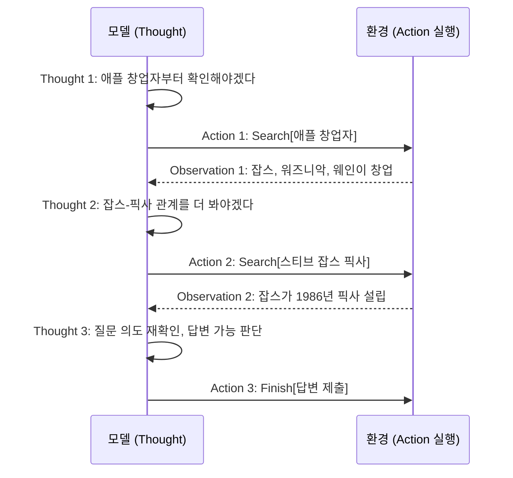
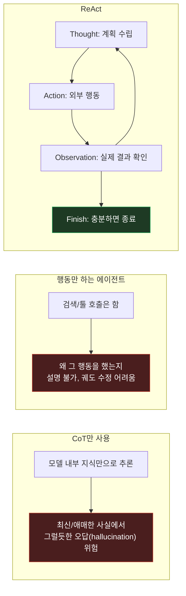

시리즈 여섯 번째 편이자 "에이전트/툴 사용" 트랙의 첫 편. 지금까지 다룬 CoT/Self-Consistency/Tree of Thoughts가 전부 모델 "내부"에서만 추론했다면, 이번에 다룰 **ReAct: Synergizing Reasoning and Acting in Language Models** (Yao et al., 2022, ICLR 2023)는 처음으로 외부 세계(검색, 툴)와 상호작용하며 추론하는 구조다.

## 1. 기본적인 이해부터

쉽게 말하면, ReAct는 **"생각하고 → 행동하고 → 그 결과를 보고 → 다시 생각하는" 루프를 프롬프트로 만드는 방법**이다. 모델이 머릿속으로만 추론하는 게 아니라, 중간중간 "검색해봐야겠다" 같은 **실제 행동(Action)**을 하고, 그 행동의 **결과(Observation)**를 다음 생각의 재료로 삼는다. Thought(생각) → Action(행동) → Observation(관찰)을 반복하다가 답이 나오면 끝낸다.

## 2. 문제점/배경

CoT는 모델이 추론 과정을 텍스트로 풀어내게 만들어서 정확도를 올렸지만, 어디까지나 **모델이 이미 알고 있는(파라미터에 저장된) 지식 안에서만** 추론한다. 그래서 최신 정보나 모델이 애매하게 기억하는 사실을 다룰 때 **그럴듯하게 틀린 답(hallucination)**을 만들어내기 쉬웠다. 반대로 검색·툴 호출만 하는 에이전트(행동만 하고 추론 과정은 안 남기는 방식)는 왜 그 행동을 했는지 설명이 안 되고, 검색 결과가 엉뚱해도 "이 방향이 맞나?" 스스로 점검하며 계획을 수정하는 능력이 없었다. 즉 "생각만 하는 모델"과 "행동만 하는 모델" 사이에 다리가 없었던 것.

## 3. 해결책의 핵심 아이디어

**핵심 한 줄 요약:** 추론(생각)과 행동(외부 툴 호출)을 한 프롬프트 안에서 번갈아 인터리빙하면, 생각이 행동을 계획하고 행동의 관찰 결과가 다음 생각을 교정해준다.

**단계별 설명:**
1. Few-shot 예시를 `Thought → Action → Observation`이 반복되는 궤적(trajectory)으로 구성
2. **Thought**: "다음에 뭘 해야 할지" 자연어로 계획 (예: "이 인물의 출생년도를 검색해야겠다")
3. **Action**: 실제 외부 행동 실행 (예: `Search[인물명]`, `Lookup[키워드]`) — 위키피디아 API, 웹 브라우저 조작, 쇼핑몰 클릭 등 환경에 맞는 행동 공간 정의
4. **Observation**: 그 행동이 환경으로부터 받은 실제 결과(검색 결과 텍스트 등)를 프롬프트에 이어붙임
5. 이 세 가지를 반복하다가, Observation이 답을 찾기에 충분하다고 판단되면 `Finish[답변]` 액션으로 종료 — 중간에 검색이 엉뚱한 결과를 주면 Thought 단계에서 "이 결과는 아닌 것 같다, 다른 검색어로 다시 해보자"처럼 **스스로 궤도 수정**

## 4. 비유/예시

**모르는 걸 검색하며 리포트 쓰는 사람에 비유하면:**

| 방법 | 비유 |
|---|---|
| CoT만 사용 | 도서관 안 가고 기억에만 의존해서 리포트를 씀 — 아는 척하다 틀린 정보를 그럴듯하게 씀 |
| 행동만 하는 에이전트 | 검색은 하는데 왜 그 검색어를 골랐는지, 결과가 맞는지 판단 없이 그냥 나온 걸 붙여넣음 |
| ReAct | "이 부분은 확실하지 않으니 검색해봐야겠다" → 검색 → "어, 이 결과는 내가 찾는 사람이 아니네, 동명이인 같다" → 다른 검색어로 재시도 → "이제 맞다" → 답변 작성 |

ReAct는 "왜 이 행동을 하는지"와 "행동 결과가 기대와 다르면 어떻게 할지"를 명시적으로 프롬프트에 드러내는 게 핵심이다.

## 5. 실제 동작 과정

```text
[질문: "애플 창업자 중 한 명이 만든 다른 회사가 픽사와 합병된 적 있는가?"]

Thought 1: 애플 창업자가 누구인지, 그 중 누가 픽사와 관련 있는지 확인해야겠다.
Action 1: Search[애플 창업자]
Observation 1: 애플은 스티브 잡스, 스티브 워즈니악, 로널드 웨인이 창업했다.

Thought 2: 스티브 잡스가 픽사와 관련 있을 가능성이 높다. 잡스와 픽사 관계를 검색해보자.
Action 2: Search[스티브 잡스 픽사]
Observation 2: 스티브 잡스는 1986년 루카스필름의 컴퓨터 그래픽 부서를 인수해 픽사를 설립했다.

Thought 3: 질문은 "합병"을 물었는데 지금까지는 "인수/설립" 정보만 나왔다.
           질문 의도를 다시 보니 "픽사 자체가 애플 창업자가 만든 회사"라는 뜻 같다.
           추가 검색 없이 지금 정보로 답변 가능하다.
Action 3: Finish[스티브 잡스가 픽사를 설립했다 — 별도 회사가 픽사와 "합병"한 것은 아니고
          잡스가 직접 픽사의 전신을 인수해 설립했다]
```

논문은 이 구조를 HotpotQA(여러 문서를 넘나드는 멀티홉 질의응답), FEVER(사실 검증) 같은 지식 집약적 QA 태스크에는 위키피디아 검색 API(`Search`, `Lookup`, `Finish`)를 액션으로 붙여서 평가했고, ALFWorld(텍스트 기반 가상 집안일 시뮬레이션), WebShop(온라인 쇼핑 환경) 같은 의사결정 태스크에는 각 환경에 맞는 액션 집합을 붙여서 평가했다. 결과적으로 순수 CoT보다 사실관계 오류(hallucination)가 줄었고, 행동만 하는 베이스라인보다 해석 가능성과 견고성이 좋았다.

> 구체적 벤치마크 수치는 이 글에서 뭉뚱그렸다 — 정확한 인용이 필요하면 원문을 대조할 것.

## 그림으로 보기





위쪽 sequenceDiagram은 실제 Thought-Action-Observation 궤적의 시간 순서를, 아래쪽 flowchart는 CoT-only / 행동-only / ReAct 세 접근의 구조적 차이를 보여준다.

## 6. 결과/장점

- **환각(hallucination) 감소**: 답을 모델 내부 지식으로만 지어내지 않고 실제 검색 결과에 근거하게 만들어서 사실관계 오류를 줄임
- **해석 가능성과 디버깅 용이성**: Thought가 텍스트로 남아서 "왜 이 검색을 했는지" 사람이 그대로 읽을 수 있음 — 에이전트가 삼천포로 빠졌을 때 어디서부터 잘못됐는지 추적하기 쉬움
- **궤도 수정 능력**: 검색 결과가 기대와 다르면 다음 Thought에서 스스로 다른 접근을 시도 — CoT/Self-Consistency/ToT가 모델 "내부"의 생각만 다뤘다면, ReAct는 "생각 ↔ 외부 세계"의 피드백 루프를 처음으로 프롬프트 구조에 넣음

## 실무 적용 아이디어

캐릭터 기반 대화형 서비스라면, 응답하기 전에 "이 응답이 안전한지, 설정에 맞는지"를 확인하는 경량 툴(언어 감지기, 정책 필터 등)을 호출하고 그 결과를 보고 다시 생각해서 응답을 조정하는 구조에 ReAct 패턴을 응용할 수 있다. "생성 후 사후 재시도" 방식보다 "생성 중 스스로 확인하며 진행"하는 쪽에 가까워지는 셈이다. 다만 매 턴마다 Thought-Action-Observation 루프를 도는 건 실시간 채팅에는 지연시간 부담이 크므로, 실시간성이 덜 중요한 백그라운드 판정(신고 처리, 콘텐츠 검수)에 먼저 적용해보는 게 현실적이다.

---

다음 편은 **Toolformer (Schick et al., 2023)** — ReAct가 프롬프트로 툴 호출 패턴을 가르치는 방식이라면, Toolformer는 모델이 스스로 "언제 툴을 써야 할지"까지 학습하는 접근이라 흥미로운 대조가 된다.
