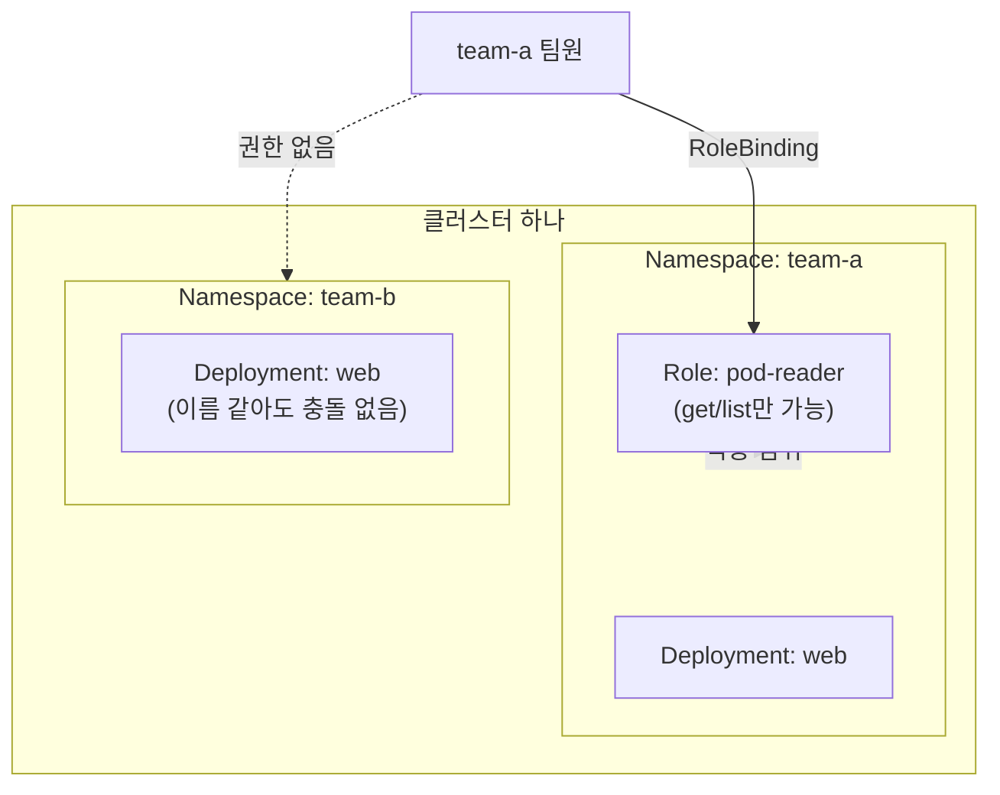

[지난 편]()까지 Pod/Deployment/Service/Ingress로 앱 하나를 배포하고 노출하는 흐름을 정리했다. 이번 편은 조금 결이 다르다 — 클러스터 하나를 여러 팀이나 여러 환경이 같이 쓸 때 필요한 Namespace와 RBAC.

## TL;DR

- Namespace는 클러스터 하나를 여러 논리적 구획으로 나누는 칸막이 — 지금까지 만든 Pod/Deployment 전부 사실 `default`라는 Namespace 안에 있었다
- RBAC는 그 칸막이 안에서 "누가 무엇을 할 수 있는지"를 정하는 출입증 시스템
- Role은 네임스페이스 범위, ClusterRole은 클러스터 전체 범위 권한
- 신입 개발자에게 "조회만 가능"처럼 최소 권한만 부여하면 실수로 프로덕션을 지우는 사고를 구조적으로 막을 수 있다

<br/>

## 1. 클러스터 하나를 여러 팀이 같이 쓰면 생기는 문제

- 팀 A와 팀 B가 각자 `web`이라는 이름의 Deployment를 만들고 싶다 → 클러스터 전체에서 이름이 겹치면 충돌
- 팀 A가 실수로 `kubectl delete deployment web`을 쳤는데, 그게 팀 B의 리소스였다 → 실수로 남의 서비스를 지워버림
- 모든 팀원이 클러스터 전체에 대한 관리자 권한을 가지고 있다 → 신입도 프로덕션 결제 서비스를 삭제할 수 있는 상태
- 특정 팀이 클러스터 전체 CPU/메모리를 다 써버려서 다른 팀 서비스가 죽는다 → 팀별 사용량 제한이 없음

## 2. 핵심 아이디어

**핵심 한 줄 요약:** Namespace로 리소스를 논리적으로 격리하고, RBAC로 그 안에서 "누가 무엇을 할 수 있는지"를 최소한으로 제한한다.

1. **Namespace 생성:** 클러스터를 `team-a`, `team-b`, `dev`, `prod` 같은 가상 구획으로 나눔
2. **이름 충돌 방지:** 리소스는 기본적으로 자신의 Namespace 안에서만 이름이 유일하면 됨
3. **ResourceQuota:** Namespace별로 "여기서는 CPU 4코어, 메모리 8GB까지만" 같은 사용량 상한을 걸 수 있음
4. **Role:** 특정 Namespace 안에서 허용할 동작(조회는 되지만 삭제는 안 됨 등)을 정의
5. **RoleBinding:** 그 Role을 특정 사용자나 서비스 어카운트에게 부여
6. **ClusterRole/ClusterRoleBinding:** Namespace 경계를 넘어 클러스터 전체에 적용해야 하는 권한에는 이걸 씀



team-a 팀원은 RoleBinding을 통해 team-a 안에서만 정해진 동작을 할 수 있고, team-b 쪽은 아예 보이지도 않는다.

## 3. 비유 — 공유 오피스 건물

| 상황 | 비유 |
|---|---|
| 클러스터 | 건물 전체 |
| Namespace | 각 층/사무실 (팀A 사무실, 팀B 사무실) |
| 이름 충돌 없음 | 팀A 사무실에도, 팀B 사무실에도 "회의실"이 있어도 헷갈리지 않음 |
| ResourceQuota | 사무실마다 전기 사용량 한도 계약 |
| Role | "이 출입증으로는 문 열기·불 켜기만 가능, 인테리어 철거는 불가" |
| RoleBinding | 그 출입증을 실제로 특정 직원에게 발급 |

## 4. 실제로 이렇게 쓴다

```yaml
# Namespace 생성
apiVersion: v1
kind: Namespace
metadata:
  name: team-a
```

```yaml
# ResourceQuota — team-a 안에서 쓸 수 있는 리소스 상한
apiVersion: v1
kind: ResourceQuota
metadata:
  name: team-a-quota
  namespace: team-a
spec:
  hard:
    requests.cpu: "4"
    requests.memory: 8Gi
    pods: "20"
```

```yaml
# Role — team-a Namespace 안에서 Pod 조회만 허용 (삭제/생성 불가)
apiVersion: rbac.authorization.k8s.io/v1
kind: Role
metadata:
  namespace: team-a
  name: pod-reader
rules:
- apiGroups: [""]
  resources: ["pods"]
  verbs: ["get", "list", "watch"]   # 딱 이 세 가지 동작만 허용
```

```yaml
# RoleBinding — 실제 사용자에게 위 Role을 부여
apiVersion: rbac.authorization.k8s.io/v1
kind: RoleBinding
metadata:
  name: read-pods
  namespace: team-a
subjects:
- kind: User
  name: junior-dev@example.com
  apiGroup: rbac.authorization.k8s.io
roleRef:
  kind: Role
  name: pod-reader
  apiGroup: rbac.authorization.k8s.io
```

```bash
kubectl get pods -n team-a

kubectl auth can-i delete pods -n team-a --as=junior-dev@example.com
# no   <- Role에 delete를 안 줬으니 거부됨
```

## 지금 상태 / 다음에 할 일

Namespace/RBAC까지 정리하면서, kubernetes.io 공식 문서로 다시 대조해봤는데 이번 편은 전부 그대로 맞았다(apiVersion, Role/ClusterRole 구분, ResourceQuota 필드명, `kubectl auth can-i --as=` 문법 전부 정확). 다음 편은 **스케줄링 & 리소스** — 클러스터가 Pod를 어디에, 어떻게 배치하는지.
