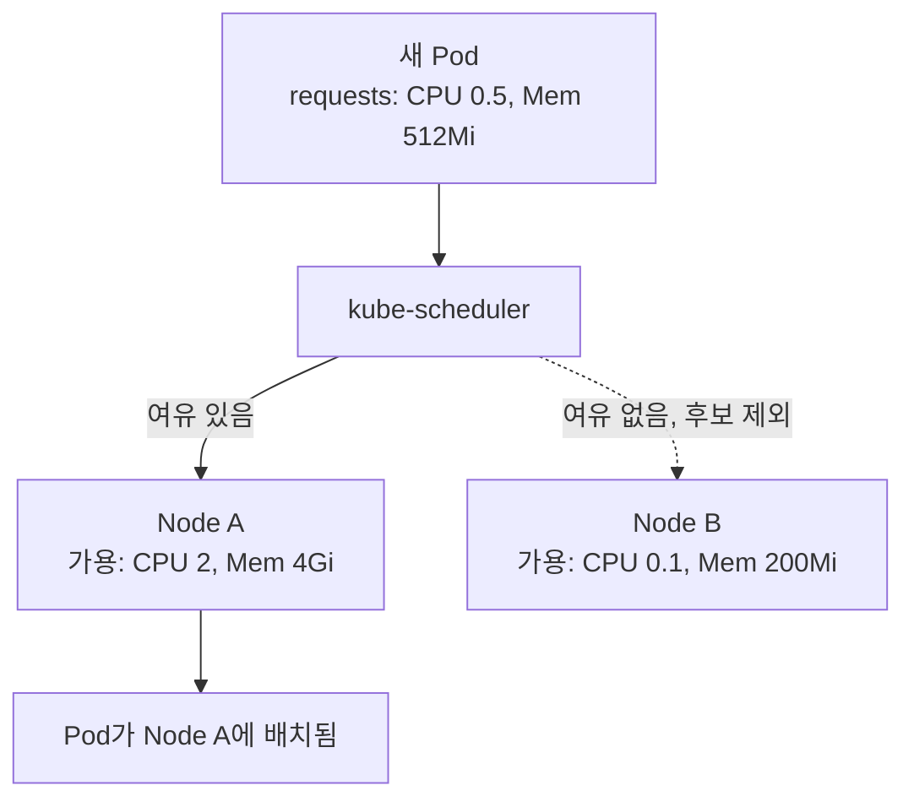

[지난 편](/journal/development%20diary/2026/07/27/k8s-study-07-namespace-rbac.html)까지 클러스터를 팀/환경별로 나누는 법을 봤다. 이번 편은 조금 더 물리적인 질문 — 노드(서버)가 여러 대인 클러스터에서, K8s는 새 Pod를 어디에 배치할지 어떻게 결정하는가.

## TL;DR

- 스케줄러(kube-scheduler)는 Pod가 선언한 **requests**만 보고 배치할 노드를 결정한다 — limits는 배치 판단에 안 쓰인다
- CPU가 limits를 넘으면 느려지기만 하고(throttle), 메모리가 limits를 넘으면 죽는다(OOMKilled) — 압축 가능/불가능 자원의 차이
- requests/limits 설정 여부에 따라 QoS 등급(Guaranteed/Burstable/BestEffort)이 자동으로 매겨지고, 노드가 바빠지면 이 순서대로 먼저 쫓겨난다
- K8s 1.35(GA)부터는 Pod 재시작 없이 리소스를 그 자리에서 조정하는 In-Place Resize도 가능해졌다

<br/>

## 1. 리소스 선언 없이 배치하면 생기는 문제

- Pod가 얼마나 CPU/메모리를 쓸지 정보가 없으면 → 스케줄러가 "이 노드에 여유가 있는지" 판단할 근거가 없어서, 이미 꽉 찬 노드에도 Pod를 던져 넣을 수 있음
- 그렇게 배치된 Pod가 뜨자마자 메모리 부족(OOM)으로 죽거나, CPU 경합으로 응답이 느려짐
- 한 Pod가 버그로 메모리를 무한정 먹기 시작하면 → 같은 노드의 죄 없는 다른 Pod들까지 같이 죽음 ("이웃 효과")

## 2. 핵심 아이디어

**핵심 한 줄 요약:** Pod는 requests(최소 보장 필요량)와 limits(초과 금지 상한)를 선언하고, 스케줄러는 requests를 만족하는 노드를 찾아 배치하며, 실행 중에는 limits를 넘지 못하게 강제한다.

1. **선언:** Pod가 `resources.requests`와 `resources.limits`를 CPU/메모리 단위로 선언
2. **스케줄링 판단:** 스케줄러가 각 노드의 "전체 용량 − 이미 배치된 Pod들의 requests 합"을 계산해서 후보 노드를 남김
3. **배치:** 후보 노드 중 하나를 골라 실제로 띄움
4. **실행 중 제한:** CPU는 limits를 넘으면 throttle(느려짐)만, **메모리**는 limits를 넘으면 OOMKilled — 처리 방식이 다르다 (CPU는 압축 가능 자원, 메모리는 압축 불가능 자원이라 그렇다)
5. **QoS 클래스:** requests/limits 설정 방식에 따라 Guaranteed(둘이 같음) / Burstable(둘 다 있지만 다름) / BestEffort(둘 다 없음)이 자동 결정되고, 노드가 부족해지면 BestEffort → Burstable → Guaranteed 순으로 축출됨 (같은 Burstable끼리는 requests를 얼마나 초과했는지로 한 번 더 갈림)



## 3. 비유 — 이사 갈 집 구하기

| 상황 | 비유 |
|---|---|
| Pod의 requests | "최소 방 3개, 20평은 필요해요"라고 부동산에 요청하는 조건 |
| 스케줄러 | 그 조건에 맞는 빈 건물(노드)을 찾아주는 부동산 중개인 |
| Pod의 limits | "아무리 짐이 늘어도 30평 이상은 못 씁니다"라는 계약상 상한 |
| CPU 초과(throttle) | 짐을 더 놓으려 하면 문이 안 열려서 못 들어감(느려짐, 죽지는 않음) |
| 메모리 초과(OOMKill) | 계약 면적을 넘어서 짐을 쌓다가 바닥이 무너져 강제 퇴거당함 |

## 4. 실제로 이렇게 쓴다

```yaml
apiVersion: apps/v1
kind: Deployment
metadata:
  name: web
spec:
  replicas: 3
  selector:
    matchLabels:
      app: web
  template:
    metadata:
      labels:
        app: web
    spec:
      containers:
      - name: nginx
        image: nginx:1.25
        resources:
          requests:              # 최소 이만큼은 확보돼야 스케줄링됨
            cpu: "250m"           # 0.25 코어
            memory: "256Mi"
          limits:                 # 이 이상은 못 씀
            cpu: "500m"
            memory: "512Mi"
```

```bash
kubectl describe node node-a
# Allocated resources:
#   Resource   Requests    Limits
#   --------   --------    ------
#   cpu        1500m (75%)  3000m (150%)
#   memory     3Gi (60%)    6Gi (120%)

kubectl top pods   # 실제 사용량 확인 (metrics-server 필요)
# NAME        CPU(cores)   MEMORY(bytes)
# web-abc123  180m         210Mi
```

> **최신 동향 (공식문서 검증):** 예전엔 requests/limits를 바꾸려면 Pod를 지우고 다시 만들어야 했다. [In-Place Pod Resize](https://kubernetes.io/blog/2025/05/16/kubernetes-v1-33-in-place-pod-resize-beta/) 기능이 K8s 1.35(2025-12)에서 GA되면서, 재시작 없이 실행 중인 Pod의 CPU/메모리를 그 자리에서 조정할 수 있게 됐다.

## 지금 상태 / 다음에 할 일

스케줄링/QoS까지 정리했고, kubernetes.io로 재검증한 결과 스케줄러의 requests 기준 판단, CPU/메모리 초과 처리 차이, QoS 축출 순서 전부 정확했다(1.35 GA된 In-Place Resize만 추가). 다음 편은 **Helm** — 지금까지 써온 YAML 매니페스트 뭉치를 어떻게 패키징하고 재사용하는지.
