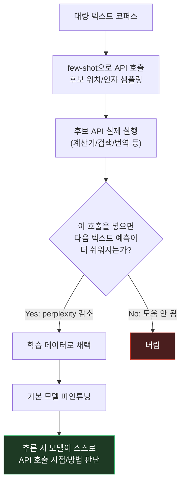
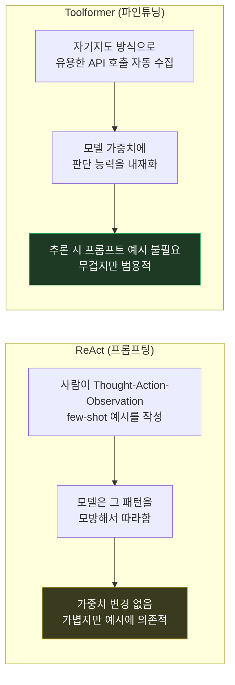

시리즈 일곱 번째 편이자 "에이전트/툴 사용" 트랙의 마지막 편. 지난 편에서 다룬 [ReAct](/study/llm/2026/07/23/llm-prompting-paper-06-react.html)가 프롬프트로 "언제 툴을 쓸지" 예시를 보여주는 방식이었다면, 이번에 다룰 [**Toolformer: Language Models Can Teach Themselves to Use Tools**](https://arxiv.org/abs/2302.04761) (Schick et al., 2023, NeurIPS)는 그 판단 자체를 모델 가중치에 학습시키는 접근이라 흥미로운 대조가 된다.

## 1. 기본적인 이해부터

쉽게 말하면, Toolformer는 **"언제 계산기를 쓰고, 언제 검색을 해야 하는지"를 모델이 스스로 학습하게 만드는 방법**이다. ReAct처럼 프롬프트에 "이럴 땐 이렇게 검색해라"라는 예시를 매번 손으로 써주는 대신, 모델이 텍스트를 만들다가 필요한 순간에 **스스로 API 호출 토큰을 생성**하도록 파인튜닝한다. 그러면 이후엔 별도 프롬프트 지시 없이도 모델이 알아서 "여기선 계산기가 필요하다"고 판단한다.

## 2. 문제점/배경

ReAct는 강력했지만, **모든 게 프롬프트 안 few-shot 예시에 달려있었다.** 새 태스크나 새 툴을 붙이려면 사람이 "이런 상황에서 이렇게 Thought-Action-Observation을 써라"라는 예시를 매번 정성껏 작성해야 했고, 모델은 그 예시 패턴을 모방할 뿐 "이 툴이 정말 필요한지"를 스스로 판단하는 능력을 내재화하진 않았다. 게다가 LLM은 태생적으로 산수, 최신 사실, 정확한 번역 같은 데 약한데, 아무리 모델을 키워도 이 약점은 근본적으로 안 사라졌다. 즉 "프롬프트로 매번 알려주는" 방식 말고, **모델 자체가 "나는 이런 걸 못하니 이럴 땐 도구를 써야 한다"를 알고 있게** 만들 방법이 필요했다.

## 3. 해결책의 핵심 아이디어

**핵심 한 줄 요약:** 대량의 텍스트에 "이 위치에서 이 API를 호출하면 다음 단어 예측이 더 쉬워지는지"를 자기지도적으로 검증해서, 실제로 도움이 되는 API 호출만 골라 그 텍스트로 모델을 파인튜닝한다.

**단계별 설명:**
1. 각 툴에 대해, 기본 모델에게 few-shot으로 "이 텍스트의 어느 위치에 이 API를 호출하면 좋을지" 후보를 대량으로 생성시킴 (예: "은하수엔 별이 [API 호출 후보] 개 있다")
2. 후보로 뽑힌 API 호출을 **실제로 실행**해서 진짜 결과값을 받아옴 (계산기면 실제 계산, 검색이면 실제 검색 결과)
3. 그 API 호출 + 결과를 텍스트에 끼워 넣었을 때, **모델이 이어지는 텍스트를 예측하는 게 더 쉬워지는지(perplexity가 줄어드는지)**를 기준으로 필터링 — 실제로 도움이 안 되는 호출(불필요한 검색 등)은 버림
4. 이렇게 "진짜 도움이 된 API 호출"만 남은 텍스트 데이터셋으로 기본 모델을 **파인튜닝**
5. 결과적으로 모델은 "이런 문맥에선 계산기를 호출하는 게 다음 단어를 더 잘 맞춘다"는 걸 가중치에 내재화 — 추론 시 별도 프롬프트 지시 없이도 알아서 API 호출 토큰을 생성하고, 그 호출이 실행되면 결과를 이어서 문장을 완성함

## 4. 비유/예시

**매번 매뉴얼을 참고하는 신입 vs 체화된 베테랑에 비유하면:**

| ReAct | Toolformer |
|---|---|
| 매뉴얼(few-shot 예시)을 보면서 "아, 이 상황엔 검색하라고 써있네" 하고 그대로 따라함 | 오래 일해서 "이런 계산은 내가 암산하면 틀리니 계산기를 꺼내야지"가 몸에 밴 상태 |
| 새 상황이 매뉴얼에 없으면 대응 못 함 | 매뉴얼 없이도 "이건 도구가 필요한 상황"이라는 판단 자체가 체화됨 |
| 프롬프트만 바꾸면 즉시 적용(가볍다) | 판단 능력 자체를 새로 학습시키려면 파인튜닝 파이프라인이 필요(무겁다) |

ReAct가 "매번 알려주는" 방식이라면 Toolformer는 "한 번 제대로 가르쳐서 체화시키는" 방식이다.

## 5. 실제 동작 과정

```text
[Step 1: 후보 생성 — few-shot으로 API 호출 위치 후보 샘플링]
원문: "은하수에는 약 2,500억 개의 별이 있다고 추정된다."
후보 삽입: "은하수에는 약 [QA(은하수의 별 개수는?)] 개의 별이 있다고 추정된다."

[Step 2: 실제 실행]
QA(은하수의 별 개수는?) → 실행 결과: "2,500억"

[Step 3: 필터링 — 이 호출이 다음 텍스트 예측에 도움이 되는가?]
호출 포함 버전: "...[QA(...) → 2,500억] 개의 별이..." → 모델이 "2,500억"을 훨씬 쉽게 예측
호출 없는 버전:  "...개의 별이..." → 모델이 정확한 숫자를 맞히기 어려움
→ 예측이 쉬워졌으니 이 API 호출은 "유용함"으로 채택

[Step 4: 파인튜닝]
"유용함"으로 판정된 API 호출이 포함된 텍스트들만 모아서 기본 모델을 파인튜닝

[Step 5: 추론 시점]
유저: "은하수에는 별이 몇 개나 있어?"
모델(파인튜닝 후): "은하수에는 [QA(은하수의 별 개수는?)" ← 모델이 스스로 이 시점에 호출 필요성을 판단
→ (API 실행) → 결과 "2,500억" 삽입 → "약 2,500억 개의 별이 있다고 추정돼요."
   (별도 프롬프트 지시 없이 모델이 알아서 호출 토큰을 생성)
```

논문은 계산기·Q&A(Atlas)·위키피디아 검색(BM25 리트리버)·번역(NLLB, 600M)·캘린더 다섯 가지 툴에 이 방식을 적용했고, **GPT-J(6.7B)를 파인튜닝**한 Toolformer가 같은 크기의 원본 모델보다 산수·질의응답 등 툴이 도움되는 태스크에서 zero-shot 성능이 크게 향상됐다. 중요한 건 "유용한 호출만" 걸러서 학습시켰기 때문에, 툴이 필요 없는 상황에서 불필요하게 남발하지 않았다는 점이다.

> 구체적 벤치마크 수치(정확도 %)는 이 글에서 뭉뚱그렸다 — 정확한 인용이 필요하면 원문 표를 대조할 것.

## 그림으로 보기





위쪽은 Toolformer의 데이터 생성→필터링→파인튜닝 파이프라인을, 아래쪽은 ReAct(프롬프팅, 가볍지만 예시 의존)와 Toolformer(파인튜닝, 무겁지만 판단 능력이 체화됨)의 근본적 차이를 보여준다.

## 6. 결과/장점

- **프롬프트 의존성 탈피**: 매 태스크마다 few-shot 예시를 손으로 안 써도, 모델이 스스로 "지금 도구가 필요한 순간"을 판단
- **자기지도 데이터 구축**: 사람이 라벨링한 데이터 없이, 모델 스스로 후보를 만들고 perplexity 기준으로 자체 필터링해서 학습 데이터를 만듦 — 사람 개입 최소화
- **과사용 방지**: perplexity 개선에 실제로 도움이 된 호출만 학습에 남기기 때문에, 불필요한 곳에서 툴을 남발하지 않는 균형 잡힌 습관이 형성됨
- **트레이드오프**: ReAct는 프롬프트만 바꾸면 바로 쓸 수 있는 반면, Toolformer는 후보 생성-실행-필터링-파인튜닝이라는 무거운 파이프라인이 필요하고, 가중치에 접근해 파인튜닝할 수 있는 모델이어야 적용 가능(폐쇄형 API 모델엔 그대로 적용 불가)

## 실무 적용 아이디어

캐릭터 기반 채팅 서비스에서 ReAct 패턴을 프롬프트로 적용하는 게 매 상황마다 예시를 관리해야 해서 유지보수 부담이 커진다면, "이런 안전장치 개입이 실제로 응답 품질에 도움이 됐는지"를 데이터로 축적해뒀다가 추후 그 판단 자체를 파인튜닝으로 내재화하는 방향도 검토할 수 있다. 다만 이건 자체 파인튜닝 파이프라인을 운용할 수 있는 오픈 웨이트 모델에만 해당되는 얘기라 현재 스택 구조를 먼저 확인해야 한다. perplexity 기반 "이 개입이 실제로 도움이 됐는가" 필터링 아이디어는, 안전장치가 실제로 응답 품질을 개선했는지 정량 평가하는 방법론으로도 참고할 만하다.

---

이걸로 "에이전트/툴 사용" 트랙을 마무리한다. 다음은 정렬/안전성 트랙 — **InstructGPT (Ouyang et al., 2022)**로 이어갈 예정.
