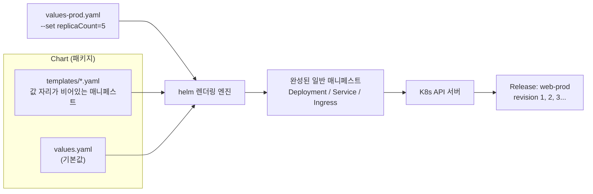
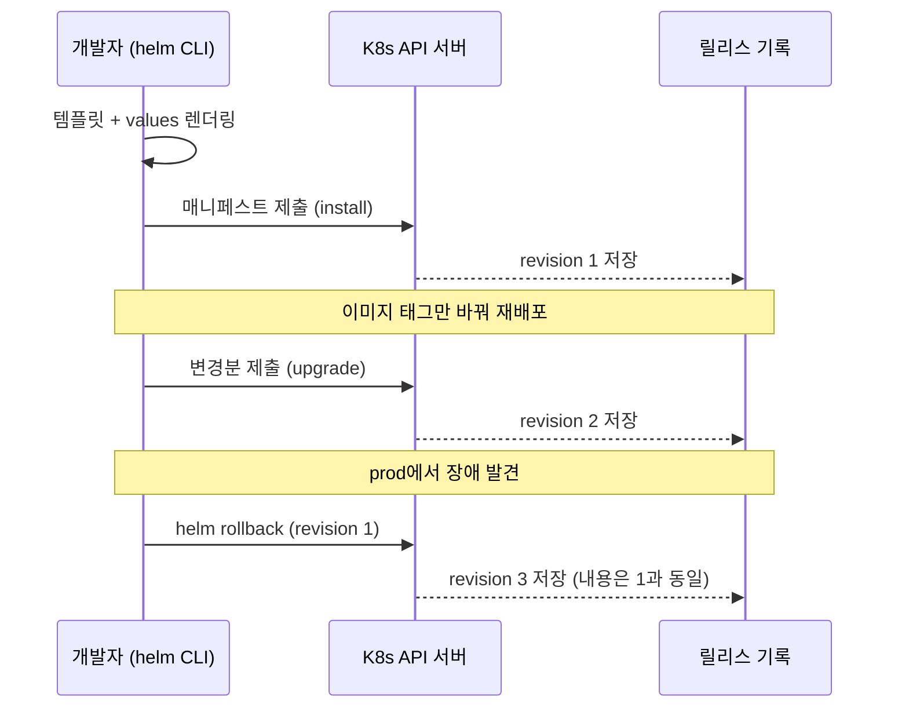

[지난 편](/journal/development%20diary/2026/07/27/k8s-study-08-scheduling-resources.html)까지 Pod를 어디에 어떻게 배치하는지를 봤다. 1강부터 8강까지 오면서 손에 남은 건 결국 YAML 파일 뭉치다. 이번 편은 그 뭉치를 어떻게 하나의 패키지로 묶어 재사용하고 되돌리는가 — [Helm](https://helm.sh/docs/) 이야기.

## TL;DR

- Helm은 쿠버네티스용 **패키지 매니저**다. Chart(패키지 = 템플릿 묶음) / Values(주입할 설정값) / Release(설치된 결과물) 세 단어면 개념의 8할은 끝난다
- 매니페스트에서 환경마다 달라지는 값을 `{{ .Values.x }}` 자리로 파내고, 그 값을 values 파일로 분리한다 → 환경이 몇 개든 차트는 한 벌
- 렌더링은 **내 노트북(또는 CI)에서** 끝나고, 클러스터에 도착하는 건 평범한 YAML이다. 클러스터에 상주하는 Helm 서버 같은 건 없다
- 설치 결과가 **릴리스 리비전**으로 기록되므로 `helm rollback` 한 줄로 이전 상태로 되돌아간다. 롤백조차 새 리비전으로 쌓여서 이력이 끊기지 않는다
- 값이 겹치면 나중에 준 게 이긴다 — `--set` > 뒤에 온 `-f` > 앞에 온 `-f` > 차트의 `values.yaml`
- 참고로 **Helm 4가 2025년 11월에 GA** 됐다. 개념과 기본 명령어는 그대로지만 `--atomic` 같은 플래그 이름이 바뀌었다 (아래 각주)

<br/>

## 1. YAML이 쌓이면 생기는 문제

앱 하나를 제대로 배포하려면 Deployment, Service, ConfigMap, Secret, Ingress, HPA… 파일이 금방 5~10개가 된다. 여기서부터 문제가 시작된다.

- **환경별 복붙 지옥:** dev/staging/prod가 99% 같은데 이미지 태그, replicas, 도메인, 리소스 크기만 다르다. 그래서 디렉터리를 3벌 복사하고, 시간이 지나면 세 벌이 조금씩 어긋난다(drift). "prod에만 왜 이 환경변수가 없지?"가 여기서 나온다
- **설치/삭제 단위가 없음:** `kubectl apply -f ./`로 밀어 넣긴 쉬운데, "이 앱이 만든 리소스만 정확히 지워줘"가 어렵다
- **롤백 개념이 없음:** 되돌리려면 이전 YAML을 git에서 찾아 다시 apply해야 하고, "어느 커밋이 마지막 정상이었더라"를 사람이 기억해야 한다
- **남의 앱 설치가 중노동:** Redis, PostgreSQL, Prometheus를 올리려면 StatefulSet·Service·PVC를 직접 수십 줄씩 쓴다. 이미 세상 사람들이 다 똑같이 쓴 YAML인데도

## 2. 핵심 아이디어

**핵심 한 줄 요약:** 매니페스트에서 변하는 값을 템플릿 자리로 파내고 values로 분리한 뒤, 렌더링 결과 전체를 "릴리스"라는 버전 단위로 설치·업그레이드·롤백한다.

1. **템플릿화:** `image: nginx:1.25` → `image: {{ .Values.image.repository }}:{{ .Values.image.tag }}`
2. **기본값 선언:** 차트 안 `values.yaml`에 기본값을 모아둔다
3. **환경별 덮어쓰기:** 설치할 때 `-f values-prod.yaml`이나 `--set replicaCount=5`로 필요한 값만 덮어쓴다
4. **렌더링:** Helm이 템플릿 + values를 합쳐 **완성된 평범한 YAML**을 만든다. 이 시점 이후는 1~8강에서 본 그 매니페스트와 똑같다
5. **제출 & 기록:** 렌더링된 매니페스트를 API 서버에 보내고, "무엇을 어떤 값으로 설치했는지"를 릴리스 리비전으로 클러스터 안에 기록한다
6. **업그레이드/롤백:** 다음 배포는 revision 2, 3…으로 쌓이고, 문제가 생기면 `helm rollback` 한 줄로 되돌린다



여기서 중요한 감각 하나 — **Helm은 클러스터에 상주하는 무언가가 아니다.** 렌더링은 클라이언트에서 끝나고, 클러스터에 남는 Helm의 흔적은 "이 릴리스의 매니페스트가 이랬다"는 기록뿐이다.

그 기록이 실제로 어디 있냐면 — **릴리스와 같은 네임스페이스의 Secret**이다([공식문서](https://helm.sh/docs/topics/advanced/)). `kubectl get secret -l owner=helm`으로 눈으로 확인된다. 다만 이 Secret에는 렌더링에 쓰인 values 전체가 들어가므로 **비밀번호를 values로 넘겼다면 그것도 같이 들어있다**. 공식문서가 직접 경고하는 부분이다.



롤백조차 **새 리비전으로 쌓인다**는 점이 포인트다. 되돌리기가 기록을 지우는 게 아니라 "1번 상태로 돌아간 3번"을 새로 만드는 방식이라, 나중에 이력을 읽을 때 무슨 일이 있었는지가 그대로 보인다.

## 3. 비유로 한 번 더

메일 머지(mail merge)로 청첩장 100장을 만든다고 생각하면 거의 그대로 대응된다.

| Helm 개념 | 비유 |
|---|---|
| Chart의 templates/ | `{이름}님께` 자리가 비어있는 청첩장 서식 |
| values.yaml | 기본값이 채워진 명단 |
| `-f values-prod.yaml` | 특정 그룹만 다른 문구로 갈아끼우는 별도 명단 |
| 렌더링 | 서식 + 명단을 합쳐 실제 청첩장을 뽑는 순간 |
| Release | 실제로 발송된 청첩장 묶음 (누구에게 뭘 보냈는지 남음) |
| revision / rollback | "지난번 버전 그대로 다시" 가 가능한 발송 이력 |

서식과 명단이 분리돼 있으니 **문구를 고치고 싶으면 서식 한 장만 고치면 100장에 다 반영된다.** 복붙 방식은 100장을 다 고쳐야 하고, 그중 3장을 빼먹는다.

## 4. 실제로 이렇게 쓴다

**차트 구조** ([공식 Charts 문서](https://helm.sh/docs/topics/charts/)):

```
mychart/
├── Chart.yaml          # 필수. apiVersion(v2) + name + version 3개가 필수 필드. 의존 차트도 여기 선언
├── values.yaml         # 기본값 모음
├── templates/          # 렌더링될 매니페스트 템플릿들
│   ├── deployment.yaml
│   ├── service.yaml
│   ├── _helpers.tpl    # 재사용 조각. _ 로 시작하면 매니페스트로 출력되지 않음
│   └── NOTES.txt       # 설치 완료 후 터미널에 뜨는 안내문
├── charts/             # 의존하는 서브차트가 놓이는 자리
└── .helmignore         # 패키징에서 제외할 파일 패턴
```

**템플릿** — 3강의 Deployment에 구멍을 뚫은 것 ([Chart Template Guide](https://helm.sh/docs/chart_template_guide/)):

```yaml
apiVersion: apps/v1
kind: Deployment
metadata:
  name: {{ .Release.Name }}-web        # 릴리스 이름을 앞에 붙여 충돌 방지
spec:
  replicas: {{ .Values.replicaCount }} # 환경마다 다른 값
  selector:
    matchLabels:
      app: {{ .Release.Name }}-web
  template:
    metadata:
      labels:
        app: {{ .Release.Name }}-web
    spec:
      containers:
      - name: web
        image: "{{ .Values.image.repository }}:{{ .Values.image.tag }}"
        resources:
          {{- toYaml .Values.resources | nindent 10 }}   # 8강의 requests/limits 블록을 통째로 주입
```

- `.Values.*` — values 파일에서 온 값
- `.Release.Name` — 설치할 때 정한 릴리스 이름 (Helm이 자동으로 채워준다)
- `{{- ... }}` — 앞쪽 공백/줄바꿈을 먹으라는 표시. YAML은 들여쓰기가 문법이라 이게 없으면 결과가 깨진다
- `nindent 10` — 주입되는 블록 전체를 10칸 들여쓴다

**기본값과 환경별 덮어쓰기:**

```yaml
# values.yaml — 기본값(개발 기준)
replicaCount: 1
image:
  repository: nginx
  tag: "1.25"
resources:
  requests: { cpu: 100m, memory: 128Mi }
  limits:   { cpu: 200m, memory: 256Mi }
```

```yaml
# values-prod.yaml — 다른 것만 적는다
replicaCount: 5
resources:
  requests: { cpu: 500m, memory: 512Mi }
  limits:   { cpu: 1,    memory: 1Gi }
```

**명령어:**

```bash
# 0. 렌더링 결과를 눈으로 먼저 확인 (클러스터에 아무것도 안 보냄) — 가장 자주 쓰게 된다
helm template web-prod ./mychart -f values-prod.yaml

# 1. 설치
helm install web-prod ./mychart -f values-prod.yaml
#     ^릴리스 이름   ^차트 경로

# 2. 배포. --install 을 붙이면 없으면 설치, 있으면 업그레이드
helm upgrade --install web-prod ./mychart -f values-prod.yaml \
  --set image.tag=1.26

# 3. 이력 확인 → 문제 생기면 롤백
helm history web-prod
# REVISION  STATUS      DESCRIPTION
# 1         superseded  Install complete
# 2         deployed    Upgrade complete
helm rollback web-prod 1

# 4. 릴리스 목록 / 통째로 삭제
helm list -A
helm uninstall web-prod          # 이 릴리스가 만든 리소스만 정확히 제거

# 5. 남이 만든 차트 쓰기 — StatefulSet/PVC 직접 안 써도 Redis가 뜬다
helm repo add bitnami https://charts.bitnami.com/bitnami
helm repo update
helm search repo redis
helm install cache bitnami/redis
# 주의: --set 으로 넘긴 값은 위에서 말한 릴리스 Secret에 그대로 들어간다.
# 비밀번호는 values 대신 별도 Secret을 만들어 참조시키는 편이 안전하다(5강 참고).
```

값이 겹칠 때의 우선순위 감각 하나: **나중에 준 게 이긴다.** 공식 순서는 `차트의 values.yaml` < `부모 차트의 values.yaml` < `-f 파일(여러 개면 오른쪽이 이김)` < `--set`이다([공식문서](https://helm.sh/docs/chart_template_guide/values_files/)). 그래서 "기본값은 values.yaml, 환경 차이는 -f, 배포마다 바뀌는 이미지 태그는 --set(CI에서 주입)"이 흔한 조합이다.

그리고 `helm search repo`는 인터넷을 뒤지는 게 아니라 **내 컴퓨터에 받아둔 인덱스**를 뒤진다. 새 버전이 안 보이면 십중팔구 `helm repo update`를 안 한 것이다.

## 5. 얻는 것과, 알고 시작할 것

**얻는 것**

- **중복 제거:** 환경이 3개든 10개든 차트는 한 벌. 공통 수정이 한 곳에서 끝나 drift가 구조적으로 줄어든다
- **설치 단위:** 흩어진 리소스 8개가 "web-prod 릴리스" 하나로 묶인다. `helm uninstall` 하나로 딱 그만큼만 사라진다
- **되돌릴 수 있는 배포:** 롤백이 "git에서 옛날 YAML 찾기"가 아니라 명령 한 줄이 된다
- **생태계:** Redis·PostgreSQL·Prometheus·cert-manager 같은 표준 컴포넌트를 검증된 차트로 몇 줄 만에 올린다

**Helm의 그늘**

- **템플릿 가독성:** 조건문·반복문이 겹겹이 쌓이면 "이 차트가 결국 뭘 만드는지"를 사람이 읽어내기 어려워진다. `helm template`으로 렌더링 결과를 확인하는 습관이 그래서 중요하다
- **YAML을 문자열로 다룬다:** 구조를 이해하고 조립하는 게 아니라 텍스트를 이어붙인 뒤 파싱한다. 들여쓰기 한 칸 때문에 터지는 사고가 여기서 나온다(`nindent`가 필요한 이유)
- **대안도 있다:** 템플릿 없이 "기본 YAML + 환경별 패치(overlay)"로 같은 문제를 푸는 [Kustomize](https://kubernetes.io/docs/tasks/manage-kubernetes-objects/kustomization/)는 `kubectl apply -k`로 kubectl에 내장돼 있다. 값 주입이 단순하면 Kustomize, 배포 대상이 패키지처럼 유통돼야 하면 Helm 정도로 나눠 쓰면 무리가 없다

> **최신 동향 (공식문서 검증):** 이 글은 오래 표준이던 Helm 3 기준으로 썼는데, 정리하다 보니 **[Helm 4가 2025년 11월 12일에 GA](https://helm.sh/blog/helm-4-released/)** 됐다는 걸 알게 됐다(2026년 7월 현재 최신 4.2.3, 6년 만의 메이저 업데이트). 위에 쓴 개념과 명령어는 4에서도 그대로 통하고, 공식 안내도 *"Helm 4는 기존 Helm 3 릴리스를 별도 마이그레이션 없이 관리할 수 있다"*고 명시한다. 다만 옮겨가며 걸릴 것 세 가지:
>
> - **플래그 이름이 바뀜** — 배포 실패 시 자동 롤백하는 `--atomic` → `--rollback-on-failure`, `--force` → `--force-replace`(구 이름은 당분간 동작하되 경고). `--wait`도 전략 선택형(`watcher`/`hookOnly`/`legacy`)으로 동작이 바뀌었다
> - **Helm 3는 수명이 정해짐** — [공식 EOL 공지](https://helm.sh/blog/helm-v3-end-of-life/) 기준 마지막 마이너 릴리스 2026-09-09, 보안 패치 종료 2027-02-10
> - **문서 사이트 기본값이 4** — helm.sh/docs는 이제 Helm 4 문서를 보여준다. 3 기준 문법을 확인하려면 URL에 `/v3/`를 끼워야 한다(`helm.sh/docs/v3/helm/helm_install/`)
>
> 새로 들어간 것 중엔 **Server-Side Apply 지원**과 **WebAssembly 기반 플러그인 시스템**이 눈에 띈다. 단, Helm 3 때 만들어진 기존 릴리스는 4로 올려도 기본은 client-side apply로 유지된다.

> **역사 한 조각:** Helm 2에는 클러스터 안에 **Tiller**라는 서버 컴포넌트가 상주하면서 대신 배포를 수행했다. 강한 권한을 가진 채 떠 있어서 RBAC이 기본 활성화된 이후 보안상 다루기 까다로웠고, Helm 3에서 **아예 제거**됐다([공식 FAQ](https://helm.sh/docs/faq/changes_since_helm2/)). 지금 Helm이 "내 kubeconfig 권한으로 동작하는 순수 CLI"인 건 그 결과다. 오래된 글에서 Tiller 얘기가 나오면 Helm 2 시절 자료라고 보면 된다.

## 지금 상태 / 다음에 할 일

1강부터 9강까지, "왜 K8s인가"에서 시작해 Pod·Deployment·Service·ConfigMap/Secret·Ingress·Namespace/RBAC·스케줄링을 지나, 이제 그 전부를 하나의 패키지로 묶는 데까지 왔다. 개념 한 바퀴는 여기서 일단락. 다음은 배운 걸 실제 클러스터에 직접 굴려보면서 생기는 질문들을 모아볼 생각이다 — 아마 그쪽이 진짜 공부일 것 같다.
