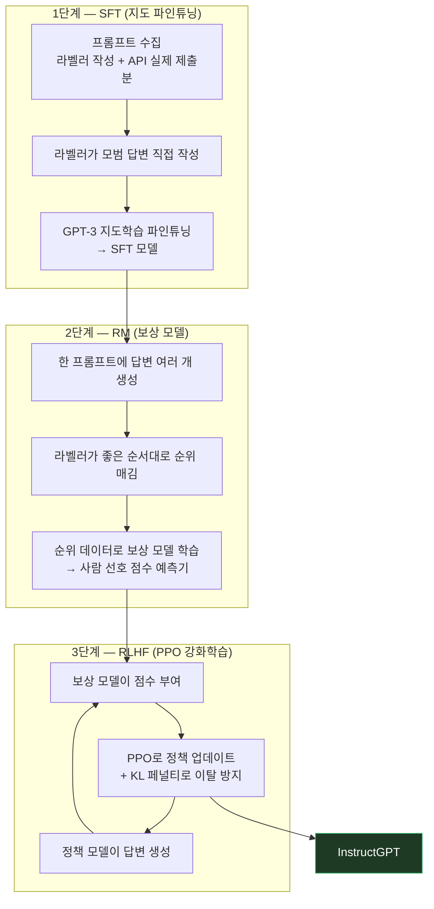
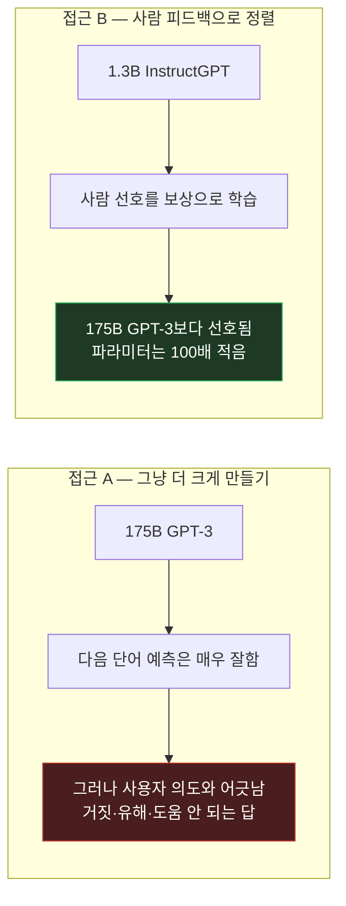

시리즈 여덟 번째 편이자 "정렬(Alignment)/안전성" 트랙의 첫 편. 지난 [Toolformer](/study/llm/2026/07/27/llm-prompting-paper-07-toolformer.html)까지가 "모델을 어떻게 더 똑똑하게 쓸 것인가"였다면, 이번에 다룰 [**Training language models to follow instructions with human feedback**](https://arxiv.org/abs/2203.02155) (Ouyang et al., 2022, NeurIPS)은 질문 자체가 다르다 — **"똑똑한 것과 사용자가 원하는 대로 하는 것은 별개"**라는 이야기다. 흔히 InstructGPT라 불리고, 이후 ChatGPT로 이어지는 RLHF의 원형이 된 논문이다.

## 1. 기본적인 이해부터

쉽게 말하면, InstructGPT는 **모델을 더 크게 만드는 대신 "사람이 더 좋아하는 답"을 하도록 가르친 방법**이다. 순서는 세 단계다. ① 사람이 직접 모범 답변을 써서 보여주고, ② 모델이 만든 여러 답변에 사람이 "이게 저것보다 낫다"고 순위를 매기고, ③ 그 순위를 학습한 채점기의 점수가 높아지는 방향으로 모델을 강화학습시킨다.

논문의 가장 유명한 결과 한 줄: **13억(1.3B) 파라미터 InstructGPT의 답변이, 100배 큰 1,750억(175B) GPT-3의 답변보다 사람들에게 더 선호됐다.**

## 2. 문제점/배경

앞서 다룬 [GPT-3](/study/llm/2026/07/22/llm-prompting-paper-04-gpt3-few-shot.html)는 "충분히 크면 예시 몇 개만으로 새 태스크를 한다"를 증명했다. 그런데 실제로 써보니 문제가 있었다 — **모델이 학습한 목표와 사용자가 원하는 것이 애초에 다른 것이었다.**

GPT-3의 학습 목표는 "인터넷 텍스트에서 다음 단어 맞히기"다. 반면 사용자가 원하는 건 "내 지시를 정확히, 사실에 맞게, 해롭지 않게 따르는 것"이다. 이 둘은 겹치는 부분이 많지만 같지 않다. 그래서 큰 모델일수록 유창해지긴 하는데, 동시에 **그럴듯한 거짓말(untruthful), 유해한 내용(toxic), 그냥 사용자에게 도움이 안 되는 답(not helpful)**도 유창하게 만들어냈다. 논문은 이 상태를 "모델이 사용자와 **정렬(align)되지 않았다**"고 부른다.

핵심은, **이 격차가 모델을 키운다고 저절로 좁혀지지 않는다**는 점이다. 논문 첫 문장이 정확히 그 얘기다 — "언어 모델을 키운다고 해서 그 자체로 사용자 의도를 더 잘 따르게 되는 것은 아니다." 이전 트랙이 "크기가 능력을 만든다"였다면, 이 논문은 **"능력과 의도 준수는 별개 축"**이라는 반대편 축을 세운 셈이다.

## 3. 해결책의 핵심 아이디어

**핵심 한 줄 요약:** 사람의 선호(어느 답이 더 나은지)를 학습한 "채점기(보상 모델)"를 만들고, 그 점수를 최대화하도록 언어 모델을 강화학습시켜서 사전학습 목표와 사용자 의도 사이의 간극을 메운다.

**단계별 설명 (3단계 파이프라인):**

1. **SFT (지도 파인튜닝)**: 라벨러가 직접 쓴 프롬프트 + API로 실제 제출된 프롬프트를 모아, 각각에 대해 **라벨러가 이상적인 답변을 직접 작성**한다. 이 (프롬프트, 모범답변) 쌍으로 GPT-3를 지도학습 파인튜닝 → **SFT 모델**
2. **RM (보상 모델 학습)**: 같은 프롬프트에 대해 모델이 답변을 여러 개 생성하게 하고, **라벨러가 좋은 순서대로 순위를 매긴다.** 이 순위 데이터로 "이 답변을 사람이 얼마나 좋아할까"를 점수로 예측하는 별도 모델(보상 모델)을 학습
   - 왜 점수를 직접 매기지 않고 **순위**를 매길까? 사람은 "이 답변 몇 점?"에는 일관성이 없지만 "A와 B 중 뭐가 나아?"에는 훨씬 일관되게 답한다. 비교는 안정적이고 절대 점수는 사람마다 들쭉날쭉하다
3. **RLHF (강화학습, PPO)**: SFT 모델을 출발점으로, 답변을 생성 → 보상 모델이 점수를 매김 → 그 점수가 높아지는 방향으로 정책을 업데이트(PPO)한다. 이 루프를 반복한 결과물이 **InstructGPT**
   - 이때 보상 점수만 좇으면 모델이 "채점기를 속이는 이상한 문장"으로 폭주할 수 있어서, **원래 모델에서 너무 멀어지지 않도록 붙잡는 페널티(KL 제약)**를 같이 건다. 채점기는 어디까지나 사람 선호의 근사치이지 사람 그 자체가 아니기 때문이다

여기서 중요한 관점 전환: **사람이 정답을 다 써주는 게 아니라, 사람은 "판정"만 하고 그 판정을 모델(보상 모델)로 복제해서 무한히 쓴다.** 사람이 매번 채점하면 확장이 안 되니, 사람의 취향을 학습한 채점기를 만들어 그걸 대신 돌리는 것이다.

## 4. 비유/예시

**요리 견습생을 가르치는 과정에 비유하면:**

| 단계 | 비유 |
|---|---|
| 사전학습(GPT-3) | 세상의 모든 요리책을 통째로 외운 사람 — 물어보면 뭐든 그럴듯하게 읊지만, 지금 이 손님이 뭘 원하는지에는 관심이 없다 |
| 1단계 SFT | 선배가 옆에서 "손님이 이렇게 물으면 이렇게 내는 거야" 하고 **모범 시범을 직접 보여줌** |
| 2단계 RM | 손님들에게 접시 여러 개를 내고 **"어느 게 더 낫냐"고 순위만 받아서**, 그걸로 "우리 손님들 입맛 예측기"를 만듦 |
| 3단계 RLHF | 견습생이 매번 손님을 부르는 대신 **그 입맛 예측기의 점수를 올리도록 계속 연습** |
| KL 제약 | "예측기 점수만 노리다 요리가 이상해지지 않게, 원래 배운 기본기에서 너무 벗어나지 말 것" |

핵심은 **손님(사람)은 순위만 매기고, 실제 반복 훈련은 예측기가 대신 채점한다**는 구조다. 사람의 시간은 비싸고 훈련 횟수는 많아야 하니까.

## 5. 실제 동작 과정

```text
[프롬프트: "6살 아이에게 달 착륙을 설명해줘"]

── 1단계: SFT (사람이 모범답변 작성) ──────────────
라벨러가 직접 작성: "달은 밤하늘에 보이는 커다란 돌덩어리야.
                    아주 오래전에 사람들이 로켓을 타고 거기까지 날아가서
                    직접 발을 디뎠단다. ..."
→ 이런 (프롬프트, 모범답변) 쌍 수천 개로 GPT-3 파인튜닝 → SFT 모델

── 2단계: RM (사람이 순위 매기기) ─────────────────
같은 프롬프트에 SFT 모델이 답변 4개 생성:
  A. "아폴로 11호는 1969년 7월 20일 정지궤도 전이 후 하강 단계에서..."  (어려움)
  B. "달은 밤하늘의 큰 돌이야. 사람들이 로켓 타고 가서 걸었어!"        (눈높이 맞음)
  C. "달 착륙은 조작이라는 주장도 있습니다."                          (부적절)
  D. "설명할 수 없습니다."                                          (도움 안 됨)

라벨러 순위:  B > A > D > C
→ 이런 순위 데이터로 보상 모델 학습
   보상모델(B)=높은 점수 / 보상모델(C)=낮은 점수  를 예측하게 됨

── 3단계: RLHF (보상 모델 점수를 최대화) ───────────
SFT 모델이 답변 생성 → 보상 모델이 점수 매김 → PPO로 정책 업데이트
                    ↑                                    │
                    └────────── 반복 ────────────────────┘
   (+ KL 페널티: 원래 SFT 모델에서 너무 멀어지면 감점)

→ 결과: InstructGPT — 별도 few-shot 예시 없이도 지시를 의도대로 따름
```

주목할 점은 **3단계 어디에도 "정답 텍스트"가 필요 없다**는 것이다. 1단계만 사람이 답을 쓰고, 2·3단계는 "둘 중 뭐가 나아?"라는 비교 신호만으로 굴러간다. 정답을 정의하기 어려운 태스크(글쓰기, 상담, 대화)에도 적용할 수 있는 이유가 여기 있다.

## 그림으로 보기





위쪽은 SFT → RM → RLHF 3단계가 어떻게 물리는지를, 아래쪽은 이 논문의 핵심 대비("크기"가 아니라 "정렬"이 사용자 만족을 만든다)를 보여준다.

## 6. 결과/장점

- **크기보다 정렬이 중요하다는 실증**: 1.3B InstructGPT의 출력이 175B GPT-3보다 사람 평가에서 선호됐다. 파라미터 100배 차이를 정렬 기법이 뒤집은 것 — "성능을 올리려면 모델을 키워야 한다"는 스케일링 일변도 사고에 대한 강력한 반례
- **정답 없는 태스크에도 적용 가능**: 비교(순위) 신호만 있으면 되므로, 글쓰기·요약·대화처럼 정답을 못 박기 어려운 영역에 쓸 수 있음
- **진실성 향상과 유해 출력 감소**: 공개 NLP 벤치마크 성능 저하는 최소한으로 유지하면서 개선 — 다만 정렬 학습이 일부 벤치마크 성능을 깎는 현상은 **"정렬 세금(alignment tax)"**이라 불리며, 논문도 이를 완화 대상으로 다룬다
- **이 논문 이후의 표준이 됨**: SFT → RM → RLHF 3단계는 이후 대화형 모델 학습의 사실상 기본 레시피가 됐다

## 실무 적용 아이디어

캐릭터 기반 채팅 서비스를 운영하다 보면 사용자 신고 데이터가 쌓이는데, 보통은 개별 건의 판정과 보상 처리에만 쓰이고 거기서 끝난다. 이 논문의 관점을 빌리면 그건 **이미 확보된 사람 피드백 데이터**다. RLHF 파이프라인을 직접 돌리자는 얘기가 아니라(대부분의 서비스에선 비용·규모가 안 맞는다), 반복해서 올라오는 신고 유형을 정례적으로 모아 프롬프트와 가드레일 개정 주기에 투입하는 루프를 만드는 게 현실적인 축소판이다. 사람 판정에서 시스템 개선으로 이어지는 순환이 끊겨 있는 게 흔한 문제다.

"순위가 절대 점수보다 안정적"이라는 부분도 그대로 실무에 옮길 수 있다. 응답 품질을 평가할 때 "이 응답 몇 점?"으로 재면 평가 기준 자체가 계속 흔들리는데, 같은 상황의 응답 두 개를 놓고 "어느 쪽이 더 나은가"를 묻는 형태로 바꾸면 판정 일관성이 올라간다. 논문이 보상 모델을 순위 데이터로 학습시킨 이유가 정확히 이것이다.

마지막으로 **정렬 세금**은 이름을 알아두는 것만으로도 값어치가 있다. 안전 가드를 조일수록 응답의 표현력이나 재미가 깎이는 트레이드오프는 실제로 존재하고, 논문이 이를 측정 대상으로 명시했다. 가드레일을 강화할 때 "안전은 올랐는데 무언가 빠졌다"를 측정 없이 넘어가지 않는 게 중요하다 — 두 축을 같이 봐야 한다.

---

다음은 정렬/안전성 트랙의 마지막 편, **Constitutional AI (Bai et al., 2022)** — 사람이 유해성 라벨을 달지 않고 원칙 목록만으로 모델을 정렬시키는 방법으로 이어간다.
