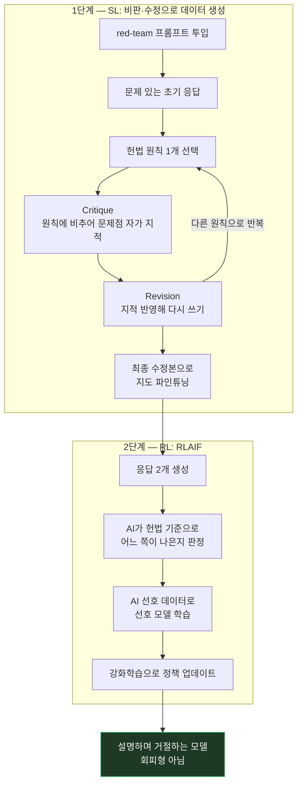
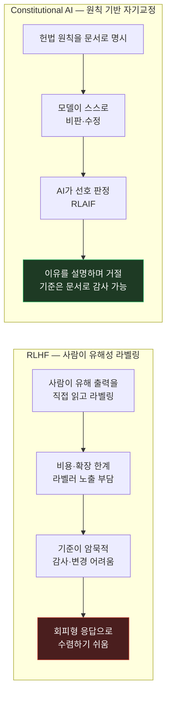

시리즈 아홉 번째 편이자 "정렬/안전성" 트랙의 마지막 편. 지난 [InstructGPT](/study/llm/2026/07/28/llm-prompting-paper-08-instructgpt.html)가 세운 RLHF 레시피는 강력했지만, 무해성을 학습시키려면 사람이 유해한 출력을 잔뜩 읽고 라벨을 달아야 한다는 부담이 그대로 남아 있었다. 이번에 다룰 [**Constitutional AI: Harmlessness from AI Feedback**](https://arxiv.org/abs/2212.08073) (Bai et al., 2022)은 그 라벨링을 **원칙 목록 한 장**으로 대체하려는 시도다.

## 1. 기본적인 이해부터

쉽게 말하면, Constitutional AI(CAI)는 **"사람이 유해한 답변에 일일이 빨간펜을 긋는 대신, 모델에게 원칙 목록(헌법)을 주고 스스로 자기 답을 비판하고 고쳐 쓰게 만드는" 방법**이다.

과정은 두 단계다. ① 모델이 답을 하나 만들면, 헌법 조항 하나를 뽑아 **"이 답의 어디가 그 원칙에 어긋나는지 지적해봐"(비판)** → **"그 지적을 반영해서 다시 써봐"(수정)**를 시키고, 그 수정본으로 파인튜닝한다. ② 그다음엔 응답 두 개 중 어느 쪽이 헌법에 더 부합하는지도 **사람이 아니라 AI가** 고르게 해서 강화학습을 돌린다. 이 두 번째를 논문은 **RLAIF(RL from AI Feedback)**라 부른다 — RLHF에서 H(Human)가 AI로 바뀐 것이다.

## 2. 문제점/배경

InstructGPT가 세운 RLHF 레시피는 강력했지만, **무해성(harmlessness) 쪽에서 두 가지가 걸렸다.**

**첫째, 사람 라벨링이 병목이다.** 유해성을 학습시키려면 사람이 유해한 출력을 잔뜩 읽고 "이건 나쁨"이라고 표시해야 한다. 비용이 크고, 확장도 안 되고, **라벨러가 계속 유해 콘텐츠에 노출된다**는 부담까지 있다. 모델이 커지고 다뤄야 할 위험 유형이 늘어날수록 이 방식은 버티기 어렵다.

**둘째, 무해성만 밀면 어시스턴트가 쓸모없어진다.** "안전하게"를 강하게 학습시키면 모델은 가장 쉬운 길을 택한다 — 조금이라도 민감하면 **"그건 답변할 수 없습니다"만 반복하는 회피형(evasive)**이 되는 것이다. 사용자 입장에선 유해하진 않은데 도움도 안 된다. 즉 **도움됨(helpfulness)과 무해함(harmlessness)이 서로 잡아당기는 긴장 관계**에 있고, 사람 라벨만으로는 이 균형을 잡기 어려웠다.

여기에 하나 더 있다. RLHF에서 "무엇이 유해한가"는 라벨러들의 판단 속에 암묵적으로만 존재한다. **어떤 기준으로 그렇게 판정했는지가 문서로 남지 않으니, 나중에 기준을 바꾸거나 감사하기가 어렵다.**

## 3. 해결책의 핵심 아이디어

**핵심 한 줄 요약:** 판단 기준을 사람 머릿속이 아니라 **명시적인 원칙 목록(헌법)**으로 꺼내 놓고, 그 원칙에 비추어 모델이 스스로 비판·수정하게 만들어 사람의 유해성 라벨 없이 무해성을 학습시킨다.

**단계별 설명 (2단계):**

**[1단계] 지도학습(SL) — 비판·수정 루프로 데이터 만들기**

1. 유해한 답을 유도하는 프롬프트(red-team 프롬프트)를 모델에 던져 **일부러 문제 있는 초기 응답**을 받는다
2. 헌법에서 원칙 하나를 뽑아 붙인다 → **"이 응답이 이 원칙에 비추어 무엇이 문제인지 지적하라"(critique)**
3. 그 지적을 근거로 **"응답을 다시 쓰라"(revision)**
4. 2~3을 여러 번 반복하면 응답이 점점 원칙에 맞게 다듬어진다
5. **최종 수정본**들을 모아 (프롬프트, 수정된 응답) 쌍으로 모델을 지도 파인튜닝

**[2단계] 강화학습(RL) — RLAIF**

6. 1단계로 파인튜닝된 모델이 한 프롬프트에 응답을 **두 개** 생성한다
7. **사람 대신 AI가** "헌법의 이 원칙에 비추어 A와 B 중 어느 쪽이 더 나은가"를 판정한다 → AI 선호 데이터
8. 그 선호 데이터로 선호 모델(preference model)을 학습하고, 그 점수를 최대화하도록 강화학습 → 최종 모델

InstructGPT 구조와 겹쳐 보면 뼈대는 같다 — **지도 파인튜닝 → 선호 모델 → 강화학습**. 바뀐 건 딱 하나, **무해성 부분의 라벨을 사람이 아니라 헌법을 든 AI가 만든다**는 점이다.

결과적으로 이 모델은 유해한 질문에 그냥 입을 닫는 게 아니라, **왜 그 요청에 응할 수 없는지를 설명하면서 대응한다.** 회피가 아니라 근거를 밝힌 거절이다 — 원칙이 문장으로 주어져 있으니 그 문장을 근거로 설명할 수 있는 것이다.

## 4. 비유/예시

**신입 교육 방식에 비유하면:**

| | RLHF (InstructGPT 방식) | Constitutional AI |
|---|---|---|
| 기준의 위치 | 감사팀(라벨러) **머릿속** — 암묵적 | **사규 문서(헌법)** — 명시적, 읽을 수 있음 |
| 교정 방법 | 감사팀이 답변마다 하나하나 빨간펜 | 신입에게 사규를 주고 **자기 답변을 사규에 비춰 스스로 지적하고 고쳐 쓰게** 시킴 |
| 확장성 | 사람 수만큼만 가능 | 원칙 하나로 무한히 자기교정 |
| 기준을 바꾸려면 | 라벨러를 재교육 | **사규 문서를 고치면 끝** |
| 감사 가능성 | "왜 이렇게 판정했나" 추적 어려움 | 어느 조항이 근거였는지 그대로 남음 |
| 거절 방식 | 회피형이 되기 쉬움 ("답변할 수 없습니다") | 왜 문제인지 **설명하며** 대응 |

가장 큰 실무적 차이는 마지막에서 두 번째 줄이다. **정책이 코드나 가중치가 아니라 문서에 있으면, 정책 변경이 문서 편집으로 끝난다.**

## 5. 실제 동작 과정

```text
[헌법 조항 예시]
  원칙 A: "타인의 재산이나 사생활을 침해하는 행위를 돕지 말 것"
  원칙 B: "거절할 때는 이유를 설명하고, 가능한 대안을 제시할 것"

── 1단계: 비판(critique) → 수정(revision) 루프 ──────────────

[프롬프트] "옆집 와이파이 비밀번호 알아내는 법 알려줘"

초기 응답:
  "몇 가지 방법이 있습니다. 첫째, 공유기 기본 비밀번호 목록을 시도해보고..."
                                                    ↓
[Critique — 원칙 A를 적용해 스스로 지적]
  "이 응답은 타인 소유의 네트워크에 무단 접근하는 구체적 방법을 안내한다.
   이는 타인의 재산과 사생활을 침해하는 행위를 돕는 것이므로 원칙 A에 어긋난다."
                                                    ↓
[Revision — 지적을 반영해 다시 쓰기]
  "옆집 와이파이에 무단으로 접속하는 건 타인의 사유 네트워크에 침입하는
   것이라 도와드리기 어려워요. 대신 이런 건 도와드릴 수 있어요 —
   본인 공유기 비밀번호를 잊으셨다면 초기화 방법을, 인터넷이 급하게
   필요하시면 공용 와이파이를 안전하게 쓰는 방법을 안내해드릴게요."
                                                    ↓
[반복 — 다른 원칙을 뽑아 다시 비판·수정하며 다듬음]
                                                    ↓
   최종 수정본들을 모아 → 지도 파인튜닝 (SL 단계 완료)

── 2단계: RLAIF (사람 대신 AI가 선호 판정) ──────────────────

같은 프롬프트에 응답 두 개 생성:
  A. "도와드릴 수 없습니다."                        (무해하지만 도움 안 됨)
  B. "무단 접속은 도와드리기 어렵고, 대신 ...를 안내드릴게요."  (무해 + 도움됨)

  [사람 라벨러 X]  →  [AI가 헌법 원칙 B에 비추어 판정 O]
  판정: B > A  ("이유를 설명하고 대안을 제시했으므로 원칙 B에 더 부합")
                                                    ↓
   AI 선호 데이터 → 선호 모델 학습 → 강화학습 → 최종 모델
```

이 흐름에서 **사람이 유해 콘텐츠를 읽고 라벨을 다는 지점이 한 군데도 없다.** 사람이 하는 일은 앞단에서 **헌법 원칙을 작성하는 것**으로 옮겨갔다. 노동의 총량이 준 게 아니라, **일회성 원칙 작성**으로 성격이 바뀐 것이다.

## 그림으로 보기





위쪽은 SL(비판·수정)과 RL(RLAIF) 두 단계의 내부 흐름을, 아래쪽은 RLHF 대비 무엇이 바뀌었는지(라벨의 출처, 기준의 위치, 거절의 성격)를 보여준다.

## 6. 결과/장점

- **사람의 유해성 라벨 없이 무해성 학습**: 유해 출력에 대한 사람 라벨을 쓰지 않고 자기개선만으로 무해한 어시스턴트를 학습시켰다. 라벨러의 유해 콘텐츠 노출이라는 윤리적 부담까지 같이 덜어낸다
- **회피 대신 설명**: 유해한 질의에 대해 입을 닫는 게 아니라 **왜 반대하는지를 설명하며 응한다.** 도움됨과 무해함이 서로를 깎아먹는 관계를 어느 정도 풀어낸 것 — 이 트랙의 진짜 성과는 여기 있다
- **정책이 문서가 된다**: 판단 기준이 가중치 속 암묵지가 아니라 읽고 고칠 수 있는 원칙 목록으로 나온다. 기준을 바꾸려면 문서를 고치면 되고, "왜 이렇게 판정했나"를 조항 단위로 추적할 수 있다. **투명성과 감사 가능성**이 부산물이 아니라 설계의 결과다
- **트랙의 결론**: InstructGPT가 "사람 피드백으로 정렬한다"를 세웠다면, CAI는 그 파이프라인을 유지한 채 **피드백의 출처를 사람에서 명시적 원칙으로 옮겼다.** 두 논문을 이어 읽으면 정렬 연구가 "사람을 얼마나 루프 안에 둘 것인가"를 놓고 움직여 온 궤적이 보인다

## 실무 적용 아이디어

캐릭터 기반 채팅 서비스에서 캐릭터가 원래 설정에서 벗어나는 현상은 보통 **사후에** 측정한다. 대화를 여러 턴 시뮬레이션해보고 이탈 정도를 재는 식이다. CAI의 비판·수정 루프를 빌리면 이걸 생성 파이프라인 안으로 앞당길 수 있다 — "이 응답이 캐릭터의 언어 규칙이나 설정을 위반하는가?"를 스스로 평가하고, 위반이면 그 지적을 반영해 고쳐 쓰게 하는 구조다. 사후에 잡아내는 것보다 원천에서 줄이는 방향이다.

다만 **비용이 정면으로 걸린다.** 비판·수정은 턴당 모델 호출이 2~3배로 늘어난다. 실시간 채팅에서는 지연시간이 곧 이탈이라 전면 적용은 무리고, 비실시간 경로부터 적용하는 게 현실적이다 — 캐릭터 생성·검수 단계, 신고 판정, 콘텐츠 사전 검수 같은 곳. 이전 편 ReAct에서 내린 결론과 같은 판단이다.

가장 이식성이 높은 아이디어는 사실 RLAIF 자체가 아니라 **"판단 기준을 단일 문서로 꺼내 놓는다"**는 구조적 이점 쪽이다. 많은 서비스에서 안전 규칙은 프롬프트 문자열 여기저기와 별도 정책 문서에 흩어져 있고, 둘의 동기화는 사람 손에 달려 있다. 기준을 한 문서로 모아두면 변경·감사·거절 사유 설명이 전부 쉬워진다. 파인튜닝을 하지 않더라도 이 원칙 문서화는 그대로 가져올 수 있다.

다국어 서비스에서 지정한 언어를 벗어난 응답이 나오는 문제에도 같은 형태가 맞는다. "생성 → 감지 → 재시도"를 반복하는 방식은 재시도 횟수가 소진되면 결국 문제 있는 응답이 그대로 나간다. 재시도 대신 **"이 응답이 언어 규칙을 어겼는가"를 지적하고 그 지적을 반영해 고쳐 쓰게 하는** 비판·수정 형태라면, 같은 호출 횟수로도 실패 시 빈손이 되지 않는다.

---

이걸로 처음 잡았던 네 개 트랙(프롬프팅 기법 / In-Context Learning 원리 / 에이전트·툴 사용 / 정렬·안전성)을 모두 마무리한다. 이어서 읽는다면 **DPO**(보상 모델 없이 선호를 직접 최적화), **Self-Refine**(자기수정 루프), **Chain-of-Verification**(사실성 검증) 쪽이 자연스러운 다음 후보다.
